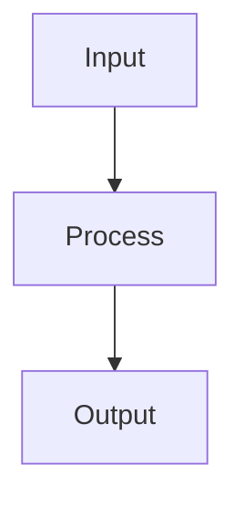

# Project Requirements and Standards

## CRITICAL: This file  "1. requirements.md" must be read and followed for EVERY user request and code change

## 1. Zero Technical Debt Policy

### 1.1 No Placeholder Code
- **PROHIBITED**: Mock functions, stub implementations, placeholder returns
- **PROHIBITED**: Comments like "TODO", "FIXME", "implement later"
- **PROHIBITED**: Simulated results or hardcoded test data in production code
- **REQUIRED**: Every function must be fully implemented and tested
- **REQUIRED**: All error paths must be handled with real recovery logic

### 1.2 Complete Implementation Requirements
```python
# PROHIBITED Example:
def process_data(data):
    # TODO: implement processing
    return {"result": "mock_result"}

# REQUIRED Example:
def process_data(data):
    if not data:
        raise ValueError("Data cannot be empty")
    
    validated = validate_data(data)
    processed = transform_data(validated)
    stored = database.store(processed)
    
    return {
        "result": processed,
        "storage_id": stored.id,
        "timestamp": datetime.now().isoformat()
    }
```

## 2. Full System Integration Requirements

### 2.1 Data Flow Integration
- **Interview Results → Database**: All interview results MUST be stored with proper indexing
- **Database → Routing Engine**: Routing decisions MUST use actual database results
- **Routing → Execution**: Selected routes MUST trigger real model calls
- **Execution → Monitoring**: All executions MUST be logged and monitored
- **Monitoring → Database**: Metrics MUST be stored for future routing improvements

### 2.2 Integration Verification Checklist
Each component MUST verify:
- [ ] Input sources are connected and providing real data
- [ ] Output destinations are receiving and processing data
- [ ] Error propagation reaches appropriate handlers
- [ ] Metrics are being collected and stored
- [ ] Health checks cover all integration points

### 2.3 Integration Testing Requirements
```python
# Every integration point must have tests
class TestIntegration:
    def test_interview_to_database(self):
        # Real interview execution
        result = interview_system.conduct_interview(model_a, model_b)
        
        # Verify database storage
        stored = database.get_interview(result.session_id)
        assert stored is not None
        assert stored.data == result.to_dict()
        
        # Verify routing engine uses it
        routing_decision = router.route_request(test_prompt)
        assert routing_decision.uses_interview_data == True
```

## 3. Code Quality Standards

### 3.1 Linting Requirements
- **Python**: Must pass `black`, `flake8`, `mypy`, and `pylint` with zero errors
- **Configuration**: Use `.pre-commit-config.yaml` for automatic checking
- **CI/CD**: All commits must pass linting before merge

### 3.2 Error Checking
```yaml
# .pre-commit-config.yaml
repos:
  - repo: https://github.com/psf/black
    rev: 23.12.0
    hooks:
      - id: black
        language_version: python3.11
  
  - repo: https://github.com/PyCQA/flake8
    rev: 7.0.0
    hooks:
      - id: flake8
        args: ['--max-line-length=100', '--extend-ignore=E203']
  
  - repo: https://github.com/pre-commit/mirrors-mypy
    rev: v1.8.0
    hooks:
      - id: mypy
        args: ['--strict', '--ignore-missing-imports']
  
  - repo: https://github.com/PyCQA/pylint
    rev: v3.0.3
    hooks:
      - id: pylint
        args: ['--fail-under=8.0']
```

### 3.3 Memory Leak Prevention
- **Required Tools**: `memory_profiler`, `tracemalloc`, `objgraph`
- **Monitoring**: Continuous memory monitoring in production
- **Testing**: Memory leak tests for all long-running processes

```python
# Memory leak detection test
import tracemalloc
import gc

def test_no_memory_leak():
    tracemalloc.start()
    
    # Take snapshot before
    snapshot1 = tracemalloc.take_snapshot()
    
    # Run operation 1000 times
    for _ in range(1000):
        result = perform_operation()
        del result
        gc.collect()
    
    # Take snapshot after
    snapshot2 = tracemalloc.take_snapshot()
    
    # Compare snapshots
    top_stats = snapshot2.compare_to(snapshot1, 'lineno')
    
    # Assert no significant growth
    total_growth = sum(stat.size_diff for stat in top_stats)
    assert total_growth < 1024 * 1024  # Less than 1MB growth
```

## 4. Project Structure Requirements

### 4.1 Directory Structure
```
intern/
├── docs/                  # All documentation
│   ├── architecture/      # Architecture diagrams
│   ├── api/              # API documentation
│   ├── workflows/        # Workflow descriptions
│   └── *.md             # Markdown files
│
├── src/                  # Source code
│   ├── adapters/        # Model adapters
│   ├── mcp/            # MCP server implementation
│   ├── routing/        # Routing engine
│   ├── interview/      # Interview system
│   ├── storage/        # Database layer
│   ├── monitoring/     # Monitoring and metrics
│   ├── utils/          # Utility functions
│   └── __init__.py
│
├── tests/               # Test files
│   ├── unit/           # Unit tests
│   ├── integration/    # Integration tests
│   ├── performance/    # Performance tests
│   ├── fixtures/       # Test fixtures
│   └── conftest.py
│
├── config/             # Configuration files
│   ├── development/    # Dev configs
│   ├── production/     # Prod configs
│   └── testing/        # Test configs
│
├── scripts/            # Utility scripts
│   ├── setup/         # Setup scripts
│   ├── deployment/    # Deployment scripts
│   └── maintenance/   # Maintenance scripts
│
├── data/              # Data storage
│   ├── cache/        # Cache files
│   ├── logs/         # Log files
│   └── db/           # Database files
│
└── requirements/      # Dependency files
    ├── base.txt
    ├── development.txt
    ├── production.txt
    └── testing.txt
```

### 4.2 File Naming Conventions
- **Python files**: `snake_case.py`
- **Classes**: `PascalCase`
- **Functions/Variables**: `snake_case`
- **Constants**: `UPPER_SNAKE_CASE`
- **Test files**: `test_*.py` or `*_test.py`

## 5. Documentation Requirements

### 5.1 File Documentation Template
Every new file MUST have accompanying documentation:

```markdown
# [Component Name] Documentation

## Overview
Brief description of what this component does and why it exists.

## Architecture


## Dependencies
- Internal: List of internal components this depends on
- External: List of external libraries required

## API Reference
### Functions
- `function_name(params)`: Description
  - Parameters: Type and description
  - Returns: Type and description
  - Raises: Exceptions that can be raised

## Data Flow
1. Step-by-step data flow
2. Integration points with other components
3. Error handling flow

## Configuration
Required configuration parameters and environment variables

## Testing
How to test this component

## Performance Considerations
- Time complexity
- Space complexity
- Optimization opportunities

## Monitoring
- Metrics exposed
- Log entries
- Health check endpoints
```

### 5.2 Workflow Documentation
Every workflow MUST be documented with:
- Mermaid diagram showing all steps
- Integration points clearly marked
- Error handling paths shown
- Performance metrics included

## 6. Entity Accountability

### 6.1 Entity Registry
All entities (models, services, components) MUST be registered:

```python
# src/registry/entity_registry.py
class EntityRegistry:
    def __init__(self):
        self.entities = {}
        self.dependencies = {}
        self.health_checks = {}
    
    def register_entity(self, name: str, entity: Any, 
                       dependencies: List[str],
                       health_check: Callable):
        """Register an entity with its dependencies and health check."""
        self.entities[name] = entity
        self.dependencies[name] = dependencies
        self.health_checks[name] = health_check
        
        # Verify all dependencies exist
        for dep in dependencies:
            if dep not in self.entities:
                raise ValueError(f"Dependency {dep} not found for {name}")
    
    def verify_integration(self):
        """Verify all entities are properly integrated."""
        for name, deps in self.dependencies.items():
            for dep in deps:
                if dep not in self.entities:
                    raise IntegrationError(f"{name} missing dependency: {dep}")
```

### 6.2 Holistic Integration Verification
```python
# Run at startup and after any configuration change
def verify_system_integration():
    checks = [
        ("Database → Router", test_database_to_router_flow),
        ("Router → Adapters", test_router_to_adapter_flow),
        ("Interview → Database", test_interview_to_database_flow),
        ("Monitoring → Storage", test_monitoring_to_storage_flow),
    ]
    
    for name, check in checks:
        result = check()
        if not result.success:
            raise IntegrationError(f"Integration failed: {name} - {result.error}")
```

## 7. Code Review Requirements

### 7.1 Immediate Review Triggers
Code review MUST be triggered for:
- Any new function or class
- Any modification to integration points
- Any change to routing logic
- Any database schema change
- Any API contract change

### 7.2 Review Checklist
```markdown
## Code Review Checklist
- [ ] No placeholder or mock code
- [ ] All functions fully implemented
- [ ] Error handling complete
- [ ] Integration points verified
- [ ] Tests cover all paths
- [ ] Documentation updated
- [ ] Linting passed
- [ ] Memory leak check performed
- [ ] Performance impact assessed
- [ ] Security implications reviewed
- [ ] File size within limits (see section 13)
- [ ] Comments use human language (see section 14)
- [ ] Code justification is uniform (see section 14)
```

### 7.3 Performance Review Criteria
Every function must be reviewed for:
- Time complexity (must be documented)
- Space complexity (must be documented)
- Database query efficiency
- Network call optimization
- Caching opportunities
- Parallelization potential

## 8. Continuous Improvement Process

### 8.1 Performance Monitoring
```python
# Required for all critical functions
@monitor_performance
@track_memory_usage
@log_errors
def critical_function(params):
    """Function implementation with full monitoring."""
    pass
```

### 8.2 Improvement Identification
- Daily performance report review
- Weekly bottleneck analysis
- Monthly architecture review
- Quarterly dependency audit

### 8.3 Immediate Optimization Requirements
If any of these thresholds are exceeded, optimization is REQUIRED:
- Response time > 1 second
- Memory usage > 1GB for single operation
- Error rate > 1%
- Cache miss rate > 20%
- Database query time > 100ms

## 9. Enforcement Mechanisms

### 9.1 Pre-commit Hooks
```bash
#!/bin/bash
# .git/hooks/pre-commit

# Check for prohibited patterns
if grep -r "TODO\|FIXME\|mock\|placeholder\|stub" --include="*.py" src/; then
    echo "ERROR: Placeholder code detected"
    exit 1
fi

# Check file sizes (see section 13)
for file in $(git diff --cached --name-only); do
    if [ -f "$file" ]; then
        size=$(wc -l < "$file")
        if [ "$size" -gt 2000 ]; then
            echo "ERROR: File $file exceeds 2000 lines"
            exit 1
        fi
    fi
done

# Run linting
black --check src/ tests/
flake8 src/ tests/
mypy src/
pylint src/

# Run integration tests
pytest tests/integration/ -v

# Check documentation exists
for file in $(git diff --cached --name-only --diff-filter=A | grep ".py$"); do
    doc_file="${file%.py}.md"
    if [ ! -f "docs/$doc_file" ]; then
        echo "ERROR: Missing documentation for $file"
        exit 1
    fi
done
```

### 9.2 CI/CD Pipeline Requirements
```yaml
# .github/workflows/ci.yml
name: CI Pipeline
on: [push, pull_request]

jobs:
  quality:
    runs-on: ubuntu-latest
    steps:
      - name: Check requirements.md compliance
        run: python scripts/check_requirements.py
      
      - name: No technical debt check
        run: |
          ! grep -r "TODO\|FIXME\|mock\|placeholder" src/
      
      - name: Check file sizes
        run: python scripts/check_file_sizes.py
      
      - name: Verify comment quality
        run: python scripts/check_comment_quality.py
      
      - name: Full integration test
        run: pytest tests/integration/ --cov=src --cov-report=term-missing
      
      - name: Memory leak detection
        run: python scripts/detect_memory_leaks.py
      
      - name: Performance benchmarks
        run: python scripts/run_benchmarks.py
```

## 10. Compliance Verification

### 10.1 Requirements Checker Script
```python
# scripts/check_requirements.py
import sys
import ast
import os
from pathlib import Path

def check_no_placeholders(filepath):
    """Check file has no placeholder code."""
    with open(filepath, 'r') as f:
        content = f.read()
        
    prohibited = ['TODO', 'FIXME', 'mock', 'placeholder', 'stub', 'pass  # implement']
    for term in prohibited:
        if term in content:
            return False, f"Found prohibited term: {term}"
    
    # Check for empty function bodies
    tree = ast.parse(content)
    for node in ast.walk(tree):
        if isinstance(node, ast.FunctionDef):
            if len(node.body) == 1 and isinstance(node.body[0], ast.Pass):
                return False, f"Empty function: {node.name}"
    
    return True, "OK"

def check_file_size(filepath):
    """Check file is within size limits."""
    with open(filepath, 'r') as f:
        lines = f.readlines()
    
    if len(lines) > 2000:
        return False, f"File exceeds 2000 lines: {len(lines)}"
    
    # Check line length
    for i, line in enumerate(lines, 1):
        if len(line) > 100:
            return False, f"Line {i} exceeds 100 characters"
    
    return True, "OK"

def verify_all_requirements():
    """Verify all requirements are met."""
    src_path = Path('src')
    
    for py_file in src_path.rglob('*.py'):
        success, message = check_no_placeholders(py_file)
        if not success:
            print(f"FAIL: {py_file} - {message}")
            return False
        
        success, message = check_file_size(py_file)
        if not success:
            print(f"FAIL: {py_file} - {message}")
            return False
    
    return True

if __name__ == "__main__":
    if not verify_all_requirements():
        sys.exit(1)
```

## 11. Reading Enforcement

### THIS FILE MUST BE:
1. **Read at project start**: Before any development begins
2. **Read before commits**: Part of pre-commit checklist
3. **Read in code reviews**: Reviewers must verify compliance
4. **Read after user requests**: Ensure all points are followed
5. **Updated with lessons learned**: Continuous improvement

### Automatic Reminder System
```python
# src/__init__.py
import os
import sys

# Force requirements check on import
requirements_file = os.path.join(os.path.dirname(__file__), '..', 'requirements.md')
if not os.path.exists(requirements_file):
    sys.stderr.write("ERROR: requirements.md not found\n")
    sys.exit(1)

# Log that requirements should be reviewed
import logging
logging.info("REMINDER: Review requirements.md before making changes")
```

## 12. No Emoji Policy

- **PROHIBITED**: Use of emojis in any code, comments, or documentation
- **PROHIBITED**: Unicode emoticons or decorative characters
- **REQUIRED**: Professional, clear text without visual embellishments

## 13. File Size Limits for Model Compatibility

### 13.1 Claude Code and Ollama Limits
To ensure files can be read and edited without errors by both Claude Code and Ollama:

- **Maximum file size**: 2000 lines per file
- **Maximum line length**: 100 characters (enforced by black formatter)
- **Maximum token count**: ~25,000 tokens per file (approximately 100KB)
- **Maximum function length**: 100 lines per function
- **Maximum class size**: 500 lines per class

### 13.2 File Splitting Requirements
When a file approaches limits:
```python
# REQUIRED: Split large files into logical components
# Example: Instead of one large router.py file

# router/base.py - Base classes and interfaces (< 500 lines)
class BaseRouter:
    pass

# router/decision.py - Decision logic (< 500 lines)
class DecisionEngine:
    pass

# router/cache.py - Caching logic (< 500 lines)
class RouterCache:
    pass

# router/main.py - Main router combining components (< 500 lines)
from .base import BaseRouter
from .decision import DecisionEngine
from .cache import RouterCache

class MainRouter(BaseRouter):
    def __init__(self):
        self.decision_engine = DecisionEngine()
        self.cache = RouterCache()
```

### 13.3 File Size Monitoring
```python
# scripts/check_file_sizes.py
import os
from pathlib import Path

MAX_LINES = 2000
MAX_LINE_LENGTH = 100
MAX_FILE_SIZE_KB = 100

def check_all_files():
    """Verify all files are within size limits."""
    for filepath in Path('src').rglob('*.py'):
        with open(filepath, 'r') as f:
            lines = f.readlines()
        
        # Check total lines
        if len(lines) > MAX_LINES:
            print(f"ERROR: {filepath} has {len(lines)} lines (max: {MAX_LINES})")
            return False
        
        # Check line lengths
        for i, line in enumerate(lines, 1):
            if len(line) > MAX_LINE_LENGTH:
                print(f"ERROR: {filepath}:{i} exceeds {MAX_LINE_LENGTH} characters")
                return False
        
        # Check file size
        size_kb = os.path.getsize(filepath) / 1024
        if size_kb > MAX_FILE_SIZE_KB:
            print(f"ERROR: {filepath} is {size_kb:.1f}KB (max: {MAX_FILE_SIZE_KB}KB)")
            return False
    
    return True
```

## 14. Code Comments and Justification Standards

### 14.1 Uniform Justification
All code justification throughout the project MUST follow the same format:

```python
# CORRECT: Uniform justification format
def process_request(request):
    # Validate input to prevent injection attacks
    if not validate_input(request):
        raise SecurityError("Invalid input detected")
    
    # Use cache for performance optimization
    cached = cache.get(request.id)
    if cached:
        return cached
    
    # Process request with timeout to prevent hanging
    with timeout(30):
        result = perform_processing(request)
    
    return result
```

### 14.2 Human Language Comments
Comments MUST use natural, human-readable language:

```python
# PROHIBITED: Technical jargon without context
def optimize():
    # O(n log n) impl w/ memoization
    pass

# REQUIRED: Clear human language
def optimize():
    # Sort the data efficiently and remember previous calculations
    # to avoid repeating expensive operations
    pass
```

### 14.3 Comment Guidelines
```python
# DO NOT comment obvious operations
# PROHIBITED:
x = x + 1  # Increment x by 1
items.append(item)  # Add item to list

# DO comment complex business logic
# REQUIRED:
def calculate_routing_score(prompt, model_performance):
    # Combine interview results with recent performance metrics
    # giving more weight to recent data (70%) than historical (30%)
    # to adapt to model improvements over time
    recent_weight = 0.7
    historical_weight = 0.3
    
    score = (recent_performance * recent_weight + 
             historical_performance * historical_weight)
    
    # Apply penalty if model failed recently to prevent
    # routing to unstable models
    if model_failed_in_last_hour:
        score *= 0.5
    
    return score
```

### 14.4 Prohibited Comment Patterns
```python
# PROHIBITED comments on:
# - Variable declarations with obvious names
# - Standard library function calls
# - Simple mathematical operations
# - Loop structures with clear iterables
# - Well-named function calls

# Examples of unnecessary comments (PROHIBITED):
for user in users:  # Loop through users
    email = user.email  # Get user email
    send_email(email)  # Send email

# The same code without unnecessary comments (REQUIRED):
for user in users:
    email = user.email
    send_email(email)
```

### 14.5 Required Comment Patterns
```python
# REQUIRED comments for:
# - Complex algorithms or business logic
# - Performance optimizations and their rationale
# - Security considerations
# - Integration points and data flow
# - Error handling strategies
# - Configuration decisions

# Example of required comments:
def route_to_model(prompt):
    # Route to Claude for complex reasoning tasks because
    # interview results show 40% better performance on
    # multi-step logical problems
    if requires_complex_reasoning(prompt):
        return 'claude'
    
    # Use local Ollama for code generation to keep
    # sensitive code on-premises and reduce latency
    if is_code_generation(prompt):
        return 'ollama'
    
    # Default to load balancing for general queries
    # to distribute load and maintain availability
    return select_by_load_balance()
```

### 14.6 Comment Quality Checker
```python
# scripts/check_comment_quality.py
import ast
import re

def check_comment_quality(filepath):
    """Verify comments meet quality standards."""
    with open(filepath, 'r') as f:
        content = f.read()
        lines = content.split('\n')
    
    # Check for obvious comments
    obvious_patterns = [
        r'#.*increment.*by.*1',
        r'#.*add.*to.*list',
        r'#.*loop.*through',
        r'#.*get.*from.*dict',
        r'#.*return.*result'
    ]
    
    for i, line in enumerate(lines, 1):
        for pattern in obvious_patterns:
            if re.search(pattern, line, re.IGNORECASE):
                print(f"WARNING: Obvious comment at {filepath}:{i}")
    
    # Check for technical jargon without explanation
    jargon_without_context = [
        r'#\s*O\([^)]+\)\s*$',  # Just Big-O notation
        r'#\s*TODO',  # TODO comments
        r'#\s*FIXME',  # FIXME comments
        r'#\s*[A-Z]{3,}(?:\s+[A-Z]{3,})*$'  # Just acronyms
    ]
    
    for i, line in enumerate(lines, 1):
        for pattern in jargon_without_context:
            if re.search(pattern, line):
                print(f"ERROR: Poor comment quality at {filepath}:{i}")
                return False
    
    return True
```

## 15. Justification Format Standard

### 15.1 Standard Justification Template
All justifications must follow this format:
```python
# [ACTION]: [REASON]
# Where ACTION is: Cache, Validate, Optimize, Retry, Fallback, etc.
# Where REASON explains the business or technical rationale

# Examples:
# Cache: Reduce database load for frequently accessed data
# Validate: Prevent SQL injection through user input
# Optimize: Process large datasets without memory overflow
# Retry: Handle transient network failures gracefully
# Fallback: Maintain service availability during outages
```

### 15.2 Multi-line Justification Format
```python
# For complex justifications use this format:
# [ACTION]: [PRIMARY REASON]
# Additional context or details about why this approach
# was chosen over alternatives

# Example:
# Optimize: Reduce memory usage for large file processing
# Using streaming instead of loading entire file because
# files can exceed available RAM in production environment
```

## Signature

By working on this project, you acknowledge that you have read, understood, and will comply with all requirements in this document.

Last Updated: [Auto-update timestamp]
Version: 1.1.0