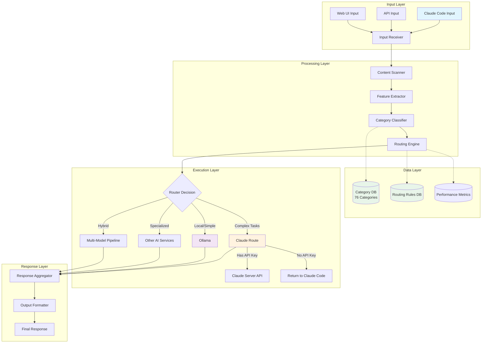

# AI Router Framework: Intelligent Task Classification & Routing System
*Last Updated: August 2025*

## Table of Contents
1. [Overview](#overview)
2. [Architecture Diagram](#architecture-diagram)
3. [Component Design](#component-design)
4. [Category Classification System](#category-classification-system)
5. [Routing Logic](#routing-logic)
6. [Database Schema](#database-schema)
7. [Implementation Guide](#implementation-guide)
8. [API Specifications](#api-specifications)
9. [Performance Optimization](#performance-optimization)
10. [Monitoring & Analytics](#monitoring--analytics)

---

## Overview

This framework provides an intelligent routing system that:
1. **Accepts** input from Claude Code or other sources
2. **Analyzes** content to determine task category (1 of 76 categories)
3. **Retrieves** routing preferences from database
4. **Routes** the request to the optimal AI service:
   - **Claude routing**: Returns to Claude Code for direct handling
   - **Ollama routing**: Sends to local Ollama instance
   - **Other services**: Routes to configured third-party APIs
5. **Returns** consolidated response to the user or passthrough directive to Claude Code

### Key Features
- Real-time content analysis and classification
- Dynamic routing based on task requirements
- Cost optimization through intelligent model selection
- Performance tracking and analytics
- Fallback mechanisms for high availability
- Extensible category system

---

## Architecture Diagram

### High-Level System Flow



### Detailed Component Flow

```
┌─────────────────────────────────────────────────────────────────┐
│                         INPUT INGESTION                          │
├─────────────────────────────────────────────────────────────────┤
│  Claude Code  │  REST API  │  WebSocket  │  CLI  │  Slack/Teams │
└────────┬──────┴─────┬──────┴──────┬──────┴───┬───┴──────┬───────┘
         │            │              │          │          │
         └────────────┴──────────────┴──────────┴──────────┘
                                 │
                                 ▼
┌─────────────────────────────────────────────────────────────────┐
│                      CONTENT PREPROCESSOR                        │
├─────────────────────────────────────────────────────────────────┤
│  • Tokenization           • Language Detection                   │
│  • Sanitization           • Format Normalization                 │
│  • Metadata Extraction    • Context Preservation                 │
└─────────────────────────────────────────────────────────────────┘
                                 │
                                 ▼
┌─────────────────────────────────────────────────────────────────┐
│                      FEATURE EXTRACTION                          │
├─────────────────────────────────────────────────────────────────┤
│  • Keywords & Entities    • Complexity Score                     │
│  • Intent Analysis        • Required Capabilities                │
│  • Domain Detection       • Resource Requirements                 │
└─────────────────────────────────────────────────────────────────┘
                                 │
                                 ▼
┌─────────────────────────────────────────────────────────────────┐
│                   CATEGORY CLASSIFICATION                        │
├─────────────────────────────────────────────────────────────────┤
│       ┌──────────────┐         ┌──────────────┐                 │
│       │ ML Classifier│◄────────│ 76 Categories│                 │
│       └──────┬───────┘         └──────────────┘                 │
│              │                                                   │
│       ┌──────▼───────┐         ┌──────────────┐                 │
│       │ Confidence   │────────►│  Threshold   │                 │
│       │   Scorer     │         │   Checker    │                 │
│       └──────────────┘         └──────────────┘                 │
└─────────────────────────────────────────────────────────────────┘
                                 │
                                 ▼
┌─────────────────────────────────────────────────────────────────┐
│                       ROUTING ENGINE                             │
├─────────────────────────────────────────────────────────────────┤
│   Category ID ──► Routing Rules ──► Model Selection              │
│       │               │                  │                       │
│       ▼               ▼                  ▼                       │
│   [Database]     [Preferences]      [Decision]                   │
│       │               │                  │                       │
│   • Priority      • Cost Limits     • Claude Code (Complex)      │
│   • Fallbacks     • Speed Req.      • Ollama (Local/Fast)       │
│   • Load Balance  • Accuracy Req.   • Hybrid (Multi-step)       │
└─────────────────────────────────────────────────────────────────┘
                                 │
                    ┌────────────┼────────────┐
                    ▼            ▼            ▼
         ┌──────────────┐ ┌──────────┐ ┌─────────────┐
         │   Claude     │ │  Ollama  │ │ Other APIs  │
         │   Routing    │ └────┬─────┘ └──────┬──────┘
         └──────┬───────┘      │               │
                │              │               │
        ┌───────┴────────┐     │               │
        ▼                ▼     │               │
  ┌──────────┐    ┌──────────┐ │               │
  │Claude API│    │Return to │ │               │
  │  Server  │    │Claude Code│ │               │
  └─────┬────┘    └─────┬────┘ │               │
        │               │       │               │
        └───────┬───────┘       │               │
                └───────────────┼───────────────┘
                               ▼
┌─────────────────────────────────────────────────────────────────┐
│                     RESPONSE HANDLER                             │
├─────────────────────────────────────────────────────────────────┤
│  • Response Validation    • Error Handling                       │
│  • Format Conversion      • Retry Logic                          │
│  • Cache Management       • Performance Logging                  │
└─────────────────────────────────────────────────────────────────┘
```

---

## Component Design

### 1. Input Receiver
```python
class InputReceiver:
    """
    Unified input handler for multiple sources
    """
    def __init__(self):
        self.validators = {}
        self.preprocessors = {}
        self.rate_limiter = RateLimiter()
    
    async def receive(self, source: str, data: dict) -> ProcessedInput:
        # Validate input
        if not self.validate(source, data):
            raise InvalidInputError()
        
        # Check rate limits
        await self.rate_limiter.check(source)
        
        # Preprocess and normalize
        processed = self.preprocess(source, data)
        
        # Add metadata
        processed.metadata = {
            'source': source,
            'timestamp': datetime.utcnow(),
            'request_id': uuid.uuid4(),
            'original_format': data.get('format')
        }
        
        return processed
```

### 2. Content Scanner
```python
class ContentScanner:
    """
    Analyzes input content for classification
    """
    def __init__(self):
        self.nlp = spacy.load("en_core_web_lg")
        self.embedding_model = SentenceTransformer('all-MiniLM-L6-v2')
    
    def scan(self, input_text: str) -> ContentFeatures:
        doc = self.nlp(input_text)
        
        features = ContentFeatures(
            tokens=len(doc),
            entities=[(ent.text, ent.label_) for ent in doc.ents],
            pos_tags=Counter([token.pos_ for token in doc]),
            complexity_score=self._calculate_complexity(doc),
            domain_keywords=self._extract_domain_keywords(doc),
            intent=self._detect_intent(doc),
            embedding=self.embedding_model.encode(input_text),
            language=detect(input_text),
            sentiment=self._analyze_sentiment(doc)
        )
        
        return features
    
    def _calculate_complexity(self, doc) -> float:
        # Factors: sentence length, vocabulary diversity, syntactic depth
        avg_sent_length = np.mean([len(sent) for sent in doc.sents])
        vocab_diversity = len(set([token.text for token in doc])) / len(doc)
        depth = max([token.dep_ for token in doc].count('ROOT'))
        
        return (avg_sent_length * 0.3 + vocab_diversity * 0.3 + depth * 0.4)
```

### 3. Category Classifier
```python
class CategoryClassifier:
    """
    Classifies input into one of 76 predefined categories
    """
    def __init__(self, model_path: str, categories_db: str):
        self.model = self._load_model(model_path)
        self.categories = self._load_categories(categories_db)
        self.threshold = 0.75
    
    def classify(self, features: ContentFeatures) -> CategoryResult:
        # Get predictions from model
        predictions = self.model.predict_proba([features.to_vector()])
        
        # Get top 3 categories with confidence scores
        top_categories = []
        for idx in np.argsort(predictions[0])[-3:]:
            category = self.categories[idx]
            confidence = predictions[0][idx]
            
            top_categories.append({
                'id': category['id'],
                'name': category['name'],
                'confidence': confidence,
                'capabilities_required': category['capabilities']
            })
        
        # Select primary category
        primary = top_categories[0]
        
        # Check if confidence meets threshold
        if primary['confidence'] < self.threshold:
            return self._handle_low_confidence(top_categories, features)
        
        return CategoryResult(
            primary_category=primary,
            alternatives=top_categories[1:],
            features_used=features.get_key_features()
        )
```

---

## Category Classification System

### 76 Categories Structure

```python
CATEGORIES = {
    # Code Generation & Development (1-15)
    1: {
        "name": "code_generation_simple",
        "description": "Basic code snippets, single functions",
        "preferred_model": "ollama",
        "complexity": "low",
        "capabilities": ["syntax", "basic_logic"]
    },
    2: {
        "name": "code_generation_complex",
        "description": "Full applications, complex algorithms",
        "preferred_model": "claude",
        "complexity": "high",
        "capabilities": ["architecture", "optimization", "debugging"]
    },
    3: {
        "name": "code_refactoring",
        "description": "Code improvement and optimization",
        "preferred_model": "claude",
        "complexity": "medium",
        "capabilities": ["pattern_recognition", "best_practices"]
    },
    4: {
        "name": "bug_fixing",
        "description": "Debugging and error resolution",
        "preferred_model": "claude",
        "complexity": "high",
        "capabilities": ["error_analysis", "debugging"]
    },
    5: {
        "name": "code_review",
        "description": "Code quality assessment",
        "preferred_model": "claude",
        "complexity": "medium",
        "capabilities": ["best_practices", "security_analysis"]
    },
    
    # Data & Analytics (16-25)
    16: {
        "name": "data_analysis_simple",
        "description": "Basic data queries and summaries",
        "preferred_model": "ollama",
        "complexity": "low",
        "capabilities": ["sql", "basic_stats"]
    },
    17: {
        "name": "data_visualization",
        "description": "Creating charts and graphs",
        "preferred_model": "ollama",
        "complexity": "medium",
        "capabilities": ["plotting", "data_formatting"]
    },
    18: {
        "name": "machine_learning",
        "description": "ML model development and training",
        "preferred_model": "claude",
        "complexity": "high",
        "capabilities": ["ml_frameworks", "model_optimization"]
    },
    
    # Content Creation (26-35)
    26: {
        "name": "technical_writing",
        "description": "Documentation, tutorials, guides",
        "preferred_model": "claude",
        "complexity": "medium",
        "capabilities": ["technical_accuracy", "formatting"]
    },
    27: {
        "name": "creative_writing",
        "description": "Stories, narratives, creative content",
        "preferred_model": "ollama",
        "complexity": "low",
        "capabilities": ["creativity", "narrative"]
    },
    
    # System & DevOps (36-45)
    36: {
        "name": "system_architecture",
        "description": "System design and architecture",
        "preferred_model": "claude",
        "complexity": "high",
        "capabilities": ["distributed_systems", "scalability"]
    },
    37: {
        "name": "deployment_config",
        "description": "CI/CD, Docker, Kubernetes configs",
        "preferred_model": "ollama",
        "complexity": "medium",
        "capabilities": ["yaml", "container_orchestration"]
    },
    
    # API & Integration (46-55)
    46: {
        "name": "api_design",
        "description": "REST/GraphQL API design",
        "preferred_model": "claude",
        "complexity": "medium",
        "capabilities": ["api_patterns", "openapi"]
    },
    47: {
        "name": "api_integration",
        "description": "Third-party API integration",
        "preferred_model": "ollama",
        "complexity": "low",
        "capabilities": ["http", "authentication"]
    },
    
    # Security & Compliance (56-65)
    56: {
        "name": "security_analysis",
        "description": "Security audits and vulnerability assessment",
        "preferred_model": "claude",
        "complexity": "high",
        "capabilities": ["security_patterns", "vulnerability_detection"]
    },
    57: {
        "name": "encryption_implementation",
        "description": "Cryptography and secure coding",
        "preferred_model": "claude",
        "complexity": "high",
        "capabilities": ["cryptography", "secure_protocols"]
    },
    
    # Miscellaneous (66-76)
    66: {
        "name": "translation",
        "description": "Language translation tasks",
        "preferred_model": "ollama",
        "complexity": "low",
        "capabilities": ["multilingual"]
    },
    67: {
        "name": "summarization",
        "description": "Text summarization",
        "preferred_model": "ollama",
        "complexity": "low",
        "capabilities": ["extraction", "condensation"]
    },
    68: {
        "name": "question_answering",
        "description": "Simple Q&A tasks",
        "preferred_model": "ollama",
        "complexity": "low",
        "capabilities": ["comprehension", "retrieval"]
    },
    69: {
        "name": "explanation",
        "description": "Concept explanation and tutorials",
        "preferred_model": "ollama",
        "complexity": "medium",
        "capabilities": ["teaching", "simplification"]
    },
    70: {
        "name": "math_computation",
        "description": "Mathematical calculations and proofs",
        "preferred_model": "claude",
        "complexity": "medium",
        "capabilities": ["symbolic_math", "theorem_proving"]
    },
    71: {
        "name": "research_analysis",
        "description": "Research paper analysis and synthesis",
        "preferred_model": "claude",
        "complexity": "high",
        "capabilities": ["academic_writing", "citation"]
    },
    72: {
        "name": "legal_document",
        "description": "Legal document analysis",
        "preferred_model": "claude",
        "complexity": "high",
        "capabilities": ["legal_knowledge", "compliance"]
    },
    73: {
        "name": "medical_information",
        "description": "Medical and health-related queries",
        "preferred_model": "claude",
        "complexity": "high",
        "capabilities": ["medical_knowledge", "safety"]
    },
    74: {
        "name": "financial_analysis",
        "description": "Financial modeling and analysis",
        "preferred_model": "claude",
        "complexity": "high",
        "capabilities": ["financial_models", "risk_analysis"]
    },
    75: {
        "name": "real_time_interaction",
        "description": "Chat, dialogue, interactive tasks",
        "preferred_model": "ollama",
        "complexity": "low",
        "capabilities": ["conversation", "context_management"]
    },
    76: {
        "name": "unknown_general",
        "description": "Uncategorized or general tasks",
        "preferred_model": "claude",
        "complexity": "medium",
        "capabilities": ["general"]
    }
}
```

---

## Routing Logic

### Routing Decision Engine

```python
class RoutingEngine:
    """
    Determines optimal routing based on category and context
    """
    def __init__(self, db_connection):
        self.db = db_connection
        self.routing_cache = TTLCache(maxsize=1000, ttl=300)
        self.performance_tracker = PerformanceTracker()
    
    async def route(self, category_result: CategoryResult, context: dict) -> RoutingDecision:
        category_id = category_result.primary_category['id']
        
        # Check cache first
        cache_key = f"{category_id}:{hash(str(context))}"
        if cache_key in self.routing_cache:
            return self.routing_cache[cache_key]
        
        # Get routing rules from database
        routing_rules = await self.db.get_routing_rules(category_id)
        
        # Apply dynamic routing logic
        decision = self._make_routing_decision(
            routing_rules,
            category_result,
            context
        )
        
        # Cache the decision
        self.routing_cache[cache_key] = decision
        
        # Track the routing decision
        await self.performance_tracker.track_routing(decision)
        
        return decision
    
    def _make_routing_decision(self, rules, category_result, context):
        """
        Complex routing logic considering multiple factors
        """
        factors = {
            'complexity': category_result.primary_category['complexity'],
            'confidence': category_result.primary_category['confidence'],
            'user_preference': context.get('user_preference'),
            'cost_limit': context.get('cost_limit'),
            'response_time_requirement': context.get('max_response_time'),
            'accuracy_requirement': context.get('min_accuracy'),
            'current_load': self._get_service_loads(),
            'historical_performance': self._get_historical_performance(category_result)
        }
        
        # Primary routing logic
        if factors['complexity'] == 'high' and factors['accuracy_requirement'] > 0.9:
            # Route to Claude - will check API availability internally
            primary_route = 'claude'
        elif factors['complexity'] == 'low' and factors['response_time_requirement'] < 1000:
            primary_route = 'ollama'
        elif factors['cost_limit'] and factors['cost_limit'] < 0.01:
            primary_route = 'ollama'
        else:
            primary_route = rules['default_route']
        
        # Determine fallback options
        fallbacks = self._determine_fallbacks(primary_route, factors)
        
        # Check if hybrid approach is better
        if self._should_use_hybrid(category_result, factors):
            return self._create_hybrid_route(category_result, factors)
        
        return RoutingDecision(
            primary_service=primary_route,
            fallback_services=fallbacks,
            routing_reason=self._explain_decision(factors),
            estimated_cost=self._estimate_cost(primary_route, factors),
            estimated_time=self._estimate_time(primary_route, factors),
            confidence=self._calculate_routing_confidence(factors)
        )
```

### Dynamic Routing Rules

```python
class DynamicRoutingRules:
    """
    Adaptive routing based on real-time metrics
    """
    
    ROUTING_MATRIX = {
        # (complexity, urgency, cost_sensitivity) -> service
        ('high', 'low', 'high'): 'claude',  # Complex, not urgent, cost not an issue
        ('high', 'high', 'high'): 'claude',  # Complex, urgent, cost not an issue
        ('high', 'low', 'low'): 'ollama_then_claude',  # Try cheap first
        ('low', 'high', 'any'): 'ollama',  # Simple and urgent
        ('medium', 'medium', 'medium'): 'load_balanced',  # Balance across services
    }
    
    @staticmethod
    def get_route(complexity: str, urgency: str, cost_sensitivity: str) -> str:
        key = (complexity, urgency, cost_sensitivity)
        return DynamicRoutingRules.ROUTING_MATRIX.get(
            key, 
            'intelligent_selection'  # Use ML model for edge cases
        )
```

---

## Database Schema

### PostgreSQL Schema

```sql
-- Categories table
CREATE TABLE categories (
    id SERIAL PRIMARY KEY,
    name VARCHAR(100) UNIQUE NOT NULL,
    description TEXT,
    complexity VARCHAR(20) CHECK (complexity IN ('low', 'medium', 'high')),
    preferred_model VARCHAR(50),
    capabilities JSONB,
    created_at TIMESTAMP DEFAULT CURRENT_TIMESTAMP,
    updated_at TIMESTAMP DEFAULT CURRENT_TIMESTAMP
);

-- Routing rules table
CREATE TABLE routing_rules (
    id SERIAL PRIMARY KEY,
    category_id INTEGER REFERENCES categories(id),
    rule_name VARCHAR(100),
    conditions JSONB NOT NULL,
    primary_service VARCHAR(50) NOT NULL,
    fallback_services JSONB,
    priority INTEGER DEFAULT 0,
    is_active BOOLEAN DEFAULT true,
    created_at TIMESTAMP DEFAULT CURRENT_TIMESTAMP,
    updated_at TIMESTAMP DEFAULT CURRENT_TIMESTAMP
);

-- Routing history for analytics
CREATE TABLE routing_history (
    id SERIAL PRIMARY KEY,
    request_id UUID UNIQUE NOT NULL,
    category_id INTEGER REFERENCES categories(id),
    input_hash VARCHAR(64),
    selected_service VARCHAR(50),
    routing_reason TEXT,
    confidence_score FLOAT,
    response_time_ms INTEGER,
    tokens_used INTEGER,
    cost_estimate DECIMAL(10, 6),
    success BOOLEAN,
    error_message TEXT,
    created_at TIMESTAMP DEFAULT CURRENT_TIMESTAMP
);

-- Performance metrics table
CREATE TABLE service_performance (
    id SERIAL PRIMARY KEY,
    service_name VARCHAR(50),
    category_id INTEGER REFERENCES categories(id),
    avg_response_time_ms FLOAT,
    success_rate FLOAT,
    avg_cost_per_request DECIMAL(10, 6),
    total_requests INTEGER,
    measured_at TIMESTAMP DEFAULT CURRENT_TIMESTAMP
);

-- User preferences table
CREATE TABLE user_routing_preferences (
    id SERIAL PRIMARY KEY,
    user_id VARCHAR(100) NOT NULL,
    category_id INTEGER REFERENCES categories(id),
    preferred_service VARCHAR(50),
    max_cost_per_request DECIMAL(10, 6),
    max_response_time_ms INTEGER,
    min_accuracy_score FLOAT,
    created_at TIMESTAMP DEFAULT CURRENT_TIMESTAMP,
    updated_at TIMESTAMP DEFAULT CURRENT_TIMESTAMP,
    UNIQUE(user_id, category_id)
);

-- Indexes for performance
CREATE INDEX idx_routing_history_category ON routing_history(category_id);
CREATE INDEX idx_routing_history_created ON routing_history(created_at);
CREATE INDEX idx_routing_rules_category ON routing_rules(category_id);
CREATE INDEX idx_service_performance_lookup ON service_performance(service_name, category_id);
```

### Redis Cache Schema

```python
# Cache key patterns
CACHE_PATTERNS = {
    'category_classification': 'classify:{input_hash}',
    'routing_decision': 'route:{category_id}:{context_hash}',
    'service_availability': 'service:{service_name}:available',
    'rate_limit': 'ratelimit:{user_id}:{service}',
    'performance_metrics': 'metrics:{service}:{category_id}',
}

# Example Redis operations
class CacheManager:
    def __init__(self, redis_client):
        self.redis = redis_client
    
    async def get_cached_classification(self, input_hash: str):
        key = f"classify:{input_hash}"
        data = await self.redis.get(key)
        return json.loads(data) if data else None
    
    async def cache_classification(self, input_hash: str, result: dict, ttl: int = 3600):
        key = f"classify:{input_hash}"
        await self.redis.setex(key, ttl, json.dumps(result))
    
    async def get_service_status(self, service: str) -> bool:
        key = f"service:{service}:available"
        return await self.redis.get(key) == "1"
```

---

## Implementation Guide

### Quick Start Implementation

```python
# main.py
from typing import Dict, Any
import asyncio
from fastapi import FastAPI, HTTPException
from pydantic import BaseModel

app = FastAPI(title="AI Router Framework")

class RoutingRequest(BaseModel):
    input_text: str
    context: Dict[str, Any] = {}
    user_id: str = "anonymous"

class RoutingResponse(BaseModel):
    request_id: str
    category: Dict[str, Any]
    routing_decision: Dict[str, Any]
    response: str
    metadata: Dict[str, Any]

# Initialize components
input_receiver = InputReceiver()
content_scanner = ContentScanner()
classifier = CategoryClassifier("models/classifier.pkl", "config/categories.json")
routing_engine = RoutingEngine(db_connection)
executor = ServiceExecutor()

@app.post("/route", response_model=RoutingResponse)
async def route_request(request: RoutingRequest):
    """
    Main routing endpoint
    """
    try:
        # Step 1: Receive and validate input
        processed_input = await input_receiver.receive(
            source="api",
            data=request.dict()
        )
        
        # Step 2: Scan content
        features = content_scanner.scan(processed_input.text)
        
        # Step 3: Classify into category
        category_result = classifier.classify(features)
        
        # Step 4: Determine routing
        routing_decision = await routing_engine.route(
            category_result,
            request.context
        )
        
        # Step 5: Execute request
        response = await executor.execute(
            routing_decision,
            processed_input,
            category_result
        )
        
        # Step 6: Check for Claude Code passthrough
        if response.routing_mode == 'passthrough_to_origin':
            # Return special response for Claude Code to handle directly
            return RoutingResponse(
                request_id=processed_input.metadata['request_id'],
                category=category_result.to_dict(),
                routing_decision={
                    'action': 'RETURN_TO_CLAUDE_CODE',
                    'reason': 'No API key available or API failure',
                    'original_request': processed_input.to_dict()
                },
                response=None,  # Claude Code will generate
                metadata={
                    'requires_claude_code_processing': True,
                    'passthrough_data': response.passthrough_data
                }
            )
        
        # Step 7: Format and return normal response
        return RoutingResponse(
            request_id=processed_input.metadata['request_id'],
            category=category_result.to_dict(),
            routing_decision=routing_decision.to_dict(),
            response=response.content,
            metadata={
                'service_used': routing_decision.primary_service,
                'response_time_ms': response.timing,
                'tokens_used': response.tokens,
                'cost': response.cost
            }
        )
        
    except Exception as e:
        raise HTTPException(status_code=500, detail=str(e))

@app.get("/categories")
async def list_categories():
    """List all available categories"""
    return CATEGORIES

@app.get("/routing-rules/{category_id}")
async def get_routing_rules(category_id: int):
    """Get routing rules for a specific category"""
    return await routing_engine.get_rules(category_id)

@app.post("/analyze")
async def analyze_input(request: RoutingRequest):
    """Analyze input without routing (for testing)"""
    processed_input = await input_receiver.receive("api", request.dict())
    features = content_scanner.scan(processed_input.text)
    category_result = classifier.classify(features)
    
    return {
        'features': features.to_dict(),
        'category': category_result.to_dict(),
        'suggested_routing': await routing_engine.suggest(category_result)
    }

if __name__ == "__main__":
    import uvicorn
    uvicorn.run(app, host="0.0.0.0", port=8000)
```

### Service Executor

```python
class ServiceExecutor:
    """
    Executes requests on selected AI services
    """
    def __init__(self):
        self.services = {
            'claude': ClaudeService(),
            'ollama': OllamaService(),
            'openai': OpenAIService(),
            'anthropic': AnthropicService()
        }
        self.timeout_config = {
            'claude': 30000,
            'ollama': 10000,
            'openai': 20000
        }
    
    async def execute(self, routing: RoutingDecision, input_data, category):
        service_name = routing.primary_service
        service = self.services.get(service_name)
        
        if not service:
            raise ValueError(f"Unknown service: {service_name}")
        
        # Prepare request based on service requirements
        request = self._prepare_request(service_name, input_data, category)
        
        try:
            # Execute with timeout
            response = await asyncio.wait_for(
                service.execute(request),
                timeout=self.timeout_config[service_name] / 1000
            )
            
            # Check if Claude needs passthrough handling
            if response.routing_directive == 'CLAUDE_CODE_DIRECT':
                return await self._handle_claude_code_passthrough(response, input_data)
            
            return response
            
        except asyncio.TimeoutError:
            # Try fallback service
            if routing.fallback_services:
                return await self._execute_fallback(
                    routing.fallback_services[0],
                    input_data,
                    category
                )
            raise
        
        except Exception as e:
            # Log error and try fallback
            await self._log_error(service_name, e)
            if routing.fallback_services:
                return await self._execute_fallback(
                    routing.fallback_services[0],
                    input_data,
                    category
                )
            raise
    
    async def _handle_claude_code_passthrough(self, response: ServiceResponse, input_data):
        """
        Handle Claude Code passthrough routing
        
        When Claude service cannot use API directly, this method
        returns the request to Claude Code for direct processing
        """
        return ServiceResponse(
            content=None,
            service='claude-code',
            routing_mode='passthrough_to_origin',
            passthrough_data={
                'original_input': input_data.to_dict(),
                'instruction': 'Process directly in Claude Code',
                'reason': response.metadata.get('reason'),
                'category': input_data.category
            },
            metadata={
                'routing_path': 'router->claude_service->claude_code',
                'timestamp': datetime.utcnow().isoformat()
            }
        )
```

### Claude Service Integration

```python
class ClaudeService:
    """
    Claude routing handler - Routes to Claude server or returns to Claude Code
    
    IMPORTANT: This service handles two routing modes:
    1. Direct API routing (if API key is available) - sends directly to Claude server
    2. Claude Code passthrough - returns to Claude Code for direct handling
    """
    def __init__(self):
        self.api_key = os.getenv("CLAUDE_API_KEY")
        self.has_api_access = bool(self.api_key)
        self.base_url = "https://api.anthropic.com/v1"
        self.model = "claude-3-opus-20240229"
    
    async def execute(self, request: ServiceRequest) -> ServiceResponse:
        """
        Route to Claude based on API key availability
        """
        if self.has_api_access:
            # Mode 1: Direct API routing to Claude server
            return await self._execute_via_api(request)
        else:
            # Mode 2: Return to Claude Code for direct handling
            return self._prepare_claude_code_passthrough(request)
    
    async def _execute_via_api(self, request: ServiceRequest) -> ServiceResponse:
        """
        Direct routing to Claude API server (requires API key)
        """
        headers = {
            "x-api-key": self.api_key,
            "anthropic-version": "2023-06-01",
            "content-type": "application/json"
        }
        
        payload = {
            "model": self.model,
            "messages": [
                {"role": "user", "content": request.prompt}
            ],
            "max_tokens": request.max_tokens or 4096,
            "temperature": request.temperature or 0.7,
            "system": request.system_prompt
        }
        
        try:
            async with aiohttp.ClientSession() as session:
                async with session.post(
                    f"{self.base_url}/messages",
                    headers=headers,
                    json=payload
                ) as response:
                    data = await response.json()
                    
                    return ServiceResponse(
                        content=data['content'][0]['text'],
                        tokens=data['usage']['total_tokens'],
                        cost=self._calculate_cost(data['usage']),
                        timing=response.headers.get('X-Response-Time', 0),
                        service='claude-api',
                        routing_mode='direct_api'
                    )
        except Exception as e:
            # If API fails, fallback to Claude Code passthrough
            return self._prepare_claude_code_passthrough(request, error=str(e))
    
    def _prepare_claude_code_passthrough(self, request: ServiceRequest, error: str = None) -> ServiceResponse:
        """
        Prepare response for Claude Code to handle directly
        
        This returns a special response that signals the router to
        send the original request back to Claude Code for direct processing
        """
        return ServiceResponse(
            content=None,  # No content - Claude Code will generate
            routing_directive='CLAUDE_CODE_DIRECT',
            original_request=request.to_dict(),
            service='claude-code',
            routing_mode='passthrough',
            metadata={
                'reason': 'no_api_key' if not self.has_api_access else 'api_failure',
                'error': error,
                'instruction': 'Return to Claude Code for direct processing',
                'timestamp': datetime.utcnow().isoformat()
            }
        )
```

### Ollama Service Integration

```python
class OllamaService:
    """
    Ollama local API integration
    """
    def __init__(self):
        self.base_url = os.getenv("OLLAMA_URL", "http://localhost:11434")
        self.model = "llama3.2"
    
    async def execute(self, request: ServiceRequest) -> ServiceResponse:
        payload = {
            "model": self.model,
            "prompt": request.prompt,
            "stream": False,
            "options": {
                "temperature": request.temperature or 0.7,
                "num_predict": request.max_tokens or 2048
            }
        }
        
        start_time = time.time()
        
        async with aiohttp.ClientSession() as session:
            async with session.post(
                f"{self.base_url}/api/generate",
                json=payload
            ) as response:
                data = await response.json()
                
                return ServiceResponse(
                    content=data['response'],
                    tokens=data.get('eval_count', 0),
                    cost=0,  # Local execution, no cost
                    timing=int((time.time() - start_time) * 1000),
                    service='ollama'
                )
```

---

## API Specifications

### REST API Endpoints

```yaml
openapi: 3.0.0
info:
  title: AI Router Framework API
  version: 1.0.0

paths:
  /route:
    post:
      summary: Route an AI request
      requestBody:
        required: true
        content:
          application/json:
            schema:
              type: object
              properties:
                input_text:
                  type: string
                  description: The input text to process
                context:
                  type: object
                  description: Additional context for routing
                user_id:
                  type: string
                  description: User identifier for preferences
      responses:
        200:
          description: Successful routing and execution
          content:
            application/json:
              schema:
                $ref: '#/components/schemas/RoutingResponse'

  /categories:
    get:
      summary: List all categories
      responses:
        200:
          description: List of categories
          content:
            application/json:
              schema:
                type: array
                items:
                  $ref: '#/components/schemas/Category'

  /routing-rules/{category_id}:
    get:
      summary: Get routing rules for a category
      parameters:
        - name: category_id
          in: path
          required: true
          schema:
            type: integer
      responses:
        200:
          description: Routing rules
          content:
            application/json:
              schema:
                $ref: '#/components/schemas/RoutingRules'

  /analyze:
    post:
      summary: Analyze input without routing
      requestBody:
        required: true
        content:
          application/json:
            schema:
              $ref: '#/components/schemas/RoutingRequest'
      responses:
        200:
          description: Analysis results
          content:
            application/json:
              schema:
                $ref: '#/components/schemas/AnalysisResult'

  /metrics:
    get:
      summary: Get performance metrics
      parameters:
        - name: service
          in: query
          schema:
            type: string
        - name: category_id
          in: query
          schema:
            type: integer
        - name: time_range
          in: query
          schema:
            type: string
      responses:
        200:
          description: Performance metrics
          content:
            application/json:
              schema:
                $ref: '#/components/schemas/Metrics'
```

### WebSocket API

```python
# WebSocket implementation for real-time routing
@app.websocket("/ws/route")
async def websocket_route(websocket: WebSocket):
    await websocket.accept()
    
    try:
        while True:
            # Receive input
            data = await websocket.receive_json()
            
            # Process through routing pipeline
            request = RoutingRequest(**data)
            
            # Send status updates
            await websocket.send_json({
                "status": "processing",
                "stage": "classification"
            })
            
            # Perform routing
            response = await route_request(request)
            
            # Send final response
            await websocket.send_json({
                "status": "complete",
                "response": response.dict()
            })
            
    except WebSocketDisconnect:
        pass
```

---

## Performance Optimization

### Caching Strategy

```python
class PerformanceOptimizer:
    """
    Optimization strategies for the routing framework
    """
    def __init__(self):
        self.classification_cache = LRUCache(maxsize=10000)
        self.routing_cache = TTLCache(maxsize=5000, ttl=300)
        self.response_cache = TTLCache(maxsize=1000, ttl=3600)
    
    async def optimize_classification(self, input_text: str):
        # Generate cache key
        cache_key = hashlib.md5(input_text.encode()).hexdigest()
        
        # Check cache
        if cache_key in self.classification_cache:
            return self.classification_cache[cache_key]
        
        # Perform classification
        result = await self.classifier.classify(input_text)
        
        # Cache result
        self.classification_cache[cache_key] = result
        
        return result
    
    async def batch_process(self, requests: List[RoutingRequest]):
        """
        Process multiple requests in batch for efficiency
        """
        # Group by category
        grouped = defaultdict(list)
        for req in requests:
            category = await self.quick_classify(req)
            grouped[category].append(req)
        
        # Process each group in parallel
        results = []
        tasks = []
        
        for category, group_requests in grouped.items():
            if len(group_requests) > 1:
                # Batch processing for same category
                task = self.process_batch_category(category, group_requests)
            else:
                # Single request
                task = self.process_single(group_requests[0])
            tasks.append(task)
        
        results = await asyncio.gather(*tasks)
        return results
```

### Load Balancing

```python
class LoadBalancer:
    """
    Intelligent load balancing across services
    """
    def __init__(self):
        self.service_loads = defaultdict(lambda: 0)
        self.service_capacities = {
            'claude': 100,  # requests per minute
            'ollama': 500,  # higher for local
            'openai': 200
        }
    
    async def select_service(self, eligible_services: List[str]) -> str:
        """
        Select service based on current load
        """
        scores = {}
        
        for service in eligible_services:
            current_load = self.service_loads[service]
            capacity = self.service_capacities[service]
            
            # Calculate availability score
            availability = 1 - (current_load / capacity)
            
            # Get recent performance
            performance = await self.get_service_performance(service)
            
            # Combined score
            scores[service] = availability * 0.4 + performance * 0.6
        
        # Select service with highest score
        return max(scores, key=scores.get)
    
    async def track_request(self, service: str):
        """
        Track request to service
        """
        self.service_loads[service] += 1
        
        # Decay over time (per minute)
        asyncio.create_task(self._decay_load(service))
    
    async def _decay_load(self, service: str):
        await asyncio.sleep(60)
        self.service_loads[service] = max(0, self.service_loads[service] - 1)
```

---

## Monitoring & Analytics

### Metrics Collection

```python
class MetricsCollector:
    """
    Comprehensive metrics collection
    """
    def __init__(self):
        self.prometheus_client = PrometheusClient()
        self.metrics = {
            'routing_requests': Counter('routing_requests_total'),
            'routing_latency': Histogram('routing_latency_seconds'),
            'category_distribution': Counter('category_distribution'),
            'service_usage': Counter('service_usage_total'),
            'error_rate': Counter('routing_errors_total'),
            'cost_tracking': Gauge('routing_cost_dollars')
        }
    
    async def track_routing(self, routing_result: RoutingResult):
        # Update metrics
        self.metrics['routing_requests'].inc()
        self.metrics['routing_latency'].observe(routing_result.latency)
        self.metrics['category_distribution'].labels(
            category=routing_result.category
        ).inc()
        self.metrics['service_usage'].labels(
            service=routing_result.service
        ).inc()
        
        if routing_result.error:
            self.metrics['error_rate'].labels(
                error_type=routing_result.error_type
            ).inc()
        
        self.metrics['cost_tracking'].set(routing_result.cost)
        
        # Store in database for analytics
        await self.store_metrics(routing_result)
```

### Dashboard Configuration

```python
# Grafana dashboard queries
DASHBOARD_QUERIES = {
    'requests_per_minute': """
        rate(routing_requests_total[1m])
    """,
    
    'category_breakdown': """
        sum by (category) (
            increase(category_distribution[1h])
        )
    """,
    
    'service_distribution': """
        sum by (service) (
            rate(service_usage_total[5m])
        )
    """,
    
    'error_rate': """
        rate(routing_errors_total[5m]) / 
        rate(routing_requests_total[5m])
    """,
    
    'average_latency': """
        histogram_quantile(0.95, 
            rate(routing_latency_seconds_bucket[5m])
        )
    """,
    
    'cost_per_hour': """
        increase(routing_cost_dollars[1h])
    """
}
```

---

## Testing Framework

### Unit Tests

```python
import pytest
from unittest.mock import Mock, AsyncMock

@pytest.fixture
def classifier():
    return CategoryClassifier("test_model.pkl", "test_categories.json")

@pytest.fixture
def routing_engine():
    mock_db = Mock()
    return RoutingEngine(mock_db)

@pytest.mark.asyncio
async def test_classification(classifier):
    """Test category classification"""
    input_text = "Write a Python function to sort a list"
    features = ContentFeatures(input_text)
    
    result = classifier.classify(features)
    
    assert result.primary_category['name'] == 'code_generation_simple'
    assert result.primary_category['confidence'] > 0.7

@pytest.mark.asyncio
async def test_routing_decision(routing_engine):
    """Test routing decision logic"""
    category_result = CategoryResult(
        primary_category={'id': 1, 'complexity': 'low'},
        confidence=0.9
    )
    
    context = {'max_response_time': 1000}
    
    decision = await routing_engine.route(category_result, context)
    
    assert decision.primary_service == 'ollama'
    assert len(decision.fallback_services) > 0

@pytest.mark.asyncio
async def test_load_balancing():
    """Test load balancer"""
    balancer = LoadBalancer()
    
    # Simulate high load on ollama
    balancer.service_loads['ollama'] = 450
    balancer.service_loads['claude'] = 10
    
    selected = await balancer.select_service(['ollama', 'claude'])
    
    assert selected == 'claude'  # Should select less loaded service

@pytest.mark.asyncio
async def test_end_to_end():
    """Test complete routing pipeline"""
    request = RoutingRequest(
        input_text="Explain quantum computing",
        context={'user_id': 'test_user'}
    )
    
    response = await route_request(request)
    
    assert response.request_id
    assert response.category
    assert response.routing_decision
    assert response.response
```

---

## Deployment Guide

### Docker Deployment

```dockerfile
# Dockerfile
FROM python:3.11-slim

WORKDIR /app

# Install dependencies
COPY requirements.txt .
RUN pip install --no-cache-dir -r requirements.txt

# Copy application
COPY . .

# Download models
RUN python scripts/download_models.py

# Expose port
EXPOSE 8000

# Run application
CMD ["uvicorn", "main:app", "--host", "0.0.0.0", "--port", "8000"]
```

```yaml
# docker-compose.yml
version: '3.8'

services:
  router:
    build: .
    ports:
      - "8000:8000"
    environment:
      - DATABASE_URL=postgresql://user:pass@db:5432/router
      - REDIS_URL=redis://redis:6379
      - CLAUDE_API_KEY=${CLAUDE_API_KEY}
      - OLLAMA_URL=http://ollama:11434
    depends_on:
      - db
      - redis
      - ollama
    volumes:
      - ./models:/app/models
      - ./logs:/app/logs

  db:
    image: postgres:15
    environment:
      - POSTGRES_DB=router
      - POSTGRES_USER=user
      - POSTGRES_PASSWORD=pass
    volumes:
      - postgres_data:/var/lib/postgresql/data

  redis:
    image: redis:7-alpine
    ports:
      - "6379:6379"

  ollama:
    image: ollama/ollama:latest
    ports:
      - "11434:11434"
    volumes:
      - ollama_data:/root/.ollama

  prometheus:
    image: prom/prometheus
    ports:
      - "9090:9090"
    volumes:
      - ./prometheus.yml:/etc/prometheus/prometheus.yml

  grafana:
    image: grafana/grafana
    ports:
      - "3000:3000"
    environment:
      - GF_SECURITY_ADMIN_PASSWORD=admin
    volumes:
      - grafana_data:/var/lib/grafana

volumes:
  postgres_data:
  ollama_data:
  grafana_data:
```

---

## Claude Routing Behavior

### Important: Claude Route Decision Flow

When the router determines that a request should go to Claude, the following logic applies:

```python
class ClaudeRoutingBehavior:
    """
    Detailed Claude routing behavior documentation
    """
    
    def route_to_claude(self, request):
        """
        Claude routing follows this decision tree:
        
        1. IF Claude API key is available (CLAUDE_API_KEY env var set):
           -> Send request directly to Claude API server
           -> Process response and return to user
           
        2. IF Claude API key is NOT available:
           -> Return routing directive to Claude Code
           -> Claude Code processes the request directly
           -> No external API call is made
           
        3. IF Claude API call fails (network, rate limit, etc):
           -> Fallback to returning to Claude Code
           -> Claude Code handles as if no API was available
        """
        
        if has_api_key():
            try:
                # Attempt direct API routing
                response = call_claude_api(request)
                return response
            except Exception:
                # API failure - fallback to Claude Code
                pass
        
        # No API key or API failed - return to Claude Code
        return {
            'action': 'RETURN_TO_CLAUDE_CODE',
            'instruction': 'Process this request directly in Claude Code',
            'original_request': request
        }
```

### Response Handling for Claude Code Passthrough

When the router returns a Claude Code passthrough directive:

```javascript
// Client-side handling example
async function handleRoutingResponse(response) {
    if (response.routing_decision.action === 'RETURN_TO_CLAUDE_CODE') {
        // The router determined Claude should handle this,
        // but no API key is available
        
        // Option 1: If this is FROM Claude Code already
        if (source === 'claude_code') {
            // Process directly without routing
            return await claudeCode.processDirectly(response.original_request);
        }
        
        // Option 2: If this is from another source
        // Send to Claude Code for processing
        return await sendToClaudeCode(response.original_request);
    }
    
    // Normal response - already processed
    return response.content;
}
```

## Configuration Files

### Configuration Template

```yaml
# config.yaml
framework:
  name: "AI Router Framework"
  version: "1.0.0"
  environment: "production"

classification:
  model_path: "models/classifier_v2.pkl"
  categories_file: "config/categories.json"
  confidence_threshold: 0.75
  cache_ttl: 3600

routing:
  default_service: "claude"
  fallback_enabled: true
  max_retries: 3
  timeout_ms: 30000

services:
  claude:
    api_key: "${CLAUDE_API_KEY}"
    base_url: "https://api.anthropic.com/v1"
    model: "claude-3-opus-20240229"
    max_tokens: 4096
    rate_limit: 100
    
  ollama:
    base_url: "http://localhost:11434"
    model: "llama3.2"
    max_tokens: 2048
    rate_limit: 500

database:
  url: "${DATABASE_URL}"
  pool_size: 20
  max_overflow: 40

redis:
  url: "${REDIS_URL}"
  max_connections: 50
  
monitoring:
  prometheus_port: 9090
  log_level: "INFO"
  enable_tracing: true
```

---

## Conclusion

This AI Router Framework provides a comprehensive solution for intelligent task classification and routing between AI services. Key benefits include:

1. **Intelligent Routing**: 76 categories with smart service selection
2. **Cost Optimization**: Routes to most cost-effective service
3. **High Performance**: Caching, load balancing, and optimization
4. **Reliability**: Fallback mechanisms and error handling
5. **Observability**: Comprehensive monitoring and analytics
6. **Scalability**: Microservices architecture with horizontal scaling
7. **Extensibility**: Easy to add new categories and services

The framework serves as the crucial first step in your tool workflow, ensuring every request is handled by the most appropriate AI service based on task requirements, cost constraints, and performance needs.