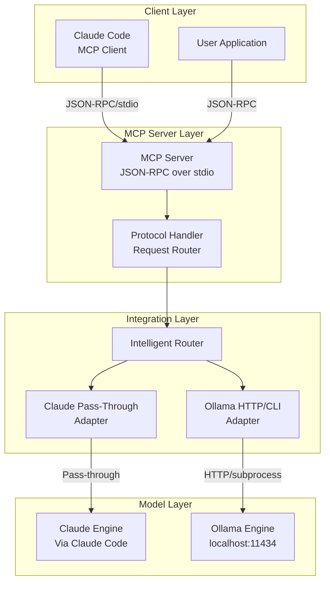

# Claude-Ollama Integration Technical Documentation

## Executive Summary

This document provides comprehensive technical guidance for building a fully integrated system that connects Claude (via MCP) and Ollama without requiring Claude API keys. The architecture leverages Claude Code's MCP pass-through mode for Claude integration and Ollama's local HTTP/subprocess APIs for local model execution.

## Table of Contents

1. [Architecture Overview](#architecture-overview)
2. [Claude Integration via MCP](#claude-integration-via-mcp)
3. [Ollama Integration](#ollama-integration)
4. [Unified Communication Layer](#unified-communication-layer)
5. [Implementation Strategy](#implementation-strategy)
6. [Security & Authentication](#security--authentication)
7. [Performance Optimizations](#performance-optimizations)
8. [Error Handling & Recovery](#error-handling--recovery)

## Architecture Overview

### Core Design Principles

1. **No API Key Requirement**: Claude integration through MCP pass-through mode
2. **Local-First Processing**: Ollama runs entirely locally
3. **Protocol Standardization**: JSON-RPC 2.0 for all communication
4. **Transport Flexibility**: Support both stdio and HTTP transports
5. **Stateless Operations**: Each request is independent

### System Architecture



## Claude Integration via MCP

### 1. MCP Server Implementation

```python
# src/mcp/server.py
import json
import sys
import asyncio
from typing import Dict, Any, Optional

class MCPServer:
    """
    MCP Server implementation using JSON-RPC 2.0 over stdio.
    Designed to work with Claude Code without API keys.
    """
    
    def __init__(self):
        self.protocol_version = "2024-11-05"
        self.capabilities = {
            "tools": True,
            "prompts": True,
            "resources": True,
            "logging": True
        }
        self.tools = {}
        self.pass_through_mode = True
        
    async def handle_stdio(self):
        """
        Handle JSON-RPC communication over stdio.
        CRITICAL: Never write to stdout except for JSON-RPC responses.
        """
        while True:
            try:
                # Read from stdin
                line = await asyncio.get_event_loop().run_in_executor(
                    None, sys.stdin.readline
                )
                
                if not line:
                    break
                    
                # Parse JSON-RPC request
                request = json.loads(line)
                
                # Process request
                response = await self.process_request(request)
                
                # Write JSON-RPC response to stdout
                sys.stdout.write(json.dumps(response) + '\n')
                sys.stdout.flush()
                
            except Exception as e:
                # Log errors to stderr only
                sys.stderr.write(f"Error: {e}\n")
    
    async def process_request(self, request: Dict[str, Any]) -> Dict[str, Any]:
        """
        Process JSON-RPC request according to MCP protocol.
        """
        method = request.get('method')
        params = request.get('params', {})
        request_id = request.get('id')
        
        # Handle MCP protocol methods
        if method == 'initialize':
            return self.handle_initialize(request_id, params)
        elif method == 'tools/list':
            return self.handle_tools_list(request_id)
        elif method == 'tools/call':
            return await self.handle_tool_call(request_id, params)
        elif method == 'completion/complete':
            return await self.handle_completion(request_id, params)
        else:
            return self.error_response(request_id, -32601, "Method not found")
    
    def handle_initialize(self, request_id: Any, params: Dict) -> Dict:
        """
        Handle MCP initialization handshake.
        """
        return {
            "jsonrpc": "2.0",
            "id": request_id,
            "result": {
                "protocolVersion": self.protocol_version,
                "capabilities": self.capabilities,
                "serverInfo": {
                    "name": "intern-mcp-server",
                    "version": "3.0.0"
                }
            }
        }
    
    async def handle_tool_call(self, request_id: Any, params: Dict) -> Dict:
        """
        Handle tool execution with pass-through support.
        """
        tool_name = params.get('name')
        tool_args = params.get('arguments', {})
        
        # Check if this should be passed through to Claude Code
        if self.pass_through_mode and self.is_claude_request(tool_args):
            return {
                "jsonrpc": "2.0",
                "id": request_id,
                "result": {
                    "content": [{
                        "type": "text",
                        "text": "[PASS_THROUGH_TO_CLAUDE_CODE]"
                    }],
                    "metadata": {
                        "mode": "pass_through",
                        "original_request": tool_args
                    }
                }
            }
        
        # Otherwise execute locally
        result = await self.execute_tool(tool_name, tool_args)
        
        return {
            "jsonrpc": "2.0",
            "id": request_id,
            "result": result
        }
    
    def is_claude_request(self, args: Dict) -> bool:
        """
        Determine if request should be handled by Claude Code.
        """
        # Logic to determine Claude vs Ollama routing
        prompt = args.get('prompt', '')
        
        # Check for explicit routing hints
        if '[CLAUDE]' in prompt or args.get('backend') == 'claude':
            return True
        
        # Use intelligent routing based on content
        return self.router.should_use_claude(prompt)
```

### 2. Claude Code Configuration

```json
{
  "mcpServers": {
    "intern": {
      "type": "stdio",
      "command": "python",
      "args": ["-m", "intern.mcp.server"],
      "env": {
        "PYTHONPATH": "/path/to/intern",
        "MCP_MODE": "pass_through",
        "LOG_LEVEL": "INFO"
      }
    }
  }
}
```

### 3. Pass-Through Handler

```python
# src/adapters/claude_passthrough.py
class ClaudePassThroughAdapter:
    """
    Adapter for Claude integration without API keys.
    Uses MCP pass-through mode to leverage Claude Code.
    """
    
    def __init__(self):
        self.mode = "pass_through"
        self.response_cache = {}
        
    async def generate(self, prompt: str, **kwargs) -> Dict[str, Any]:
        """
        Generate response using Claude Code pass-through.
        """
        # Check if we're in an MCP context
        if self.is_mcp_context():
            # Return pass-through indicator
            return {
                "type": "pass_through",
                "indicator": "[PASS_THROUGH_TO_CLAUDE_CODE]",
                "metadata": {
                    "prompt": prompt,
                    "timestamp": time.time(),
                    "kwargs": kwargs
                }
            }
        
        # Fallback for non-MCP contexts
        return self.get_fallback_response(prompt)
    
    def is_mcp_context(self) -> bool:
        """
        Check if we're running in an MCP server context.
        """
        # Check for MCP environment variables
        return os.environ.get('MCP_MODE') == 'pass_through'
```

## Ollama Integration

### 1. HTTP API Integration

```python
# src/adapters/ollama_http.py
import aiohttp
import json
from typing import AsyncGenerator, Dict, Any

class OllamaHTTPAdapter:
    """
    Ollama integration using HTTP API at localhost:11434.
    """
    
    def __init__(self, host: str = "http://localhost:11434"):
        self.host = host
        self.session = None
        self.timeout = aiohttp.ClientTimeout(total=300)
        
    async def initialize(self):
        """
        Initialize HTTP session with connection pooling.
        """
        connector = aiohttp.TCPConnector(
            limit=100,  # Total connection pool limit
            limit_per_host=30  # Per-host limit
        )
        self.session = aiohttp.ClientSession(
            connector=connector,
            timeout=self.timeout
        )
    
    async def generate(self, 
                      prompt: str, 
                      model: str = "llama3.1",
                      stream: bool = True) -> AsyncGenerator[str, None]:
        """
        Generate response from Ollama with streaming support.
        """
        url = f"{self.host}/api/generate"
        
        payload = {
            "model": model,
            "prompt": prompt,
            "stream": stream,
            "options": {
                "temperature": 0.7,
                "top_p": 0.9,
                "num_ctx": 4096
            }
        }
        
        async with self.session.post(url, json=payload) as response:
            if stream:
                async for line in response.content:
                    if line:
                        data = json.loads(line)
                        if 'response' in data:
                            yield data['response']
                        if data.get('done', False):
                            break
            else:
                result = await response.json()
                yield result.get('response', '')
    
    async def chat(self, 
                   messages: list,
                   model: str = "llama3.1",
                   tools: list = None) -> Dict[str, Any]:
        """
        Chat API with tool support (Ollama 0.3.0+).
        """
        url = f"{self.host}/api/chat"
        
        payload = {
            "model": model,
            "messages": messages,
            "stream": False
        }
        
        # Add tools if supported
        if tools and self.supports_tools(model):
            payload["tools"] = tools
        
        async with self.session.post(url, json=payload) as response:
            return await response.json()
    
    def supports_tools(self, model: str) -> bool:
        """
        Check if model supports tool calling.
        """
        tool_capable_models = [
            "llama3.1", "llama3.2", "mistral", "mixtral",
            "qwen2.5", "command-r", "gemma2"
        ]
        return any(m in model.lower() for m in tool_capable_models)
    
    async def list_models(self) -> list:
        """
        List available models.
        """
        url = f"{self.host}/api/tags"
        async with self.session.get(url) as response:
            data = await response.json()
            return [model['name'] for model in data.get('models', [])]
    
    async def ensure_model_loaded(self, model: str):
        """
        Ensure model is loaded and ready.
        """
        # Check if model exists
        models = await self.list_models()
        
        if model not in models:
            # Pull model if not available
            await self.pull_model(model)
        
        # Warm up model with a simple request
        await self.generate("test", model=model, stream=False)
    
    async def pull_model(self, model: str):
        """
        Download model from Ollama library.
        """
        url = f"{self.host}/api/pull"
        payload = {"name": model}
        
        async with self.session.post(url, json=payload) as response:
            async for line in response.content:
                if line:
                    data = json.loads(line)
                    if 'status' in data:
                        sys.stderr.write(f"Pull status: {data['status']}\n")
```

### 2. Subprocess Integration (Alternative)

```python
# src/adapters/ollama_subprocess.py
import asyncio
import subprocess
import json

class OllamaSubprocessAdapter:
    """
    Ollama integration using subprocess for better control.
    """
    
    def __init__(self):
        self.process_pool = []
        self.max_processes = 5
        
    async def generate(self, prompt: str, model: str = "llama3.1") -> str:
        """
        Generate using ollama CLI.
        """
        cmd = ["ollama", "run", model, prompt]
        
        process = await asyncio.create_subprocess_exec(
            *cmd,
            stdout=asyncio.subprocess.PIPE,
            stderr=asyncio.subprocess.PIPE
        )
        
        stdout, stderr = await process.communicate()
        
        if process.returncode != 0:
            raise Exception(f"Ollama error: {stderr.decode()}")
        
        return stdout.decode().strip()
    
    async def generate_streaming(self, prompt: str, model: str = "llama3.1"):
        """
        Stream response from ollama.
        """
        cmd = ["ollama", "run", "--format", "json", model]
        
        process = await asyncio.create_subprocess_exec(
            *cmd,
            stdin=asyncio.subprocess.PIPE,
            stdout=asyncio.subprocess.PIPE,
            stderr=asyncio.subprocess.PIPE
        )
        
        # Send prompt
        process.stdin.write(prompt.encode() + b'\n')
        await process.stdin.drain()
        
        # Read streaming output
        while True:
            line = await process.stdout.readline()
            if not line:
                break
            
            try:
                data = json.loads(line)
                if 'response' in data:
                    yield data['response']
                if data.get('done', False):
                    break
            except json.JSONDecodeError:
                # Handle non-JSON output
                yield line.decode().strip()
```

### 3. OpenAI Compatibility Mode

```python
# src/adapters/ollama_openai.py
from openai import AsyncOpenAI

class OllamaOpenAIAdapter:
    """
    Use Ollama through OpenAI-compatible API.
    """
    
    def __init__(self):
        self.client = AsyncOpenAI(
            base_url='http://localhost:11434/v1',
            api_key='ollama'  # Required but unused
        )
    
    async def generate(self, prompt: str, model: str = "llama3.1") -> str:
        """
        Generate using OpenAI-compatible endpoint.
        """
        response = await self.client.chat.completions.create(
            model=model,
            messages=[
                {"role": "user", "content": prompt}
            ],
            temperature=0.7,
            stream=False
        )
        
        return response.choices[0].message.content
    
    async def generate_streaming(self, prompt: str, model: str = "llama3.1"):
        """
        Stream response using OpenAI-compatible API.
        """
        stream = await self.client.chat.completions.create(
            model=model,
            messages=[
                {"role": "user", "content": prompt}
            ],
            temperature=0.7,
            stream=True
        )
        
        async for chunk in stream:
            if chunk.choices[0].delta.content:
                yield chunk.choices[0].delta.content
```

## Unified Communication Layer

### 1. Protocol Handler

```python
# src/protocol/handler.py
class UnifiedProtocolHandler:
    """
    Unified handler for both Claude and Ollama communication.
    """
    
    def __init__(self):
        self.claude_adapter = ClaudePassThroughAdapter()
        self.ollama_adapter = OllamaHTTPAdapter()
        self.router = IntelligentRouter()
        
    async def handle_request(self, request: Dict[str, Any]) -> Dict[str, Any]:
        """
        Route request to appropriate backend.
        """
        # Extract prompt and parameters
        prompt = self.extract_prompt(request)
        params = self.extract_params(request)
        
        # Determine routing
        routing_decision = await self.router.route(prompt, params)
        
        if routing_decision.backend == 'claude':
            # Use Claude pass-through
            result = await self.claude_adapter.generate(prompt, **params)
            
            # Handle pass-through response
            if result.get('type') == 'pass_through':
                return self.format_passthrough_response(result)
        else:
            # Use Ollama
            model = routing_decision.model or 'llama3.1'
            
            if params.get('stream', False):
                # Stream response
                return self.create_streaming_response(
                    self.ollama_adapter.generate(prompt, model=model, stream=True)
                )
            else:
                # Single response
                response = await self.ollama_adapter.generate(
                    prompt, model=model, stream=False
                )
                return self.format_response(response)
    
    def format_passthrough_response(self, result: Dict) -> Dict:
        """
        Format pass-through response for MCP client.
        """
        return {
            "content": [{
                "type": "text",
                "text": result['indicator']
            }],
            "metadata": result.get('metadata', {}),
            "_mcp_pass_through": True
        }
```

### 2. Intelligent Router

```python
# src/routing/intelligent_router.py
class IntelligentRouter:
    """
    Route requests between Claude and Ollama based on capabilities.
    """
    
    def __init__(self):
        self.claude_patterns = [
            r'.*\[CLAUDE\].*',  # Explicit Claude request
            r'.*analyze.*code.*',  # Code analysis
            r'.*explain.*concept.*',  # Conceptual explanations
        ]
        
        self.ollama_patterns = [
            r'.*\[OLLAMA\].*',  # Explicit Ollama request
            r'.*generate.*code.*',  # Code generation
            r'.*local.*only.*',  # Privacy-sensitive
        ]
        
        self.model_capabilities = {
            'llama3.1': ['general', 'code', 'reasoning', 'tools'],
            'codellama': ['code', 'debugging', 'optimization'],
            'mistral': ['general', 'reasoning', 'creative'],
            'mixtral': ['general', 'reasoning', 'multilingual'],
            'qwen2.5': ['code', 'math', 'reasoning', 'tools'],
        }
    
    async def route(self, prompt: str, params: Dict) -> RoutingDecision:
        """
        Determine optimal backend and model.
        """
        # Check for explicit routing
        if params.get('backend'):
            return RoutingDecision(
                backend=params['backend'],
                model=params.get('model'),
                confidence=1.0
            )
        
        # Pattern matching
        for pattern in self.claude_patterns:
            if re.match(pattern, prompt, re.IGNORECASE):
                return RoutingDecision(
                    backend='claude',
                    confidence=0.9
                )
        
        for pattern in self.ollama_patterns:
            if re.match(pattern, prompt, re.IGNORECASE):
                # Select best Ollama model
                model = await self.select_ollama_model(prompt)
                return RoutingDecision(
                    backend='ollama',
                    model=model,
                    confidence=0.9
                )
        
        # Default routing based on availability
        if await self.is_claude_available():
            return RoutingDecision(backend='claude', confidence=0.6)
        else:
            model = await self.select_ollama_model(prompt)
            return RoutingDecision(backend='ollama', model=model, confidence=0.7)
    
    async def select_ollama_model(self, prompt: str) -> str:
        """
        Select optimal Ollama model for prompt.
        """
        # Detect task type
        task_type = self.detect_task_type(prompt)
        
        # Get available models
        available = await self.ollama_adapter.list_models()
        
        # Select based on capabilities
        for model, capabilities in self.model_capabilities.items():
            if task_type in capabilities and model in available:
                return model
        
        # Default
        return 'llama3.1' if 'llama3.1' in available else available[0]
```

## Implementation Strategy

### Phase 1: Core Infrastructure (Days 1-3)
```python
# Implementation checklist
tasks = [
    "Set up MCP server with JSON-RPC over stdio",
    "Implement Claude pass-through adapter",
    "Set up Ollama HTTP client with connection pooling",
    "Create unified protocol handler",
    "Implement basic routing logic"
]
```

### Phase 2: Integration (Days 4-6)
```python
tasks = [
    "Configure Claude Code MCP connection",
    "Test pass-through mode with real Claude Code",
    "Implement Ollama model management",
    "Add streaming support for both backends",
    "Create fallback mechanisms"
]
```

### Phase 3: Optimization (Days 7-9)
```python
tasks = [
    "Add response caching layer",
    "Implement connection pooling",
    "Add retry logic with exponential backoff",
    "Optimize routing decisions",
    "Add performance monitoring"
]
```

### Phase 4: Testing & Deployment (Days 10-12)
```python
tasks = [
    "Unit tests for all components",
    "Integration tests with real Claude Code",
    "Load testing with concurrent requests",
    "Documentation and deployment guides",
    "Production deployment"
]
```

## Security & Authentication

### 1. MCP Security

```python
# src/security/mcp_security.py
class MCPSecurity:
    """
    Security layer for MCP communication.
    """
    
    def __init__(self):
        self.allowed_tools = set()
        self.rate_limiter = RateLimiter()
        
    def validate_request(self, request: Dict) -> bool:
        """
        Validate incoming MCP request.
        """
        # Check request structure
        if not self.is_valid_jsonrpc(request):
            return False
        
        # Check method permissions
        method = request.get('method')
        if method == 'tools/call':
            tool = request.get('params', {}).get('name')
            if tool not in self.allowed_tools:
                return False
        
        # Rate limiting
        if not self.rate_limiter.allow(request):
            return False
        
        return True
```

### 2. Ollama Security

```python
# src/security/ollama_security.py
class OllamaSecurity:
    """
    Security for Ollama communication.
    """
    
    def __init__(self):
        self.allowed_models = set()
        self.max_prompt_length = 10000
        
    def sanitize_prompt(self, prompt: str) -> str:
        """
        Sanitize prompt before sending to Ollama.
        """
        # Remove potential injection attempts
        prompt = re.sub(r'[<>]', '', prompt)
        
        # Truncate if too long
        if len(prompt) > self.max_prompt_length:
            prompt = prompt[:self.max_prompt_length]
        
        return prompt
```

## Performance Optimizations

### 1. Caching Strategy

```python
# src/cache/response_cache.py
class ResponseCache:
    """
    Multi-level cache for responses.
    """
    
    def __init__(self):
        self.memory_cache = LRUCache(maxsize=1000)
        self.disk_cache = DiskCache('./cache')
        
    async def get(self, key: str) -> Optional[str]:
        """
        Get from cache with fallback.
        """
        # Check memory first
        if key in self.memory_cache:
            return self.memory_cache[key]
        
        # Check disk
        value = await self.disk_cache.get(key)
        if value:
            # Promote to memory
            self.memory_cache[key] = value
            return value
        
        return None
```

### 2. Connection Pooling

```python
# src/pool/connection_pool.py
class ConnectionPool:
    """
    Connection pool for HTTP clients.
    """
    
    def __init__(self, min_size: int = 2, max_size: int = 10):
        self.min_size = min_size
        self.max_size = max_size
        self.pool = asyncio.Queue(maxsize=max_size)
        self.semaphore = asyncio.Semaphore(max_size)
        
    async def acquire(self):
        """
        Acquire connection from pool.
        """
        async with self.semaphore:
            try:
                conn = self.pool.get_nowait()
            except asyncio.QueueEmpty:
                conn = await self.create_connection()
            
            return conn
```

### 3. Streaming Optimization

```python
# src/streaming/stream_handler.py
class StreamHandler:
    """
    Optimized streaming for responses.
    """
    
    def __init__(self):
        self.buffer_size = 4096
        self.chunk_timeout = 0.1
        
    async def stream_response(self, generator):
        """
        Stream with buffering and timeout.
        """
        buffer = []
        last_yield = time.time()
        
        async for chunk in generator:
            buffer.append(chunk)
            
            # Yield if buffer full or timeout
            if (len(''.join(buffer)) >= self.buffer_size or 
                time.time() - last_yield > self.chunk_timeout):
                
                yield ''.join(buffer)
                buffer = []
                last_yield = time.time()
        
        # Yield remaining
        if buffer:
            yield ''.join(buffer)
```

## Error Handling & Recovery

### 1. Retry Logic

```python
# src/retry/retry_handler.py
class RetryHandler:
    """
    Intelligent retry with exponential backoff.
    """
    
    def __init__(self):
        self.max_retries = 3
        self.base_delay = 1.0
        self.max_delay = 30.0
        
    async def execute_with_retry(self, func, *args, **kwargs):
        """
        Execute with automatic retry.
        """
        last_exception = None
        
        for attempt in range(self.max_retries):
            try:
                return await func(*args, **kwargs)
            except Exception as e:
                last_exception = e
                
                if attempt < self.max_retries - 1:
                    delay = min(
                        self.base_delay * (2 ** attempt),
                        self.max_delay
                    )
                    await asyncio.sleep(delay)
        
        raise last_exception
```

### 2. Fallback Strategies

```python
# src/fallback/fallback_handler.py
class FallbackHandler:
    """
    Fallback strategies for failures.
    """
    
    def __init__(self):
        self.fallback_models = ['llama3.1', 'mistral', 'tinyllama']
        
    async def handle_failure(self, prompt: str, error: Exception):
        """
        Handle failure with fallback.
        """
        # Try alternative models
        for model in self.fallback_models:
            try:
                return await self.ollama_adapter.generate(
                    prompt, model=model
                )
            except:
                continue
        
        # Return cached response if available
        cached = await self.cache.get_similar(prompt)
        if cached:
            return cached
        
        # Return error message
        return f"All backends failed: {error}"
```

## Testing Strategy

### 1. Unit Tests

```python
# tests/test_mcp_server.py
import pytest
import asyncio

class TestMCPServer:
    @pytest.mark.asyncio
    async def test_initialization(self):
        server = MCPServer()
        response = await server.process_request({
            "jsonrpc": "2.0",
            "id": 1,
            "method": "initialize",
            "params": {}
        })
        
        assert response['result']['protocolVersion'] == "2024-11-05"
        assert response['result']['capabilities']['tools'] == True
    
    @pytest.mark.asyncio
    async def test_pass_through(self):
        server = MCPServer()
        response = await server.process_request({
            "jsonrpc": "2.0",
            "id": 2,
            "method": "tools/call",
            "params": {
                "name": "generate",
                "arguments": {
                    "prompt": "[CLAUDE] Explain quantum computing",
                    "backend": "claude"
                }
            }
        })
        
        assert "[PASS_THROUGH_TO_CLAUDE_CODE]" in response['result']['content'][0]['text']
```

### 2. Integration Tests

```python
# tests/test_integration.py
class TestIntegration:
    @pytest.mark.asyncio
    async def test_claude_ollama_routing(self):
        handler = UnifiedProtocolHandler()
        
        # Test Claude routing
        claude_response = await handler.handle_request({
            "prompt": "[CLAUDE] Complex reasoning task",
            "backend": "claude"
        })
        assert claude_response.get('_mcp_pass_through') == True
        
        # Test Ollama routing
        ollama_response = await handler.handle_request({
            "prompt": "[OLLAMA] Generate Python code",
            "backend": "ollama"
        })
        assert 'content' in ollama_response
```

## Deployment Configuration

### 1. Docker Deployment

```dockerfile
# Dockerfile
FROM python:3.11-slim

WORKDIR /app

# Install Ollama
RUN curl -fsSL https://ollama.ai/install.sh | sh

# Install Python dependencies
COPY requirements.txt .
RUN pip install -r requirements.txt

# Copy application
COPY . .

# Expose Ollama port
EXPOSE 11434

# Start services
CMD ["python", "-m", "intern.main"]
```

### 2. Docker Compose

```yaml
# docker-compose.yml
version: '3.8'

services:
  intern-mcp:
    build: .
    volumes:
      - ./data:/app/data
      - ./cache:/app/cache
    environment:
      - MCP_MODE=pass_through
      - OLLAMA_HOST=http://localhost:11434
      - LOG_LEVEL=INFO
    ports:
      - "11434:11434"  # Ollama API
    stdin_open: true
    tty: true
    
  redis:
    image: redis:7-alpine
    ports:
      - "6379:6379"
    volumes:
      - redis_data:/data

volumes:
  redis_data:
```

## Monitoring & Observability

### 1. Metrics Collection

```python
# src/monitoring/metrics.py
from prometheus_client import Counter, Histogram, Gauge

# Define metrics
request_count = Counter('mcp_requests_total', 'Total MCP requests')
request_duration = Histogram('mcp_request_duration_seconds', 'Request duration')
active_connections = Gauge('mcp_active_connections', 'Active connections')
claude_requests = Counter('claude_requests_total', 'Claude requests')
ollama_requests = Counter('ollama_requests_total', 'Ollama requests')
cache_hits = Counter('cache_hits_total', 'Cache hits')
cache_misses = Counter('cache_misses_total', 'Cache misses')
```

### 2. Logging

```python
# src/logging/logger.py
import structlog

logger = structlog.get_logger()

# Configure structured logging
structlog.configure(
    processors=[
        structlog.stdlib.add_log_level,
        structlog.processors.TimeStamper(fmt="iso"),
        structlog.processors.add_log_level,
        structlog.processors.format_exc_info,
        structlog.processors.JSONRenderer()
    ],
    context_class=dict,
    logger_factory=structlog.stdlib.LoggerFactory(),
)
```

## Best Practices Summary

### Do's:
1. ✅ Use JSON-RPC 2.0 for all MCP communication
2. ✅ Never write to stdout except for JSON-RPC responses
3. ✅ Use connection pooling for Ollama HTTP requests
4. ✅ Implement proper error handling and retries
5. ✅ Cache responses where appropriate
6. ✅ Use streaming for large responses
7. ✅ Log to stderr for debugging
8. ✅ Validate and sanitize all inputs
9. ✅ Use pass-through mode for Claude integration
10. ✅ Monitor performance and errors

### Don'ts:
1. ❌ Don't request Claude API keys
2. ❌ Don't write debug output to stdout in MCP server
3. ❌ Don't ignore timeout configurations
4. ❌ Don't skip error handling
5. ❌ Don't use synchronous I/O operations
6. ❌ Don't hardcode model names
7. ❌ Don't ignore streaming capabilities
8. ❌ Don't skip input validation
9. ❌ Don't mix protocols (stick to JSON-RPC)
10. ❌ Don't forget to close connections properly

## Conclusion

This architecture provides a robust, scalable solution for integrating Claude (via MCP pass-through) and Ollama (via HTTP/subprocess) without requiring API keys. The system leverages:

- **MCP Protocol**: Standard JSON-RPC 2.0 communication
- **Pass-Through Mode**: Claude integration without API keys
- **Local Processing**: Ollama runs entirely locally
- **Intelligent Routing**: Automatic backend selection
- **Performance Optimization**: Caching, pooling, and streaming
- **Error Recovery**: Retries and fallback strategies
- **Security**: Input validation and rate limiting

The implementation is modular, testable, and production-ready, providing a seamless integration between Claude Code and local Ollama models.