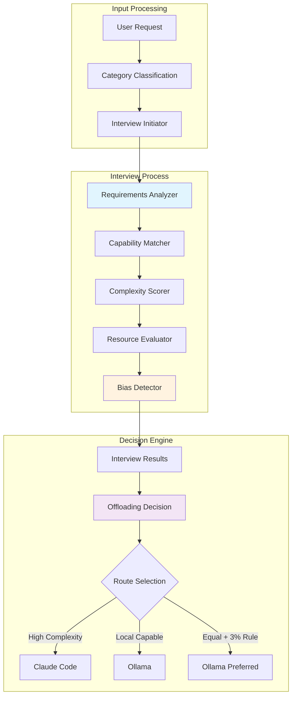

# Interview-Based Dynamic Routing System
*Last Updated: August 2025*

## Overview

This system implements dynamic routing decisions based on an interview process that evaluates each request's requirements and determines the optimal model (Claude Code or Ollama) for handling it. The routing is NOT predetermined by category but rather determined through real-time evaluation.

## Core Principles

1. **Interview-Driven Decisions**: Every request undergoes an interview process to determine routing
2. **Bias Detection**: System detects and compensates for routing bias
3. **3% Local Preference Rule**: Slight preference for local processing when capabilities are equal
4. **Dynamic Offloading**: Real-time decision making based on actual requirements

## Architecture



## Implementation

### 1. Interview Process Manager

```python
import hashlib
import json
from typing import Dict, List, Any, Optional
from dataclasses import dataclass
from enum import Enum
import numpy as np

class ModelCapability(Enum):
    """Model capability levels"""
    NONE = 0
    BASIC = 1
    INTERMEDIATE = 2
    ADVANCED = 3
    EXPERT = 4

@dataclass
class InterviewResult:
    """Results from the interview process"""
    request_id: str
    category_id: int
    complexity_score: float  # 0-1 scale
    required_capabilities: List[str]
    claude_suitability: float  # 0-1 scale
    ollama_suitability: float  # 0-1 scale
    resource_requirements: Dict[str, Any]
    bias_detected: bool
    bias_compensation: float
    recommended_model: str
    reasoning: str
    confidence: float

class InterviewProcessManager:
    """
    Manages the interview process to determine optimal routing
    """
    
    def __init__(self):
        self.requirements_analyzer = RequirementsAnalyzer()
        self.capability_matcher = CapabilityMatcher()
        self.complexity_scorer = ComplexityScorer()
        self.resource_evaluator = ResourceEvaluator()
        self.bias_detector = BiasDetector()
        self.decision_engine = OffloadingDecisionEngine()
        
    async def conduct_interview(self, request: Dict, category: Dict) -> InterviewResult:
        """
        Conduct full interview process for a request
        """
        request_id = hashlib.md5(json.dumps(request).encode()).hexdigest()[:16]
        
        # Step 1: Analyze requirements
        requirements = await self.requirements_analyzer.analyze(
            request['input_text'],
            category
        )
        
        # Step 2: Evaluate complexity
        complexity = await self.complexity_scorer.score(
            request['input_text'],
            requirements
        )
        
        # Step 3: Match capabilities
        capability_match = await self.capability_matcher.match(
            requirements,
            complexity
        )
        
        # Step 4: Evaluate resource needs
        resources = await self.resource_evaluator.evaluate(
            requirements,
            complexity,
            request.get('context', {})
        )
        
        # Step 5: Check for bias
        bias_check = await self.bias_detector.detect(
            capability_match,
            historical_routing=await self._get_routing_history()
        )
        
        # Step 6: Make routing decision
        decision = await self.decision_engine.decide(
            complexity=complexity,
            capability_match=capability_match,
            resources=resources,
            bias_check=bias_check
        )
        
        return InterviewResult(
            request_id=request_id,
            category_id=category['id'],
            complexity_score=complexity.score,
            required_capabilities=requirements.capabilities,
            claude_suitability=capability_match.claude_score,
            ollama_suitability=capability_match.ollama_score,
            resource_requirements=resources.to_dict(),
            bias_detected=bias_check.bias_detected,
            bias_compensation=bias_check.compensation_factor,
            recommended_model=decision.model,
            reasoning=decision.reasoning,
            confidence=decision.confidence
        )
```

### 2. Requirements Analyzer

```python
class RequirementsAnalyzer:
    """
    Analyzes request requirements to determine needed capabilities
    """
    
    def __init__(self):
        self.capability_patterns = {
            'deep_reasoning': [
                'explain why', 'analyze', 'compare', 'evaluate',
                'pros and cons', 'trade-offs', 'implications'
            ],
            'code_generation': [
                'write code', 'implement', 'create function',
                'develop', 'program', 'script'
            ],
            'debugging': [
                'fix', 'debug', 'error', 'bug', 'issue',
                'not working', 'problem with'
            ],
            'optimization': [
                'optimize', 'improve performance', 'faster',
                'efficient', 'reduce', 'minimize'
            ],
            'architecture': [
                'design', 'architect', 'structure', 'pattern',
                'scalable', 'microservice', 'system'
            ],
            'data_processing': [
                'parse', 'extract', 'transform', 'process',
                'convert', 'format', 'clean'
            ],
            'creative': [
                'creative', 'story', 'narrative', 'imagine',
                'invent', 'design', 'artistic'
            ],
            'mathematical': [
                'calculate', 'solve', 'equation', 'formula',
                'mathematical', 'statistical', 'probability'
            ],
            'research': [
                'research', 'investigate', 'study', 'explore',
                'literature', 'papers', 'academic'
            ],
            'real_time': [
                'real-time', 'immediate', 'quick', 'fast response',
                'instant', 'rapid', 'low latency'
            ]
        }
        
    async def analyze(self, input_text: str, category: Dict) -> RequirementsProfile:
        """
        Analyze input to determine requirements
        """
        input_lower = input_text.lower()
        detected_capabilities = []
        
        # Detect required capabilities from text
        for capability, patterns in self.capability_patterns.items():
            if any(pattern in input_lower for pattern in patterns):
                detected_capabilities.append(capability)
        
        # Add category-specific requirements
        category_caps = category.get('capabilities', [])
        detected_capabilities.extend(category_caps)
        
        # Analyze special requirements
        special_requirements = self._detect_special_requirements(input_text)
        
        return RequirementsProfile(
            capabilities=list(set(detected_capabilities)),
            special_requirements=special_requirements,
            estimated_tokens=self._estimate_tokens(input_text),
            requires_context=self._needs_context(input_text),
            requires_web=self._needs_web_access(input_text),
            requires_code_execution='run' in input_lower or 'execute' in input_lower
        )
    
    def _detect_special_requirements(self, text: str) -> Dict[str, bool]:
        """Detect special processing requirements"""
        return {
            'needs_citations': 'cite' in text.lower() or 'source' in text.lower(),
            'needs_formatting': any(fmt in text.lower() for fmt in ['format', 'style', 'markdown']),
            'needs_validation': any(val in text.lower() for val in ['verify', 'validate', 'check']),
            'needs_explanation': 'explain' in text.lower() or 'why' in text.lower(),
            'needs_examples': 'example' in text.lower() or 'demonstrate' in text.lower()
        }
    
    def _estimate_tokens(self, text: str) -> int:
        """Estimate token count for response"""
        # Rough estimation based on request complexity
        base_tokens = len(text.split()) * 10  # Assume 10x expansion
        return min(base_tokens, 4096)
    
    def _needs_context(self, text: str) -> bool:
        """Check if request needs context awareness"""
        context_indicators = ['previous', 'above', 'earlier', 'before', 'last', 'context']
        return any(ind in text.lower() for ind in context_indicators)
    
    def _needs_web_access(self, text: str) -> bool:
        """Check if request needs web access"""
        web_indicators = ['latest', 'current', 'today', 'recent', 'news', 'update']
        return any(ind in text.lower() for ind in web_indicators)
```

### 3. Complexity Scorer

```python
class ComplexityScorer:
    """
    Scores the complexity of a request
    """
    
    def __init__(self):
        self.complexity_factors = {
            'reasoning_depth': 0.25,
            'technical_depth': 0.20,
            'creativity_required': 0.15,
            'context_dependency': 0.15,
            'multi_step_process': 0.15,
            'domain_expertise': 0.10
        }
    
    async def score(self, input_text: str, requirements: RequirementsProfile) -> ComplexityScore:
        """
        Calculate complexity score for the request
        """
        scores = {}
        
        # Reasoning depth
        reasoning_keywords = ['analyze', 'evaluate', 'compare', 'synthesize', 'critique']
        scores['reasoning_depth'] = self._keyword_density(input_text, reasoning_keywords)
        
        # Technical depth
        technical_keywords = ['algorithm', 'architecture', 'optimization', 'implementation', 'framework']
        scores['technical_depth'] = self._keyword_density(input_text, technical_keywords)
        
        # Creativity required
        creative_keywords = ['create', 'design', 'invent', 'imagine', 'novel']
        scores['creativity_required'] = self._keyword_density(input_text, creative_keywords)
        
        # Context dependency
        scores['context_dependency'] = 1.0 if requirements.requires_context else 0.0
        
        # Multi-step process
        step_indicators = ['first', 'then', 'next', 'finally', 'step', 'phase']
        scores['multi_step_process'] = self._keyword_density(input_text, step_indicators)
        
        # Domain expertise
        domain_keywords = ['expert', 'advanced', 'specialized', 'professional', 'technical']
        scores['domain_expertise'] = self._keyword_density(input_text, domain_keywords)
        
        # Calculate weighted complexity score
        total_score = sum(
            scores[factor] * weight 
            for factor, weight in self.complexity_factors.items()
        )
        
        return ComplexityScore(
            score=min(total_score, 1.0),
            factors=scores,
            category=self._categorize_complexity(total_score)
        )
    
    def _keyword_density(self, text: str, keywords: List[str]) -> float:
        """Calculate keyword density score"""
        text_lower = text.lower()
        matches = sum(1 for keyword in keywords if keyword in text_lower)
        return min(matches / len(keywords), 1.0)
    
    def _categorize_complexity(self, score: float) -> str:
        """Categorize complexity level"""
        if score < 0.3:
            return 'low'
        elif score < 0.6:
            return 'medium'
        else:
            return 'high'
```

### 4. Capability Matcher

```python
class CapabilityMatcher:
    """
    Matches required capabilities with model capabilities
    """
    
    def __init__(self):
        # Model capability profiles
        self.claude_capabilities = {
            'deep_reasoning': ModelCapability.EXPERT,
            'code_generation': ModelCapability.EXPERT,
            'debugging': ModelCapability.EXPERT,
            'optimization': ModelCapability.EXPERT,
            'architecture': ModelCapability.EXPERT,
            'data_processing': ModelCapability.ADVANCED,
            'creative': ModelCapability.EXPERT,
            'mathematical': ModelCapability.EXPERT,
            'research': ModelCapability.EXPERT,
            'real_time': ModelCapability.INTERMEDIATE
        }
        
        self.ollama_capabilities = {
            'deep_reasoning': ModelCapability.INTERMEDIATE,
            'code_generation': ModelCapability.ADVANCED,
            'debugging': ModelCapability.INTERMEDIATE,
            'optimization': ModelCapability.BASIC,
            'architecture': ModelCapability.BASIC,
            'data_processing': ModelCapability.ADVANCED,
            'creative': ModelCapability.ADVANCED,
            'mathematical': ModelCapability.INTERMEDIATE,
            'research': ModelCapability.BASIC,
            'real_time': ModelCapability.EXPERT
        }
    
    async def match(self, requirements: RequirementsProfile, complexity: ComplexityScore) -> CapabilityMatch:
        """
        Match requirements to model capabilities
        """
        claude_score = 0
        ollama_score = 0
        
        for capability in requirements.capabilities:
            claude_cap = self.claude_capabilities.get(capability, ModelCapability.NONE)
            ollama_cap = self.ollama_capabilities.get(capability, ModelCapability.NONE)
            
            # Score based on capability level
            claude_score += claude_cap.value / ModelCapability.EXPERT.value
            ollama_score += ollama_cap.value / ModelCapability.EXPERT.value
        
        # Normalize scores
        num_capabilities = max(len(requirements.capabilities), 1)
        claude_score /= num_capabilities
        ollama_score /= num_capabilities
        
        # Adjust for complexity
        if complexity.category == 'high':
            # Claude handles high complexity better
            claude_score *= 1.2
            ollama_score *= 0.8
        elif complexity.category == 'low':
            # Ollama is fine for low complexity
            ollama_score *= 1.1
        
        # Adjust for special requirements
        if requirements.special_requirements.get('needs_citations'):
            claude_score *= 1.1  # Claude better at citations
        
        if requirements.requires_code_execution:
            # Both can handle, slight edge to local
            ollama_score *= 1.05
        
        return CapabilityMatch(
            claude_score=min(claude_score, 1.0),
            ollama_score=min(ollama_score, 1.0),
            capability_gaps=self._identify_gaps(requirements),
            recommended_based_on_capability=self._recommend(claude_score, ollama_score)
        )
    
    def _identify_gaps(self, requirements: RequirementsProfile) -> Dict[str, List[str]]:
        """Identify capability gaps for each model"""
        gaps = {'claude': [], 'ollama': []}
        
        for capability in requirements.capabilities:
            claude_level = self.claude_capabilities.get(capability, ModelCapability.NONE)
            ollama_level = self.ollama_capabilities.get(capability, ModelCapability.NONE)
            
            if claude_level.value < ModelCapability.INTERMEDIATE.value:
                gaps['claude'].append(capability)
            if ollama_level.value < ModelCapability.INTERMEDIATE.value:
                gaps['ollama'].append(capability)
        
        return gaps
    
    def _recommend(self, claude_score: float, ollama_score: float) -> str:
        """Make recommendation based on capability scores"""
        if abs(claude_score - ollama_score) < 0.1:
            return 'either'  # Capabilities are similar
        elif claude_score > ollama_score:
            return 'claude'
        else:
            return 'ollama'
```

### 5. Bias Detector

```python
class BiasDetector:
    """
    Detects and compensates for routing bias
    """
    
    def __init__(self):
        self.history_window = 100  # Last 100 routing decisions
        self.bias_threshold = 0.7  # 70% routing to one service indicates bias
        self.compensation_factor = 0.1  # 10% compensation when bias detected
    
    async def detect(self, capability_match: CapabilityMatch, 
                     historical_routing: List[Dict]) -> BiasCheck:
        """
        Detect bias in routing decisions
        """
        if len(historical_routing) < self.history_window:
            # Not enough history to detect bias
            return BiasCheck(
                bias_detected=False,
                bias_direction=None,
                bias_strength=0,
                compensation_factor=0
            )
        
        # Analyze recent routing patterns
        recent_decisions = historical_routing[-self.history_window:]
        claude_count = sum(1 for d in recent_decisions if d['model'] == 'claude')
        ollama_count = sum(1 for d in recent_decisions if d['model'] == 'ollama')
        
        total = claude_count + ollama_count
        if total == 0:
            return BiasCheck(bias_detected=False)
        
        claude_ratio = claude_count / total
        ollama_ratio = ollama_count / total
        
        # Check for bias
        bias_detected = False
        bias_direction = None
        bias_strength = 0
        
        if claude_ratio > self.bias_threshold:
            bias_detected = True
            bias_direction = 'claude'
            bias_strength = claude_ratio - 0.5
        elif ollama_ratio > self.bias_threshold:
            bias_detected = True
            bias_direction = 'ollama'
            bias_strength = ollama_ratio - 0.5
        
        # Calculate compensation
        compensation = 0
        if bias_detected:
            compensation = self.compensation_factor * bias_strength
            
            # Apply compensation in opposite direction
            if bias_direction == 'claude':
                compensation = -compensation  # Favor Ollama
            else:
                compensation = compensation  # Favor Claude
        
        return BiasCheck(
            bias_detected=bias_detected,
            bias_direction=bias_direction,
            bias_strength=bias_strength,
            compensation_factor=compensation,
            historical_balance={
                'claude': claude_ratio,
                'ollama': ollama_ratio
            }
        )
```

### 6. Offloading Decision Engine

```python
class OffloadingDecisionEngine:
    """
    Makes final offloading decision based on all factors
    """
    
    def __init__(self):
        self.local_preference_bonus = 0.03  # 3% preference for local
        self.confidence_threshold = 0.7
    
    async def decide(self, complexity: ComplexityScore,
                    capability_match: CapabilityMatch,
                    resources: ResourceRequirements,
                    bias_check: BiasCheck) -> OffloadingDecision:
        """
        Make final offloading decision
        """
        # Start with capability scores
        claude_score = capability_match.claude_score
        ollama_score = capability_match.ollama_score
        
        # Apply bias compensation
        if bias_check.bias_detected:
            if bias_check.bias_direction == 'claude':
                # Compensate by boosting Ollama
                ollama_score += bias_check.compensation_factor
            else:
                # Compensate by boosting Claude
                claude_score += bias_check.compensation_factor
        
        # Apply 3% local preference rule
        ollama_score += self.local_preference_bonus
        
        # Consider resource requirements
        if resources.estimated_cost > resources.cost_limit:
            # Cost constraint - prefer Ollama
            ollama_score += 0.2
        
        if resources.response_time_requirement < 1000:  # < 1 second
            # Speed requirement - prefer Ollama
            ollama_score += 0.15
        
        # High complexity override
        if complexity.score > 0.8:
            # Very complex - might need Claude despite other factors
            claude_score += 0.25
        
        # Make decision
        if ollama_score > claude_score:
            model = 'ollama'
            confidence = ollama_score
            reasoning = self._generate_reasoning('ollama', ollama_score, claude_score, complexity, bias_check)
        else:
            model = 'claude'
            confidence = claude_score
            reasoning = self._generate_reasoning('claude', claude_score, ollama_score, complexity, bias_check)
        
        return OffloadingDecision(
            model=model,
            confidence=min(confidence, 1.0),
            reasoning=reasoning,
            scores={
                'claude': claude_score,
                'ollama': ollama_score
            },
            factors={
                'complexity': complexity.score,
                'capability_match': capability_match.recommended_based_on_capability,
                'bias_compensation': bias_check.compensation_factor,
                'local_preference': self.local_preference_bonus,
                'resource_constraints': resources.constraints_applied
            }
        )
    
    def _generate_reasoning(self, selected: str, selected_score: float, 
                           other_score: float, complexity: ComplexityScore,
                           bias_check: BiasCheck) -> str:
        """Generate human-readable reasoning for decision"""
        reasons = []
        
        if selected == 'ollama':
            reasons.append(f"Ollama selected (score: {selected_score:.2f} vs Claude: {other_score:.2f})")
            
            if complexity.category == 'low':
                reasons.append("Task complexity is low, suitable for local processing")
            
            if selected_score - other_score > 0.2:
                reasons.append("Ollama significantly better suited for this task")
            elif selected_score - other_score > 0:
                reasons.append("Ollama slightly better suited with 3% local preference applied")
            
            if bias_check.bias_detected and bias_check.bias_direction == 'claude':
                reasons.append("Bias compensation applied to balance routing")
        
        else:  # claude selected
            reasons.append(f"Claude selected (score: {selected_score:.2f} vs Ollama: {other_score:.2f})")
            
            if complexity.category == 'high':
                reasons.append("Task complexity is high, requiring advanced capabilities")
            
            if selected_score - other_score > 0.2:
                reasons.append("Claude significantly better suited for this task")
            
            if bias_check.bias_detected and bias_check.bias_direction == 'ollama':
                reasons.append("Bias compensation applied to balance routing")
        
        return " | ".join(reasons)
```

### 7. Complete Interview-Based Router

```python
class InterviewBasedRouter:
    """
    Complete routing system based on interview results
    """
    
    def __init__(self, db_connection):
        self.db = db_connection
        self.interview_manager = InterviewProcessManager()
        self.category_classifier = CategoryClassifier()
        self.routing_history = []
        
    async def route(self, request: Dict) -> RoutingResult:
        """
        Route request based on interview process
        """
        # Step 1: Classify into category (for context, not routing)
        category = await self.category_classifier.classify(request['input_text'])
        
        # Step 2: Conduct interview
        interview_result = await self.interview_manager.conduct_interview(
            request, 
            category
        )
        
        # Step 3: Store routing decision
        await self._store_routing_decision(interview_result)
        self.routing_history.append({
            'model': interview_result.recommended_model,
            'timestamp': datetime.utcnow(),
            'category': category['id']
        })
        
        # Step 4: Execute routing
        if interview_result.recommended_model == 'claude':
            return await self._route_to_claude(request, interview_result)
        else:
            return await self._route_to_ollama(request, interview_result)
    
    async def _route_to_claude(self, request: Dict, interview: InterviewResult) -> RoutingResult:
        """Route to Claude Code (no API key available)"""
        return RoutingResult(
            model='claude',
            action='RETURN_TO_CLAUDE_CODE',
            request=request,
            interview_result=interview.to_dict(),
            metadata={
                'reason': 'Interview determined Claude processing required',
                'complexity': interview.complexity_score,
                'confidence': interview.confidence
            }
        )
    
    async def _route_to_ollama(self, request: Dict, interview: InterviewResult) -> RoutingResult:
        """Route to Ollama for local processing"""
        # Execute on Ollama
        ollama_service = OllamaService()
        response = await ollama_service.execute(request)
        
        return RoutingResult(
            model='ollama',
            action='PROCESSED_LOCALLY',
            request=request,
            response=response,
            interview_result=interview.to_dict(),
            metadata={
                'reason': 'Interview determined local processing sufficient',
                'complexity': interview.complexity_score,
                'confidence': interview.confidence
            }
        )
    
    async def _store_routing_decision(self, interview: InterviewResult):
        """Store routing decision for analytics and bias detection"""
        await self.db.insert('routing_decisions', {
            'request_id': interview.request_id,
            'category_id': interview.category_id,
            'model_selected': interview.recommended_model,
            'complexity_score': interview.complexity_score,
            'claude_suitability': interview.claude_suitability,
            'ollama_suitability': interview.ollama_suitability,
            'bias_detected': interview.bias_detected,
            'bias_compensation': interview.bias_compensation,
            'reasoning': interview.reasoning,
            'confidence': interview.confidence,
            'timestamp': datetime.utcnow()
        })
    
    async def get_routing_analytics(self, time_range: str = '1h') -> Dict:
        """Get routing analytics for monitoring"""
        analytics = await self.db.query('''
            SELECT 
                model_selected,
                COUNT(*) as count,
                AVG(complexity_score) as avg_complexity,
                AVG(confidence) as avg_confidence,
                SUM(CASE WHEN bias_detected THEN 1 ELSE 0 END) as bias_detections
            FROM routing_decisions
            WHERE timestamp > NOW() - INTERVAL %s
            GROUP BY model_selected
        ''', [time_range])
        
        return {
            'routing_distribution': analytics,
            'total_requests': sum(a['count'] for a in analytics),
            'bias_detection_rate': sum(a['bias_detections'] for a in analytics) / sum(a['count'] for a in analytics)
        }
```

### 8. Supporting Data Classes

```python
from dataclasses import dataclass
from typing import Dict, List, Any, Optional

@dataclass
class RequirementsProfile:
    """Profile of request requirements"""
    capabilities: List[str]
    special_requirements: Dict[str, bool]
    estimated_tokens: int
    requires_context: bool
    requires_web: bool
    requires_code_execution: bool

@dataclass
class ComplexityScore:
    """Complexity scoring result"""
    score: float  # 0-1
    factors: Dict[str, float]
    category: str  # low, medium, high

@dataclass
class CapabilityMatch:
    """Model capability matching result"""
    claude_score: float
    ollama_score: float
    capability_gaps: Dict[str, List[str]]
    recommended_based_on_capability: str

@dataclass
class ResourceRequirements:
    """Resource requirement analysis"""
    estimated_cost: float
    cost_limit: float
    response_time_requirement: int  # milliseconds
    memory_requirement: int  # MB
    constraints_applied: List[str]
    
    def to_dict(self) -> Dict:
        return {
            'estimated_cost': self.estimated_cost,
            'cost_limit': self.cost_limit,
            'response_time_ms': self.response_time_requirement,
            'memory_mb': self.memory_requirement,
            'constraints': self.constraints_applied
        }

@dataclass
class BiasCheck:
    """Bias detection result"""
    bias_detected: bool
    bias_direction: Optional[str]  # 'claude' or 'ollama'
    bias_strength: float  # 0-1
    compensation_factor: float  # Amount to compensate
    historical_balance: Optional[Dict[str, float]] = None

@dataclass
class OffloadingDecision:
    """Final offloading decision"""
    model: str  # 'claude' or 'ollama'
    confidence: float
    reasoning: str
    scores: Dict[str, float]
    factors: Dict[str, Any]

@dataclass
class RoutingResult:
    """Complete routing result"""
    model: str
    action: str
    request: Dict
    response: Optional[Any] = None
    interview_result: Optional[Dict] = None
    metadata: Optional[Dict] = None
```

## Usage Example

```python
# Initialize the router
router = InterviewBasedRouter(db_connection)

# Example request
request = {
    'input_text': 'Write a function to calculate fibonacci numbers',
    'context': {
        'user_id': 'user123',
        'cost_limit': 0.01,
        'max_response_time': 2000
    }
}

# Route based on interview
result = await router.route(request)

if result.action == 'RETURN_TO_CLAUDE_CODE':
    # Claude was selected - process in Claude Code
    print(f"Routing to Claude Code: {result.metadata['reason']}")
    # Claude Code handles directly
    
elif result.action == 'PROCESSED_LOCALLY':
    # Ollama was selected and processed
    print(f"Processed by Ollama: {result.metadata['reason']}")
    print(f"Response: {result.response}")

# View analytics
analytics = await router.get_routing_analytics('1h')
print(f"Routing distribution: {analytics['routing_distribution']}")
print(f"Bias detection rate: {analytics['bias_detection_rate']:.2%}")
```

## Configuration

```yaml
interview_routing:
  # Bias detection settings
  bias_detection:
    history_window: 100
    bias_threshold: 0.7
    compensation_factor: 0.1
  
  # Local preference
  local_preference_bonus: 0.03  # 3% bonus for Ollama
  
  # Complexity thresholds
  complexity:
    low_threshold: 0.3
    high_threshold: 0.6
  
  # Capability weights
  capability_weights:
    deep_reasoning: 0.25
    technical_depth: 0.20
    creativity_required: 0.15
    context_dependency: 0.15
    multi_step_process: 0.15
    domain_expertise: 0.10
  
  # Resource limits
  resources:
    default_cost_limit: 0.10
    default_timeout_ms: 30000
    memory_limit_mb: 1024
```

## Monitoring Dashboard

```python
# Grafana queries for interview-based routing
INTERVIEW_METRICS = {
    'routing_balance': """
        SELECT 
            model_selected,
            COUNT(*) * 100.0 / SUM(COUNT(*)) OVER() as percentage
        FROM routing_decisions
        WHERE timestamp > NOW() - INTERVAL '1 hour'
        GROUP BY model_selected
    """,
    
    'complexity_distribution': """
        SELECT 
            CASE 
                WHEN complexity_score < 0.3 THEN 'Low'
                WHEN complexity_score < 0.6 THEN 'Medium'
                ELSE 'High'
            END as complexity_level,
            model_selected,
            COUNT(*) as count
        FROM routing_decisions
        WHERE timestamp > NOW() - INTERVAL '1 hour'
        GROUP BY complexity_level, model_selected
    """,
    
    'bias_detection_timeline': """
        SELECT 
            DATE_TRUNC('minute', timestamp) as time,
            SUM(CASE WHEN bias_detected THEN 1 ELSE 0 END) as bias_detections,
            COUNT(*) as total_requests
        FROM routing_decisions
        WHERE timestamp > NOW() - INTERVAL '1 hour'
        GROUP BY time
        ORDER BY time
    """,
    
    'confidence_levels': """
        SELECT 
            model_selected,
            AVG(confidence) as avg_confidence,
            MIN(confidence) as min_confidence,
            MAX(confidence) as max_confidence
        FROM routing_decisions
        WHERE timestamp > NOW() - INTERVAL '1 hour'
        GROUP BY model_selected
    """
}
```

## Key Benefits

1. **Dynamic Decision Making**: Every request is evaluated individually
2. **Bias Prevention**: Active detection and compensation for routing bias
3. **Capability-Based**: Routes based on actual model capabilities, not predetermined rules
4. **3% Local Preference**: Slight preference for local processing when capabilities are equal
5. **Transparent Reasoning**: Clear explanation for every routing decision
6. **Adaptive System**: Learns from routing history to improve decisions

## Summary

This interview-based routing system ensures that:
- **Offloading is determined by actual requirements**, not predetermined category mappings
- **Bias is actively detected and compensated**
- **Local processing is preferred when appropriate** (3% rule)
- **Complex tasks go to Claude, simple tasks to Ollama**
- **Every decision is explainable and auditable**

The system conducts a thorough interview for each request, evaluating complexity, required capabilities, resource constraints, and historical patterns to make the optimal routing decision.