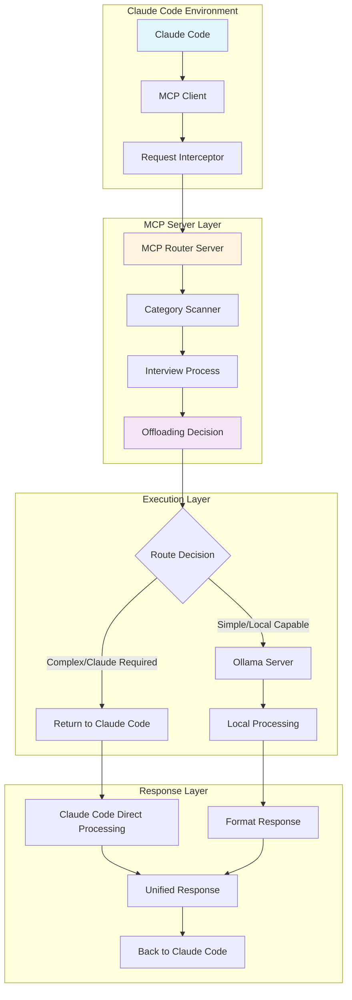

# MCP Integration: Claude Code with Interview-Based Routing
*Last Updated: August 2025*

## Overview

This document describes how the Interview-Based Routing System integrates with Claude Code using MCP (Model Context Protocol) as an API alternative. The system scans and identifies categories from Claude Code input to make intelligent offloading decisions.

## Architecture



## Implementation

### 1. MCP Server for Routing

```python
import asyncio
import json
from typing import Dict, List, Any, Optional
from dataclasses import dataclass
import uvloop
from mcp.server import Server
from mcp.server.stdio import stdio_server
from mcp.types import Tool, TextContent, Resource

# Import our routing system
from interview_router import InterviewBasedRouter
from category_classifier import CategoryClassifier

class MCPRouterServer:
    """
    MCP Server that provides routing capabilities to Claude Code
    """
    
    def __init__(self):
        self.server = Server("claude-router-mcp")
        self.router = InterviewBasedRouter(db_connection)
        self.category_scanner = CategoryScanner()
        self.active_sessions = {}
        
        # Register MCP tools
        self._register_tools()
        
    def _register_tools(self):
        """Register MCP tools for Claude Code to use"""
        
        @self.server.tool()
        async def analyze_and_route(input_text: str, context: Dict = None) -> str:
            """
            Analyze input from Claude Code and determine routing
            
            Args:
                input_text: The user's request from Claude Code
                context: Additional context (user_id, preferences, etc.)
            
            Returns:
                Routing decision with offloading recommendation
            """
            # Step 1: Scan and categorize input
            category_result = await self.category_scanner.scan_claude_input(input_text)
            
            # Step 2: Conduct interview for offloading decision
            interview_result = await self.router.interview_manager.conduct_interview(
                {'input_text': input_text, 'context': context or {}},
                category_result.category
            )
            
            # Step 3: Make routing decision
            if interview_result.recommended_model == 'ollama':
                # Can be offloaded to Ollama
                response = await self._offload_to_ollama(input_text, interview_result)
                return json.dumps({
                    'action': 'OFFLOADED',
                    'model': 'ollama',
                    'response': response,
                    'category': category_result.category['name'],
                    'confidence': interview_result.confidence,
                    'reasoning': interview_result.reasoning
                })
            else:
                # Should be handled by Claude Code
                return json.dumps({
                    'action': 'CLAUDE_REQUIRED',
                    'model': 'claude',
                    'category': category_result.category['name'],
                    'confidence': interview_result.confidence,
                    'reasoning': interview_result.reasoning,
                    'instruction': 'Process directly in Claude Code'
                })
        
        @self.server.tool()
        async def scan_categories(input_text: str) -> str:
            """
            Scan input and identify all applicable categories
            
            Args:
                input_text: The input to categorize
            
            Returns:
                List of identified categories with confidence scores
            """
            result = await self.category_scanner.scan_claude_input(input_text)
            return json.dumps({
                'primary_category': result.category,
                'all_categories': result.all_matches,
                'confidence_scores': result.confidence_scores,
                'identified_intents': result.intents
            })
        
        @self.server.tool()
        async def check_offloading_capability(category: str) -> str:
            """
            Check if a specific category can be offloaded
            
            Args:
                category: Category name to check
            
            Returns:
                Offloading capability assessment
            """
            capability = await self._assess_category_offloading(category)
            return json.dumps(capability)
        
        @self.server.tool()
        async def batch_analyze(requests: List[Dict]) -> str:
            """
            Analyze multiple requests for batch processing
            
            Args:
                requests: List of requests to analyze
            
            Returns:
                Batch routing decisions
            """
            results = []
            for request in requests:
                category_result = await self.category_scanner.scan_claude_input(
                    request.get('input_text', '')
                )
                interview_result = await self.router.interview_manager.conduct_interview(
                    request,
                    category_result.category
                )
                results.append({
                    'request_id': request.get('id'),
                    'category': category_result.category['name'],
                    'recommended_model': interview_result.recommended_model,
                    'can_offload': interview_result.recommended_model == 'ollama',
                    'confidence': interview_result.confidence
                })
            
            return json.dumps({
                'batch_results': results,
                'summary': {
                    'total': len(results),
                    'offloadable': sum(1 for r in results if r['can_offload']),
                    'claude_required': sum(1 for r in results if not r['can_offload'])
                }
            })
        
        @self.server.tool()
        async def get_routing_stats() -> str:
            """
            Get current routing statistics
            
            Returns:
                Routing statistics and performance metrics
            """
            stats = await self.router.get_routing_analytics('1h')
            return json.dumps(stats)
    
    async def _offload_to_ollama(self, input_text: str, interview_result) -> str:
        """Execute request on Ollama"""
        ollama_service = OllamaService()
        response = await ollama_service.execute({
            'prompt': input_text,
            'max_tokens': 2048,
            'temperature': 0.7
        })
        return response.content
    
    async def _assess_category_offloading(self, category: str) -> Dict:
        """Assess if a category can be offloaded"""
        # Get category capabilities
        category_info = CATEGORIES.get(category, {})
        
        # Check against Ollama capabilities
        ollama_capable = self._check_ollama_capability(category_info)
        
        return {
            'category': category,
            'can_offload': ollama_capable,
            'complexity': category_info.get('complexity', 'unknown'),
            'required_capabilities': category_info.get('capabilities', []),
            'recommendation': 'offload' if ollama_capable else 'keep_in_claude'
        }
    
    def _check_ollama_capability(self, category_info: Dict) -> bool:
        """Check if Ollama can handle this category"""
        complexity = category_info.get('complexity', 'high')
        if complexity == 'high':
            return False
        
        required_caps = category_info.get('capabilities', [])
        advanced_caps = ['architecture', 'optimization', 'debugging', 'security_analysis']
        
        if any(cap in advanced_caps for cap in required_caps):
            return False
        
        return True
    
    async def run(self):
        """Run the MCP server"""
        async with stdio_server() as (read_stream, write_stream):
            await self.server.run(read_stream, write_stream)
```

### 2. Category Scanner for Claude Code Input

```python
class CategoryScanner:
    """
    Scans and categorizes input from Claude Code
    """
    
    def __init__(self):
        self.categories = self._load_categories()
        self.pattern_matcher = PatternMatcher()
        self.intent_detector = IntentDetector()
        
    async def scan_claude_input(self, input_text: str) -> CategoryScanResult:
        """
        Comprehensive scanning of Claude Code input
        """
        # Extract features from input
        features = await self._extract_features(input_text)
        
        # Detect intents
        intents = await self.intent_detector.detect(input_text)
        
        # Match against all 76 categories
        category_matches = await self._match_categories(features, intents)
        
        # Sort by confidence
        sorted_matches = sorted(
            category_matches.items(), 
            key=lambda x: x[1]['confidence'], 
            reverse=True
        )
        
        # Get primary category
        primary_category = self.categories[sorted_matches[0][0]]
        
        return CategoryScanResult(
            category=primary_category,
            all_matches=[{
                'id': cat_id,
                'name': self.categories[cat_id]['name'],
                'confidence': match['confidence']
            } for cat_id, match in sorted_matches[:5]],
            confidence_scores={cat_id: match['confidence'] 
                             for cat_id, match in category_matches.items()},
            intents=intents,
            features=features
        )
    
    async def _extract_features(self, input_text: str) -> Dict:
        """Extract features for categorization"""
        features = {
            'keywords': self._extract_keywords(input_text),
            'code_indicators': self._detect_code_patterns(input_text),
            'complexity_indicators': self._detect_complexity(input_text),
            'domain_indicators': self._detect_domain(input_text),
            'action_verbs': self._extract_action_verbs(input_text),
            'technical_terms': self._extract_technical_terms(input_text)
        }
        return features
    
    async def _match_categories(self, features: Dict, intents: List[str]) -> Dict:
        """Match features against all categories"""
        matches = {}
        
        for cat_id, category in self.categories.items():
            score = 0
            
            # Match keywords
            category_keywords = category.get('keywords', [])
            keyword_match = self._calculate_keyword_match(
                features['keywords'], 
                category_keywords
            )
            score += keyword_match * 0.3
            
            # Match capabilities
            required_caps = category.get('capabilities', [])
            capability_match = self._calculate_capability_match(
                features, 
                required_caps
            )
            score += capability_match * 0.3
            
            # Match intents
            intent_match = self._calculate_intent_match(
                intents, 
                category.get('typical_intents', [])
            )
            score += intent_match * 0.2
            
            # Match complexity
            complexity_match = self._calculate_complexity_match(
                features['complexity_indicators'],
                category.get('complexity', 'medium')
            )
            score += complexity_match * 0.2
            
            matches[cat_id] = {
                'confidence': min(score, 1.0),
                'matched_features': {
                    'keywords': keyword_match,
                    'capabilities': capability_match,
                    'intents': intent_match,
                    'complexity': complexity_match
                }
            }
        
        return matches
    
    def _extract_keywords(self, text: str) -> List[str]:
        """Extract relevant keywords from text"""
        # Common programming and task keywords
        keywords = []
        text_lower = text.lower()
        
        keyword_patterns = [
            'function', 'class', 'api', 'database', 'algorithm',
            'optimize', 'debug', 'implement', 'create', 'build',
            'analyze', 'design', 'refactor', 'test', 'deploy',
            'data', 'model', 'train', 'predict', 'visualize',
            'security', 'encrypt', 'authenticate', 'validate',
            'performance', 'scale', 'architecture', 'pattern'
        ]
        
        for pattern in keyword_patterns:
            if pattern in text_lower:
                keywords.append(pattern)
        
        return keywords
    
    def _detect_code_patterns(self, text: str) -> Dict:
        """Detect code-related patterns"""
        patterns = {
            'has_code_blocks': '```' in text or '    ' in text,
            'mentions_language': any(lang in text.lower() for lang in 
                                    ['python', 'javascript', 'java', 'c++', 'rust']),
            'has_function_syntax': 'def ' in text or 'function' in text or 'fn ' in text,
            'has_class_syntax': 'class ' in text,
            'has_import_statements': 'import ' in text or 'require' in text,
            'has_variables': any(op in text for op in ['=', ':=', 'let ', 'const ', 'var '])
        }
        return patterns
    
    def _detect_complexity(self, text: str) -> Dict:
        """Detect complexity indicators"""
        indicators = {
            'multi_step': any(step in text.lower() for step in 
                            ['step 1', 'first', 'then', 'finally', 'next']),
            'advanced_concepts': any(concept in text.lower() for concept in
                                   ['microservice', 'distributed', 'concurrent', 
                                    'parallel', 'async', 'thread']),
            'optimization_required': any(opt in text.lower() for opt in
                                       ['optimize', 'performance', 'efficient', 
                                        'fast', 'speed up']),
            'large_scale': any(scale in text.lower() for scale in
                             ['scale', 'million', 'billion', 'large', 'massive']),
            'integration': any(integ in text.lower() for integ in
                             ['integrate', 'connect', 'api', 'webhook', 'service'])
        }
        return indicators
    
    def _detect_domain(self, text: str) -> str:
        """Detect the primary domain"""
        domains = {
            'web': ['web', 'http', 'rest', 'api', 'frontend', 'backend'],
            'data': ['data', 'analysis', 'pandas', 'numpy', 'dataset'],
            'ml': ['machine learning', 'model', 'train', 'predict', 'neural'],
            'system': ['system', 'os', 'file', 'process', 'memory'],
            'security': ['security', 'encrypt', 'auth', 'token', 'password'],
            'database': ['database', 'sql', 'query', 'table', 'schema']
        }
        
        text_lower = text.lower()
        domain_scores = {}
        
        for domain, keywords in domains.items():
            score = sum(1 for kw in keywords if kw in text_lower)
            domain_scores[domain] = score
        
        if domain_scores:
            return max(domain_scores, key=domain_scores.get)
        return 'general'
```

### 3. Claude Code Client Integration

```python
class ClaudeCodeMCPClient:
    """
    MCP client for Claude Code to communicate with the router
    """
    
    def __init__(self):
        self.mcp_connection = None
        self.router_available = False
        
    async def connect(self):
        """Connect to the MCP Router Server"""
        try:
            # Connect to MCP server
            self.mcp_connection = await self._establish_mcp_connection()
            self.router_available = True
            print("Connected to MCP Router Server")
        except Exception as e:
            print(f"Failed to connect to MCP Router: {e}")
            self.router_available = False
    
    async def process_request(self, user_input: str, context: Dict = None) -> Dict:
        """
        Process a request through the MCP router
        """
        if not self.router_available:
            # Fallback to direct Claude Code processing
            return {
                'action': 'DIRECT_PROCESSING',
                'reason': 'MCP Router not available',
                'process_locally': True
            }
        
        try:
            # Call the MCP tool
            result = await self.mcp_connection.call_tool(
                'analyze_and_route',
                {
                    'input_text': user_input,
                    'context': context or {}
                }
            )
            
            # Parse the result
            routing_decision = json.loads(result)
            
            if routing_decision['action'] == 'OFFLOADED':
                # Request was handled by Ollama
                return {
                    'action': 'OFFLOADED',
                    'response': routing_decision['response'],
                    'model': 'ollama',
                    'category': routing_decision['category'],
                    'show_to_user': True
                }
            else:
                # Request needs Claude Code processing
                return {
                    'action': 'PROCESS_IN_CLAUDE',
                    'category': routing_decision['category'],
                    'reasoning': routing_decision['reasoning'],
                    'process_locally': True
                }
                
        except Exception as e:
            print(f"Error processing through MCP: {e}")
            return {
                'action': 'FALLBACK',
                'error': str(e),
                'process_locally': True
            }
    
    async def batch_analyze(self, requests: List[Dict]) -> Dict:
        """Analyze multiple requests for batch processing"""
        if not self.router_available:
            return {'error': 'MCP Router not available'}
        
        result = await self.mcp_connection.call_tool(
            'batch_analyze',
            {'requests': requests}
        )
        
        return json.loads(result)
    
    async def _establish_mcp_connection(self):
        """Establish connection to MCP server"""
        # This would use the actual MCP client library
        # For now, showing the interface
        from mcp.client import Client
        
        client = Client()
        await client.connect("localhost", 5000)  # MCP server address
        return client
```

### 4. Integration Flow

```python
class ClaudeCodeIntegration:
    """
    Complete integration between Claude Code and the routing system
    """
    
    def __init__(self):
        self.mcp_client = ClaudeCodeMCPClient()
        self.local_processor = ClaudeCodeProcessor()
        self.response_formatter = ResponseFormatter()
        
    async def initialize(self):
        """Initialize the integration"""
        await self.mcp_client.connect()
        
    async def handle_user_input(self, user_input: str, session_context: Dict) -> str:
        """
        Main entry point for handling user input in Claude Code
        """
        # Step 1: Attempt to route through MCP
        routing_result = await self.mcp_client.process_request(
            user_input,
            session_context
        )
        
        # Step 2: Handle based on routing decision
        if routing_result['action'] == 'OFFLOADED':
            # Ollama handled it
            response = routing_result['response']
            
            # Format to appear native to Claude Code
            formatted_response = self.response_formatter.format(
                response,
                source='ollama',
                category=routing_result.get('category')
            )
            
            return formatted_response
            
        elif routing_result['action'] in ['PROCESS_IN_CLAUDE', 'DIRECT_PROCESSING', 'FALLBACK']:
            # Process directly in Claude Code
            response = await self.local_processor.process(user_input)
            
            # Track for bias detection
            if routing_result.get('category'):
                await self._track_routing_decision('claude', routing_result['category'])
            
            return response
        
        else:
            # Unknown action - process locally as fallback
            return await self.local_processor.process(user_input)
    
    async def _track_routing_decision(self, model: str, category: str):
        """Track routing decision for bias detection"""
        # This would send metrics back to the MCP server
        try:
            await self.mcp_client.mcp_connection.call_tool(
                'track_decision',
                {
                    'model': model,
                    'category': category,
                    'timestamp': datetime.utcnow().isoformat()
                }
            )
        except:
            pass  # Silent fail for tracking
```

### 5. MCP Server Configuration

```yaml
# mcp_router_config.yaml
server:
  name: "claude-router-mcp"
  version: "1.0.0"
  host: "localhost"
  port: 5000
  
tools:
  - name: "analyze_and_route"
    description: "Analyze input and determine routing"
    parameters:
      input_text:
        type: string
        required: true
      context:
        type: object
        required: false
        
  - name: "scan_categories"
    description: "Scan and identify categories"
    parameters:
      input_text:
        type: string
        required: true
        
  - name: "check_offloading_capability"
    description: "Check if category can be offloaded"
    parameters:
      category:
        type: string
        required: true
        
  - name: "batch_analyze"
    description: "Analyze multiple requests"
    parameters:
      requests:
        type: array
        required: true
        
  - name: "get_routing_stats"
    description: "Get routing statistics"
    parameters: {}

routing:
  interview_enabled: true
  bias_detection: true
  local_preference: 0.03
  
  category_offloading:
    # Categories that can typically be offloaded
    offloadable:
      - code_generation_simple
      - data_analysis_simple
      - translation
      - summarization
      - question_answering
      - creative_writing
      - data_visualization
      - api_integration
      - deployment_config
      
    # Categories that should stay in Claude
    claude_only:
      - code_generation_complex
      - bug_fixing
      - code_review
      - system_architecture
      - security_analysis
      - research_analysis
      - legal_document
      - medical_information
      - financial_analysis

ollama:
  endpoint: "http://localhost:11434"
  model: "llama3.2"
  timeout: 10000
  max_concurrent: 5

monitoring:
  track_all_decisions: true
  bias_check_interval: 100  # Check bias every 100 requests
  metrics_retention: "7d"
```

### 6. Usage Example in Claude Code

```python
# Example: How Claude Code would use this integration

async def claude_code_main():
    """
    Main Claude Code execution with MCP routing
    """
    # Initialize integration
    integration = ClaudeCodeIntegration()
    await integration.initialize()
    
    # User inputs
    user_requests = [
        "Write a simple function to reverse a string",  # Should offload to Ollama
        "Design a microservices architecture for an e-commerce platform",  # Should stay in Claude
        "Translate this text to Spanish: Hello world",  # Should offload to Ollama
        "Debug this complex race condition in my concurrent code",  # Should stay in Claude
        "Format this JSON data",  # Should offload to Ollama
    ]
    
    for request in user_requests:
        print(f"\nProcessing: {request[:50]}...")
        
        # Process through integration
        response = await integration.handle_user_input(
            request,
            {'user_id': 'test_user', 'session_id': 'abc123'}
        )
        
        print(f"Response source: {response.metadata.get('source', 'unknown')}")
        print(f"Response: {response.content[:200]}...")

# Run the example
asyncio.run(claude_code_main())
```

### 7. Startup Script

```bash
#!/bin/bash
# start_mcp_router.sh

# Start the MCP Router Server
echo "Starting MCP Router Server..."
python -m mcp_router_server &
MCP_PID=$!

# Wait for server to be ready
sleep 2

# Start Ollama if not running
if ! pgrep -x "ollama" > /dev/null; then
    echo "Starting Ollama..."
    ollama serve &
    OLLAMA_PID=$!
fi

# Register with Claude Code
echo "Registering MCP server with Claude Code..."
cat > ~/.config/claude-code/mcp_servers.json << EOF
{
  "servers": {
    "router": {
      "command": "python",
      "args": ["-m", "mcp_router_server"],
      "env": {
        "PYTHONPATH": "/path/to/router"
      }
    }
  }
}
EOF

echo "MCP Router System Ready"
echo "MCP Server PID: $MCP_PID"
echo "Ollama PID: $OLLAMA_PID"

# Keep running
wait $MCP_PID
```

## Key Integration Features

1. **Seamless Claude Code Integration**: Works as an MCP server that Claude Code can connect to
2. **Automatic Category Scanning**: Identifies all 76 categories from Claude Code input
3. **Intelligent Offloading**: Determines what can be handled by Ollama vs what needs Claude
4. **Transparent Responses**: Formats Ollama responses to appear native to Claude Code
5. **Bias Detection**: Tracks all routing decisions for bias analysis
6. **Batch Processing**: Can analyze multiple requests for efficient batch operations
7. **Fallback Handling**: Gracefully falls back to Claude Code if MCP server is unavailable

## Benefits

- **No API Keys Required**: Uses MCP as the communication protocol instead of API calls
- **Real-time Categorization**: Scans every input to identify appropriate handling
- **Dynamic Offloading**: Makes intelligent decisions about what to offload
- **Performance Optimization**: Offloads simple tasks to Ollama for faster response
- **Cost Savings**: Reduces load on Claude by handling appropriate tasks locally
- **Complete Transparency**: Users see responses as if from Claude directly