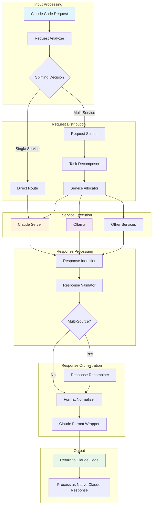

# Response Orchestration Framework: Multi-Source AI Response Management
*Last Updated: August 2025*

## Table of Contents
1. [Overview](#overview)
2. [Architecture](#architecture)
3. [Response Identification System](#response-identification-system)
4. [Request Splitting Strategy](#request-splitting-strategy)
5. [Response Recombination Engine](#response-recombination-engine)
6. [Claude Code Passthrough](#claude-code-passthrough)
7. [Implementation Guide](#implementation-guide)
8. [API Compatibility Layer](#api-compatibility-layer)
9. [Performance Optimization](#performance-optimization)
10. [Error Handling & Recovery](#error-handling--recovery)

---

## Overview

This framework orchestrates responses from multiple AI services (Claude server, Ollama, others) and provides intelligent response handling including:

- **Response Identification**: Tracking and identifying source of each response
- **Request Splitting**: Dividing complex requests across multiple services
- **Response Recombination**: Merging multi-source responses intelligently
- **Claude Code Passthrough**: Seamless integration with Claude Code as if responses came directly from Claude server

### Key Features
- Transparent multi-source response handling
- Intelligent request decomposition
- Response format normalization
- Source attribution tracking
- Seamless Claude Code integration
- Fallback and retry mechanisms

---

## Architecture

### System Flow Diagram



### Component Architecture

```
┌─────────────────────────────────────────────────────────────────┐
│                      RESPONSE ORCHESTRATOR                       │
├─────────────────────────────────────────────────────────────────┤
│                                                                   │
│  ┌──────────────────────────────────────────────────────────┐   │
│  │                  REQUEST PROCESSOR                        │   │
│  ├──────────────────────────────────────────────────────────┤   │
│  │                                                           │   │
│  │  ┌─────────────┐  ┌─────────────┐  ┌─────────────┐     │   │
│  │  │   Analyzer  │→ │  Splitter   │→ │ Distributor │     │   │
│  │  └─────────────┘  └─────────────┘  └─────────────┘     │   │
│  │                                                           │   │
│  └──────────────────────────────────────────────────────────┘   │
│                                                                   │
│  ┌──────────────────────────────────────────────────────────┐   │
│  │                  RESPONSE HANDLER                         │   │
│  ├──────────────────────────────────────────────────────────┤   │
│  │                                                           │   │
│  │  ┌─────────────┐  ┌─────────────┐  ┌─────────────┐     │   │
│  │  │ Identifier  │→ │  Validator  │→ │ Recombiner  │     │   │
│  │  └─────────────┘  └─────────────┘  └─────────────┘     │   │
│  │                                                           │   │
│  │  ┌─────────────────────────────────────────────────┐     │   │
│  │  │           Claude Format Wrapper                  │     │   │
│  │  └─────────────────────────────────────────────────┘     │   │
│  │                                                           │   │
│  └──────────────────────────────────────────────────────────┘   │
│                                                                   │
└─────────────────────────────────────────────────────────────────┘
```

---

## Response Identification System

### Response Metadata Structure

```python
class ResponseMetadata:
    """
    Metadata attached to every response for source tracking
    """
    def __init__(self):
        self.response_id = str(uuid.uuid4())
        self.source_service = None  # 'claude-api', 'ollama', etc.
        self.request_id = None
        self.parent_request_id = None  # For split requests
        self.timestamp = datetime.utcnow()
        self.processing_time_ms = 0
        self.token_count = 0
        self.model_used = None
        self.is_partial = False  # True if part of split request
        self.part_index = None  # Position in split sequence
        self.total_parts = None  # Total parts in split
        self.combination_strategy = None  # How to recombine
        self.original_format = None  # Original response format
        self.normalized_format = 'claude'  # Target format
```

### Response Identifier Implementation

```python
class ResponseIdentifier:
    """
    Identifies and tracks responses from different sources
    """
    def __init__(self):
        self.response_registry = {}
        self.source_patterns = {
            'claude-api': self._identify_claude,
            'ollama': self._identify_ollama,
            'openai': self._identify_openai,
            'deepseek': self._identify_deepseek
        }
    
    def identify_response(self, raw_response: dict, source_hint: str = None) -> IdentifiedResponse:
        """
        Identify the source and format of a response
        """
        # Create metadata
        metadata = ResponseMetadata()
        
        # Use hint if provided
        if source_hint:
            metadata.source_service = source_hint
        else:
            # Auto-detect source
            metadata.source_service = self._detect_source(raw_response)
        
        # Extract service-specific metadata
        if metadata.source_service in self.source_patterns:
            self.source_patterns[metadata.source_service](raw_response, metadata)
        
        # Register response
        self.response_registry[metadata.response_id] = metadata
        
        return IdentifiedResponse(
            metadata=metadata,
            content=raw_response,
            identified_at=datetime.utcnow()
        )
    
    def _detect_source(self, response: dict) -> str:
        """
        Auto-detect response source based on format patterns
        """
        # Claude pattern detection
        if 'content' in response and isinstance(response.get('content'), list):
            if any('text' in item for item in response['content']):
                return 'claude-api'
        
        # Ollama pattern detection
        if 'response' in response and 'model' in response:
            if 'eval_count' in response or 'prompt_eval_count' in response:
                return 'ollama'
        
        # OpenAI pattern detection
        if 'choices' in response and 'model' in response:
            return 'openai'
        
        # DeepSeek pattern detection
        if 'output' in response and 'model' in response:
            if response.get('model', '').startswith('deepseek'):
                return 'deepseek'
        
        return 'unknown'
    
    def _identify_claude(self, response: dict, metadata: ResponseMetadata):
        """Extract Claude-specific metadata"""
        metadata.model_used = response.get('model', 'claude-unknown')
        metadata.token_count = response.get('usage', {}).get('total_tokens', 0)
        
        if 'id' in response:
            metadata.original_id = response['id']
        
        if 'stop_reason' in response:
            metadata.stop_reason = response['stop_reason']
    
    def _identify_ollama(self, response: dict, metadata: ResponseMetadata):
        """Extract Ollama-specific metadata"""
        metadata.model_used = response.get('model', 'ollama-unknown')
        metadata.token_count = response.get('eval_count', 0)
        metadata.processing_time_ms = response.get('total_duration', 0) / 1000000
        
        if 'context' in response:
            metadata.context = response['context']
```

---

## Request Splitting Strategy

### Intelligent Request Decomposition

```python
class RequestSplitter:
    """
    Splits complex requests across multiple services based on capabilities
    """
    def __init__(self):
        self.splitting_strategies = {
            'sequential': self._split_sequential,
            'parallel': self._split_parallel,
            'hierarchical': self._split_hierarchical,
            'capability_based': self._split_by_capability
        }
    
    def should_split(self, request: dict, category: dict) -> bool:
        """
        Determine if request should be split across services
        """
        factors = {
            'complexity': category.get('complexity'),
            'multi_capability': len(category.get('capabilities', [])) > 2,
            'request_size': len(str(request)) > 10000,
            'multi_step': self._detect_multi_step(request),
            'mixed_content': self._has_mixed_content(request)
        }
        
        # Decision logic
        if factors['multi_step'] and factors['multi_capability']:
            return True
        
        if factors['complexity'] == 'high' and factors['mixed_content']:
            return True
        
        if factors['request_size'] and factors['multi_capability']:
            return True
        
        return False
    
    def split_request(self, request: dict, category: dict, strategy: str = 'auto') -> SplitRequest:
        """
        Split request into sub-requests for different services
        """
        if strategy == 'auto':
            strategy = self._determine_strategy(request, category)
        
        splitter = self.splitting_strategies.get(strategy, self._split_by_capability)
        
        split_parts = splitter(request, category)
        
        # Create split request object
        return SplitRequest(
            parent_request_id=request.get('id', str(uuid.uuid4())),
            strategy=strategy,
            parts=split_parts,
            recombination_strategy=self._determine_recombination(strategy),
            metadata={
                'original_category': category,
                'split_reason': self._get_split_reason(request, category),
                'expected_services': [part['target_service'] for part in split_parts]
            }
        )
    
    def _split_by_capability(self, request: dict, category: dict) -> List[dict]:
        """
        Split based on required capabilities
        """
        parts = []
        capabilities = category.get('capabilities', [])
        
        # Map capabilities to services
        capability_service_map = {
            'code_generation': 'claude',
            'data_analysis': 'claude',
            'quick_response': 'ollama',
            'translation': 'ollama',
            'creative_writing': 'ollama',
            'complex_reasoning': 'claude',
            'math_computation': 'claude',
            'simple_qa': 'ollama'
        }
        
        # Analyze request content
        request_analysis = self._analyze_request_content(request)
        
        for capability in capabilities:
            if capability in request_analysis['detected_needs']:
                service = capability_service_map.get(capability, 'claude')
                
                # Extract relevant portion
                relevant_content = self._extract_relevant_content(
                    request, 
                    capability,
                    request_analysis
                )
                
                parts.append({
                    'part_id': str(uuid.uuid4()),
                    'capability': capability,
                    'target_service': service,
                    'content': relevant_content,
                    'priority': self._get_capability_priority(capability),
                    'dependencies': self._get_dependencies(capability, capabilities)
                })
        
        return sorted(parts, key=lambda x: x['priority'])
    
    def _split_sequential(self, request: dict, category: dict) -> List[dict]:
        """
        Split into sequential steps
        """
        steps = self._identify_sequential_steps(request)
        parts = []
        
        for i, step in enumerate(steps):
            # Determine best service for this step
            service = self._select_service_for_step(step, category)
            
            parts.append({
                'part_id': str(uuid.uuid4()),
                'sequence': i,
                'target_service': service,
                'content': step['content'],
                'depends_on': parts[-1]['part_id'] if parts else None,
                'type': 'sequential'
            })
        
        return parts
    
    def _split_parallel(self, request: dict, category: dict) -> List[dict]:
        """
        Split into parallel executable parts
        """
        # Identify independent components
        components = self._identify_independent_components(request)
        parts = []
        
        for component in components:
            service = self._select_optimal_service(component, category)
            
            parts.append({
                'part_id': str(uuid.uuid4()),
                'target_service': service,
                'content': component['content'],
                'type': 'parallel',
                'can_execute_parallel': True
            })
        
        return parts
```

### Service Allocation Logic

```python
class ServiceAllocator:
    """
    Allocates split request parts to appropriate services
    """
    def __init__(self):
        self.service_capabilities = {
            'claude': {
                'strengths': ['complex_reasoning', 'code_generation', 'analysis'],
                'max_tokens': 4096,
                'cost_per_1k': 0.015,
                'latency_ms': 2000
            },
            'ollama': {
                'strengths': ['quick_response', 'translation', 'summarization'],
                'max_tokens': 2048,
                'cost_per_1k': 0,
                'latency_ms': 500
            }
        }
    
    def allocate_services(self, split_request: SplitRequest) -> AllocationPlan:
        """
        Create optimal allocation plan for split parts
        """
        allocation = AllocationPlan()
        
        for part in split_request.parts:
            # Score each service for this part
            scores = {}
            for service, capabilities in self.service_capabilities.items():
                scores[service] = self._score_service_for_part(
                    service, 
                    capabilities, 
                    part
                )
            
            # Select best service
            best_service = max(scores, key=scores.get)
            
            allocation.add_allocation(
                part_id=part['part_id'],
                service=best_service,
                estimated_latency=self.service_capabilities[best_service]['latency_ms'],
                estimated_cost=self._estimate_cost(part, best_service),
                confidence=scores[best_service]
            )
        
        return allocation
```

---

## Response Recombination Engine

### Recombination Strategies

```python
class ResponseRecombiner:
    """
    Intelligently recombines responses from multiple sources
    """
    def __init__(self):
        self.strategies = {
            'concatenate': self._concatenate_responses,
            'merge': self._merge_responses,
            'hierarchical': self._hierarchical_combination,
            'weighted': self._weighted_combination,
            'template': self._template_based_combination
        }
        self.format_normalizer = FormatNormalizer()
    
    def recombine(self, responses: List[IdentifiedResponse], 
                  split_request: SplitRequest) -> CombinedResponse:
        """
        Recombine multiple responses into single coherent response
        """
        # Validate all parts received
        if not self._validate_completeness(responses, split_request):
            return self._handle_incomplete_responses(responses, split_request)
        
        # Normalize formats
        normalized = [
            self.format_normalizer.normalize(resp) 
            for resp in responses
        ]
        
        # Apply recombination strategy
        strategy = split_request.recombination_strategy
        combiner = self.strategies.get(strategy, self._merge_responses)
        
        combined_content = combiner(normalized, split_request)
        
        # Wrap in Claude format
        return self._wrap_as_claude_response(combined_content, responses)
    
    def _merge_responses(self, responses: List[dict], split_request: SplitRequest) -> dict:
        """
        Intelligent merging of responses
        """
        merged = {
            'content': [],
            'metadata': {
                'sources': [],
                'merge_strategy': 'intelligent',
                'timestamp': datetime.utcnow().isoformat()
            }
        }
        
        # Group by response type
        grouped = self._group_responses_by_type(responses)
        
        # Merge each type appropriately
        if 'analysis' in grouped:
            merged['content'].append({
                'type': 'analysis',
                'text': self._merge_analysis_responses(grouped['analysis'])
            })
        
        if 'code' in grouped:
            merged['content'].append({
                'type': 'code',
                'text': self._merge_code_responses(grouped['code']),
                'language': self._detect_language(grouped['code'])
            })
        
        if 'explanation' in grouped:
            merged['content'].append({
                'type': 'explanation',
                'text': self._merge_explanation_responses(grouped['explanation'])
            })
        
        # Track sources
        for response in responses:
            merged['metadata']['sources'].append({
                'service': response.get('source_service'),
                'model': response.get('model_used'),
                'tokens': response.get('token_count')
            })
        
        return merged
    
    def _hierarchical_combination(self, responses: List[dict], 
                                 split_request: SplitRequest) -> dict:
        """
        Combine responses in hierarchical structure
        """
        # Build dependency tree
        tree = self._build_dependency_tree(responses, split_request)
        
        # Process from leaves to root
        combined = self._process_tree(tree)
        
        return {
            'content': combined,
            'structure': 'hierarchical',
            'levels': self._extract_levels(tree)
        }
    
    def _weighted_combination(self, responses: List[dict], 
                            split_request: SplitRequest) -> dict:
        """
        Combine with weighted importance
        """
        weighted_content = []
        
        for response in responses:
            weight = self._calculate_response_weight(response, split_request)
            
            weighted_content.append({
                'content': response['content'],
                'weight': weight,
                'source': response.get('source_service')
            })
        
        # Sort by weight and combine
        weighted_content.sort(key=lambda x: x['weight'], reverse=True)
        
        combined = {
            'primary': weighted_content[0]['content'],
            'supporting': [item['content'] for item in weighted_content[1:]],
            'weights': {item['source']: item['weight'] for item in weighted_content}
        }
        
        return combined
    
    def _template_based_combination(self, responses: List[dict], 
                                  split_request: SplitRequest) -> dict:
        """
        Combine using predefined templates
        """
        template = self._select_template(split_request.metadata.get('original_category'))
        
        filled_template = template.copy()
        
        for response in responses:
            capability = response.get('capability')
            if capability in template['slots']:
                filled_template['slots'][capability] = response['content']
        
        # Render template
        rendered = self._render_template(filled_template)
        
        return {
            'content': rendered,
            'template_used': template['name']
        }
```

### Format Normalization

```python
class FormatNormalizer:
    """
    Normalizes responses from different services to Claude format
    """
    def __init__(self):
        self.normalizers = {
            'ollama': self._normalize_ollama,
            'openai': self._normalize_openai,
            'deepseek': self._normalize_deepseek,
            'claude-api': self._normalize_claude
        }
    
    def normalize(self, response: IdentifiedResponse) -> dict:
        """
        Normalize any response to Claude format
        """
        source = response.metadata.source_service
        normalizer = self.normalizers.get(source, self._default_normalizer)
        
        normalized = normalizer(response.content)
        
        # Add tracking metadata
        normalized['_original_format'] = source
        normalized['_normalized_at'] = datetime.utcnow().isoformat()
        
        return normalized
    
    def _normalize_ollama(self, response: dict) -> dict:
        """
        Convert Ollama format to Claude format
        """
        return {
            'id': f"ollama-{uuid.uuid4()}",
            'type': 'message',
            'role': 'assistant',
            'content': [
                {
                    'type': 'text',
                    'text': response.get('response', '')
                }
            ],
            'model': response.get('model', 'ollama'),
            'stop_reason': 'end_turn' if response.get('done') else None,
            'usage': {
                'input_tokens': response.get('prompt_eval_count', 0),
                'output_tokens': response.get('eval_count', 0),
                'total_tokens': response.get('prompt_eval_count', 0) + response.get('eval_count', 0)
            }
        }
    
    def _normalize_openai(self, response: dict) -> dict:
        """
        Convert OpenAI format to Claude format
        """
        choice = response.get('choices', [{}])[0]
        message = choice.get('message', {})
        
        return {
            'id': response.get('id', f"openai-{uuid.uuid4()}"),
            'type': 'message',
            'role': message.get('role', 'assistant'),
            'content': [
                {
                    'type': 'text',
                    'text': message.get('content', '')
                }
            ],
            'model': response.get('model'),
            'stop_reason': choice.get('finish_reason'),
            'usage': {
                'input_tokens': response.get('usage', {}).get('prompt_tokens', 0),
                'output_tokens': response.get('usage', {}).get('completion_tokens', 0),
                'total_tokens': response.get('usage', {}).get('total_tokens', 0)
            }
        }
```

---

## Claude Code Passthrough

### Transparent Claude Integration

```python
class ClaudePassthrough:
    """
    Makes responses appear as if they came directly from Claude server
    """
    def __init__(self):
        self.response_wrapper = ClaudeResponseWrapper()
        self.metadata_handler = MetadataHandler()
    
    def prepare_for_claude_code(self, response: Union[dict, CombinedResponse]) -> dict:
        """
        Prepare response to be consumed by Claude Code as native Claude response
        """
        # Determine response type
        if isinstance(response, CombinedResponse):
            # Multi-source combined response
            claude_format = self._format_combined_response(response)
        else:
            # Single source response
            claude_format = self._format_single_response(response)
        
        # Add Claude-specific headers and metadata
        claude_format = self._add_claude_metadata(claude_format)
        
        # Validate format
        if not self._validate_claude_format(claude_format):
            raise ValueError("Invalid Claude format")
        
        return claude_format
    
    def _format_combined_response(self, response: CombinedResponse) -> dict:
        """
        Format combined multi-source response as Claude response
        """
        # Extract combined content
        content = response.combined_content
        
        # Build Claude response structure
        claude_response = {
            'id': f"msg_{uuid.uuid4().hex[:24]}",
            'type': 'message',
            'role': 'assistant',
            'content': self._build_content_blocks(content),
            'model': 'claude-3-opus-20240229',  # Default to opus
            'stop_reason': 'end_turn',
            'stop_sequence': None,
            'usage': self._calculate_combined_usage(response)
        }
        
        # Add source attribution in metadata (hidden from user)
        claude_response['_internal_metadata'] = {
            'actual_sources': response.sources,
            'combination_strategy': response.strategy,
            'orchestrated': True
        }
        
        return claude_response
    
    def _format_single_response(self, response: dict) -> dict:
        """
        Format single service response as Claude response
        """
        # Check if already in Claude format
        if self._is_claude_format(response):
            return response
        
        # Convert to Claude format
        return self.response_wrapper.wrap(response)
    
    def _build_content_blocks(self, content: Any) -> List[dict]:
        """
        Build Claude-style content blocks
        """
        blocks = []
        
        if isinstance(content, str):
            blocks.append({
                'type': 'text',
                'text': content
            })
        elif isinstance(content, dict):
            if 'primary' in content:
                # Weighted combination result
                blocks.append({
                    'type': 'text',
                    'text': content['primary']
                })
                
                if content.get('supporting'):
                    for support in content['supporting']:
                        blocks.append({
                            'type': 'text',
                            'text': f"\n\nAdditional context:\n{support}"
                        })
            
            elif 'content' in content:
                # Merged result
                for item in content['content']:
                    if item['type'] == 'code':
                        blocks.append({
                            'type': 'text',
                            'text': f"```{item.get('language', '')}\n{item['text']}\n```"
                        })
                    else:
                        blocks.append({
                            'type': 'text',
                            'text': item['text']
                        })
        
        elif isinstance(content, list):
            for item in content:
                blocks.extend(self._build_content_blocks(item))
        
        return blocks
    
    def _add_claude_metadata(self, response: dict) -> dict:
        """
        Add required Claude metadata for authenticity
        """
        # Add timestamp
        if 'created' not in response:
            response['created'] = int(datetime.utcnow().timestamp())
        
        # Add model info if missing
        if 'model' not in response:
            response['model'] = 'claude-code'
        
        # Ensure stop_reason
        if 'stop_reason' not in response:
            response['stop_reason'] = 'end_turn'
        
        return response
```

### Response Delivery System

```python
class ResponseDeliverySystem:
    """
    Manages delivery of orchestrated responses to Claude Code
    """
    def __init__(self):
        self.passthrough = ClaudePassthrough()
        self.delivery_queue = asyncio.Queue()
        self.delivery_status = {}
    
    async def deliver_to_claude_code(self, 
                                    response: Any,
                                    delivery_method: str = 'direct') -> DeliveryResult:
        """
        Deliver response to Claude Code using specified method
        """
        # Prepare response
        prepared = self.passthrough.prepare_for_claude_code(response)
        
        # Track delivery
        delivery_id = str(uuid.uuid4())
        self.delivery_status[delivery_id] = 'preparing'
        
        try:
            if delivery_method == 'direct':
                result = await self._direct_delivery(prepared)
            elif delivery_method == 'callback':
                result = await self._callback_delivery(prepared)
            elif delivery_method == 'webhook':
                result = await self._webhook_delivery(prepared)
            else:
                result = await self._queue_delivery(prepared)
            
            self.delivery_status[delivery_id] = 'delivered'
            
            return DeliveryResult(
                delivery_id=delivery_id,
                status='success',
                method=delivery_method,
                timestamp=datetime.utcnow()
            )
            
        except Exception as e:
            self.delivery_status[delivery_id] = 'failed'
            return DeliveryResult(
                delivery_id=delivery_id,
                status='failed',
                error=str(e),
                timestamp=datetime.utcnow()
            )
    
    async def _direct_delivery(self, response: dict) -> dict:
        """
        Direct return to Claude Code
        """
        # Format for direct consumption
        return {
            'response': response,
            'delivered_via': 'direct_return',
            'timestamp': datetime.utcnow().isoformat()
        }
    
    async def _callback_delivery(self, response: dict) -> dict:
        """
        Callback-based delivery
        """
        # Get Claude Code callback URL
        callback_url = os.getenv('CLAUDE_CODE_CALLBACK_URL')
        
        if not callback_url:
            raise ValueError("No callback URL configured")
        
        async with aiohttp.ClientSession() as session:
            async with session.post(callback_url, json=response) as resp:
                return await resp.json()
    
    async def _webhook_delivery(self, response: dict) -> dict:
        """
        Webhook-based delivery
        """
        webhook_url = os.getenv('CLAUDE_CODE_WEBHOOK')
        
        payload = {
            'event': 'response_ready',
            'data': response,
            'timestamp': datetime.utcnow().isoformat()
        }
        
        async with aiohttp.ClientSession() as session:
            async with session.post(webhook_url, json=payload) as resp:
                return {'webhook_status': resp.status}
```

---

## Implementation Guide

### Complete Integration Example

```python
# orchestrator.py
import asyncio
from typing import Dict, List, Any

class ResponseOrchestrator:
    """
    Main orchestrator class that coordinates the entire flow
    """
    def __init__(self):
        self.request_splitter = RequestSplitter()
        self.service_allocator = ServiceAllocator()
        self.response_identifier = ResponseIdentifier()
        self.response_recombiner = ResponseRecombiner()
        self.delivery_system = ResponseDeliverySystem()
        self.services = {
            'claude-code': ClaudeCodeService(),
            'ollama': OllamaService()
        }
    
    async def process_request(self, request: dict, category: dict) -> dict:
        """
        Main processing pipeline
        """
        # Step 1: Determine if splitting needed
        if self.request_splitter.should_split(request, category):
            return await self._process_split_request(request, category)
        else:
            return await self._process_single_request(request, category)
    
    async def _process_split_request(self, request: dict, category: dict) -> dict:
        """
        Handle split request processing
        """
        # Split the request
        split_request = self.request_splitter.split_request(request, category)
        
        # Allocate services
        allocation_plan = self.service_allocator.allocate_services(split_request)
        
        # Execute in parallel or sequence based on strategy
        if split_request.strategy == 'parallel':
            responses = await self._execute_parallel(split_request, allocation_plan)
        else:
            responses = await self._execute_sequential(split_request, allocation_plan)
        
        # Identify responses
        identified_responses = []
        for response in responses:
            identified = self.response_identifier.identify_response(
                response['content'],
                response['service']
            )
            identified_responses.append(identified)
        
        # Recombine responses
        combined = self.response_recombiner.recombine(
            identified_responses,
            split_request
        )
        
        # Deliver to Claude Code
        delivery_result = await self.delivery_system.deliver_to_claude_code(
            combined,
            delivery_method='direct'
        )
        
        return delivery_result.response
    
    async def _process_single_request(self, request: dict, category: dict) -> dict:
        """
        Handle single service request
        """
        # Determine service
        service_name = self._select_single_service(category)
        service = self.services[service_name]
        
        # Execute request
        response = await service.execute(request)
        
        # Identify response
        identified = self.response_identifier.identify_response(
            response,
            service_name
        )
        
        # Deliver to Claude Code
        delivery_result = await self.delivery_system.deliver_to_claude_code(
            identified,
            delivery_method='direct'
        )
        
        return delivery_result.response
    
    async def _execute_parallel(self, split_request: SplitRequest, 
                               allocation_plan: AllocationPlan) -> List[dict]:
        """
        Execute parts in parallel
        """
        tasks = []
        
        for part in split_request.parts:
            allocation = allocation_plan.get_allocation(part['part_id'])
            service = self.services[allocation.service]
            
            task = asyncio.create_task(
                self._execute_part(service, part, allocation)
            )
            tasks.append(task)
        
        responses = await asyncio.gather(*tasks)
        return responses
    
    async def _execute_sequential(self, split_request: SplitRequest,
                                 allocation_plan: AllocationPlan) -> List[dict]:
        """
        Execute parts sequentially with dependency handling
        """
        responses = []
        completed_parts = {}
        
        for part in split_request.parts:
            # Wait for dependencies
            if part.get('depends_on'):
                await self._wait_for_dependency(part['depends_on'], completed_parts)
            
            allocation = allocation_plan.get_allocation(part['part_id'])
            service = self.services[allocation.service]
            
            # Add context from previous responses if needed
            if part.get('depends_on') and part['depends_on'] in completed_parts:
                part['context'] = completed_parts[part['depends_on']]
            
            response = await self._execute_part(service, part, allocation)
            responses.append(response)
            completed_parts[part['part_id']] = response
        
        return responses
    
    async def _execute_part(self, service, part: dict, allocation) -> dict:
        """
        Execute a single part of split request
        """
        try:
            result = await service.execute(part['content'])
            
            return {
                'part_id': part['part_id'],
                'service': allocation.service,
                'content': result,
                'capability': part.get('capability'),
                'success': True
            }
        except Exception as e:
            return {
                'part_id': part['part_id'],
                'service': allocation.service,
                'error': str(e),
                'success': False
            }
```

### Usage Example

```python
# main.py
async def main():
    # Initialize orchestrator
    orchestrator = ResponseOrchestrator()
    
    # Example request that needs splitting
    complex_request = {
        'id': 'req_123',
        'content': '''
        1. Analyze this Python code for performance issues:
        ```python
        def slow_function(n):
            result = []
            for i in range(n):
                for j in range(n):
                    result.append(i * j)
            return result
        ```
        
        2. Translate the following to Spanish:
        "The quick brown fox jumps over the lazy dog"
        
        3. Generate an optimized version of the code
        ''',
        'user_id': 'user_456'
    }
    
    # Category determined by classifier
    category = {
        'id': 42,
        'name': 'mixed_task',
        'complexity': 'high',
        'capabilities': ['code_analysis', 'translation', 'code_generation']
    }
    
    # Process request
    result = await orchestrator.process_request(complex_request, category)
    
    # Result is formatted as Claude response
    print(json.dumps(result, indent=2))

if __name__ == "__main__":
    asyncio.run(main())
```

---

## API Compatibility Layer

### Claude-Compatible API Endpoint

```python
# api_compatibility.py
from fastapi import FastAPI, Request, HTTPException
from fastapi.responses import StreamingResponse

app = FastAPI(title="Claude-Compatible Orchestrator API")

@app.post("/v1/messages")
async def claude_compatible_endpoint(request: Request):
    """
    Claude-compatible API endpoint that orchestrates responses
    """
    # Parse request
    body = await request.json()
    
    # Extract Claude format request
    messages = body.get('messages', [])
    model = body.get('model', 'claude-3-opus-20240229')
    max_tokens = body.get('max_tokens', 4096)
    stream = body.get('stream', False)
    
    # Analyze and categorize
    category = await categorize_request(messages)
    
    # Process through orchestrator
    orchestrator = ResponseOrchestrator()
    
    # Build internal request
    internal_request = {
        'messages': messages,
        'model': model,
        'max_tokens': max_tokens,
        'category': category
    }
    
    # Get orchestrated response
    response = await orchestrator.process_request(internal_request, category)
    
    # Return in Claude format
    if stream:
        return StreamingResponse(
            stream_claude_response(response),
            media_type="text/event-stream"
        )
    else:
        return response

async def stream_claude_response(response: dict):
    """
    Stream response in Claude SSE format
    """
    # Start stream
    yield f"data: {json.dumps({'type': 'message_start', 'message': {'id': response['id'], 'model': response['model']}})}\n\n"
    
    # Stream content blocks
    for block in response['content']:
        yield f"data: {json.dumps({'type': 'content_block_delta', 'delta': {'text': block['text']}})}\n\n"
    
    # End stream
    yield f"data: {json.dumps({'type': 'message_stop'})}\n\n"
```

### Ollama Compatibility Layer

```python
@app.post("/api/generate")
async def ollama_compatible_endpoint(request: Request):
    """
    Ollama-compatible endpoint that can route to multiple services
    """
    body = await request.json()
    
    # Convert Ollama format to internal format
    internal_request = {
        'prompt': body.get('prompt'),
        'model': body.get('model', 'llama3.2'),
        'options': body.get('options', {})
    }
    
    # Categorize
    category = await categorize_request(internal_request['prompt'])
    
    # Check if should route to Claude
    if category.get('complexity') == 'high':
        # Route to Claude through orchestrator
        orchestrator = ResponseOrchestrator()
        response = await orchestrator.process_request(internal_request, category)
        
        # Convert back to Ollama format
        return {
            'model': body.get('model'),
            'created_at': datetime.utcnow().isoformat(),
            'response': response['content'][0]['text'],
            'done': True
        }
    else:
        # Use local Ollama
        return await forward_to_ollama(body)
```

---

## Performance Optimization

### Response Caching

```python
class ResponseCache:
    """
    Cache orchestrated responses for performance
    """
    def __init__(self, ttl: int = 3600):
        self.cache = TTLCache(maxsize=1000, ttl=ttl)
        self.split_cache = TTLCache(maxsize=500, ttl=ttl)
    
    def get_cached_response(self, request_hash: str) -> dict:
        """Get cached orchestrated response"""
        return self.cache.get(request_hash)
    
    def cache_response(self, request_hash: str, response: dict):
        """Cache orchestrated response"""
        self.cache[request_hash] = response
    
    def get_split_decision(self, request_hash: str) -> SplitRequest:
        """Get cached split decision"""
        return self.split_cache.get(request_hash)
    
    def cache_split_decision(self, request_hash: str, split: SplitRequest):
        """Cache split decision"""
        self.split_cache[request_hash] = split
```

### Parallel Processing Optimization

```python
class ParallelProcessor:
    """
    Optimized parallel processing for split requests
    """
    def __init__(self, max_workers: int = 10):
        self.executor = ThreadPoolExecutor(max_workers=max_workers)
        self.semaphore = asyncio.Semaphore(max_workers)
    
    async def process_parallel_parts(self, parts: List[dict]) -> List[dict]:
        """
        Process parts in parallel with resource management
        """
        async with self.semaphore:
            tasks = []
            
            for part in parts:
                task = asyncio.create_task(
                    self._process_with_timeout(part)
                )
                tasks.append(task)
            
            # Use gather with return_exceptions to handle partial failures
            results = await asyncio.gather(*tasks, return_exceptions=True)
            
            # Handle exceptions
            processed_results = []
            for i, result in enumerate(results):
                if isinstance(result, Exception):
                    # Handle failed part
                    processed_results.append(
                        self._create_fallback_response(parts[i], result)
                    )
                else:
                    processed_results.append(result)
            
            return processed_results
```

---

## Error Handling & Recovery

### Fault Tolerance System

```python
class FaultTolerantOrchestrator:
    """
    Orchestrator with comprehensive error handling
    """
    def __init__(self):
        self.retry_policy = RetryPolicy()
        self.fallback_handler = FallbackHandler()
        self.error_tracker = ErrorTracker()
    
    async def execute_with_recovery(self, request: dict, service: str) -> dict:
        """
        Execute with automatic recovery
        """
        attempts = 0
        last_error = None
        
        while attempts < self.retry_policy.max_attempts:
            try:
                response = await self._execute_service(request, service)
                return response
                
            except ServiceUnavailableError as e:
                # Try fallback service
                fallback_service = self.fallback_handler.get_fallback(service)
                if fallback_service:
                    return await self._execute_service(request, fallback_service)
                last_error = e
                
            except RateLimitError as e:
                # Wait and retry
                await asyncio.sleep(self.retry_policy.get_backoff(attempts))
                attempts += 1
                last_error = e
                
            except Exception as e:
                # Log and try recovery
                self.error_tracker.track_error(service, e)
                
                if self.can_recover(e):
                    recovery_response = await self.attempt_recovery(request, e)
                    if recovery_response:
                        return recovery_response
                
                last_error = e
                attempts += 1
        
        # All attempts failed
        return self._create_error_response(request, last_error)
    
    def can_recover(self, error: Exception) -> bool:
        """Determine if error is recoverable"""
        recoverable_errors = [
            TimeoutError,
            ConnectionError,
            RateLimitError
        ]
        return type(error) in recoverable_errors
    
    async def attempt_recovery(self, request: dict, error: Exception) -> dict:
        """Attempt to recover from error"""
        if isinstance(error, TimeoutError):
            # Try with increased timeout
            return await self._execute_with_extended_timeout(request)
        
        elif isinstance(error, ConnectionError):
            # Try alternative connection method
            return await self._execute_with_alternative_transport(request)
        
        return None
```

---

## Monitoring & Analytics

### Response Tracking

```python
class ResponseTracker:
    """
    Track orchestrated responses for analytics
    """
    def __init__(self):
        self.metrics = {
            'total_requests': 0,
            'split_requests': 0,
            'combined_responses': 0,
            'service_distribution': defaultdict(int),
            'average_response_time': 0,
            'error_rate': 0
        }
    
    async def track_orchestration(self, orchestration_result: dict):
        """Track orchestration metrics"""
        self.metrics['total_requests'] += 1
        
        if orchestration_result.get('was_split'):
            self.metrics['split_requests'] += 1
        
        if orchestration_result.get('sources_combined'):
            self.metrics['combined_responses'] += 1
        
        for source in orchestration_result.get('sources', []):
            self.metrics['service_distribution'][source] += 1
        
        # Update response time
        response_time = orchestration_result.get('total_time_ms', 0)
        self._update_average_response_time(response_time)
        
        # Store for detailed analytics
        await self._store_detailed_metrics(orchestration_result)
```

---

## Configuration

### Orchestrator Configuration

```yaml
# orchestrator_config.yaml
orchestration:
  splitting:
    enabled: true
    strategies:
      - capability_based
      - sequential
      - parallel
    max_parts: 5
    
  recombination:
    default_strategy: merge
    enable_weighting: true
    template_matching: true
    
  services:
    claude:
      enabled: true
      api_key: ${CLAUDE_API_KEY}
      fallback_to_code: true
      max_retries: 3
      
    ollama:
      enabled: true
      base_url: http://localhost:11434
      models:
        - llama3.2
        - mistral
      timeout_ms: 10000
      
  delivery:
    method: direct  # direct, callback, webhook
    format: claude  # Always deliver in Claude format
    
  performance:
    cache_ttl: 3600
    max_parallel_requests: 10
    request_timeout_ms: 30000
    
  monitoring:
    enabled: true
    metrics_port: 9090
    log_level: INFO
```

---

## Conclusion

This Response Orchestration Framework provides:

1. **Intelligent Response Identification**: Tracks sources and formats
2. **Smart Request Splitting**: Distributes work across services optimally
3. **Sophisticated Recombination**: Merges responses intelligently
4. **Seamless Claude Integration**: Responses appear native to Claude Code
5. **Fault Tolerance**: Comprehensive error handling and recovery
6. **Performance Optimization**: Caching, parallel processing, and resource management
7. **Complete Observability**: Detailed tracking and analytics

The framework ensures that whether responses come from Claude server, Ollama, or a combination of services, they are delivered to Claude Code in the expected format, maintaining consistency and reliability throughout the orchestration process.