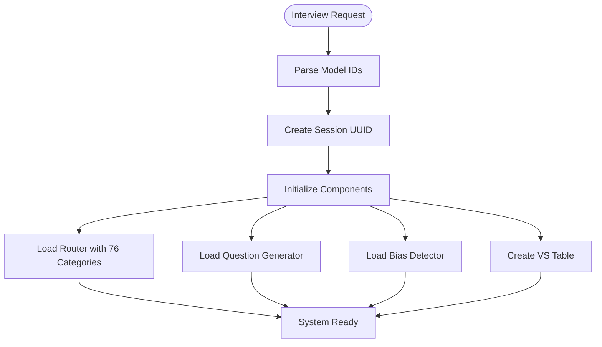
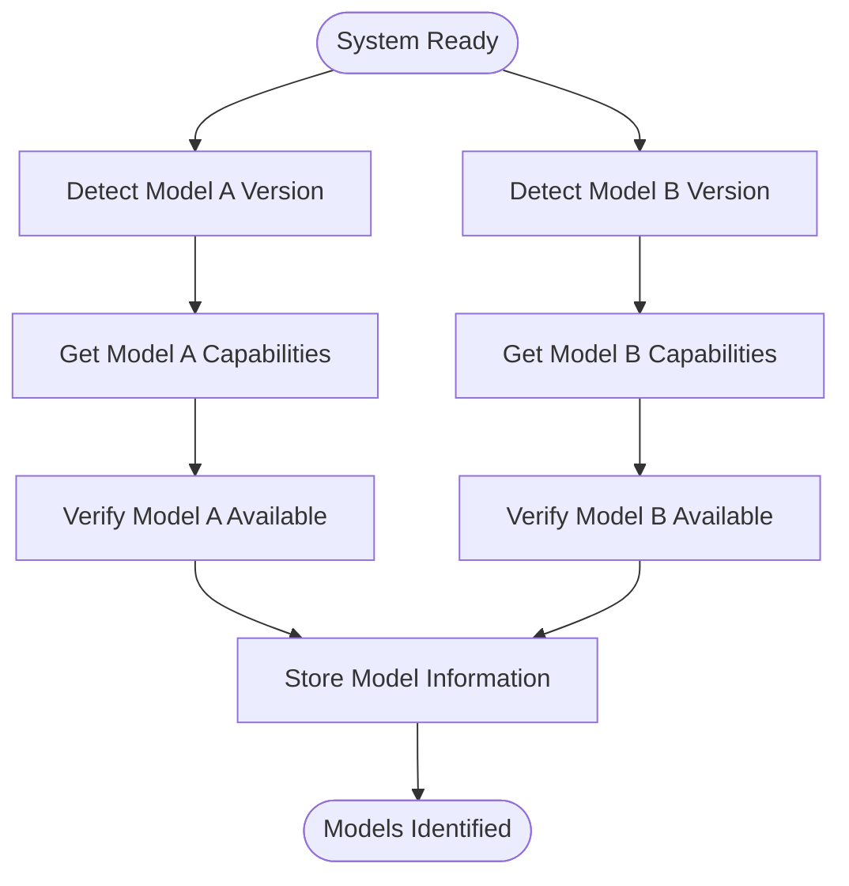
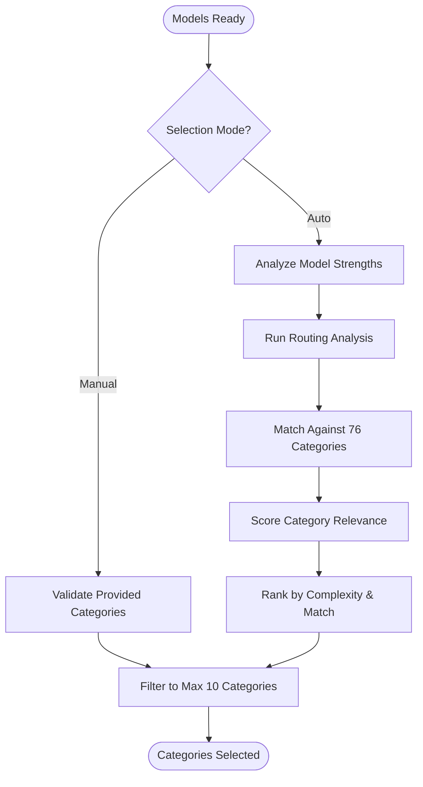
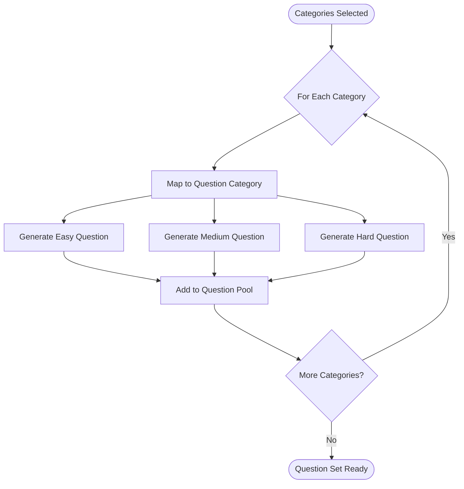
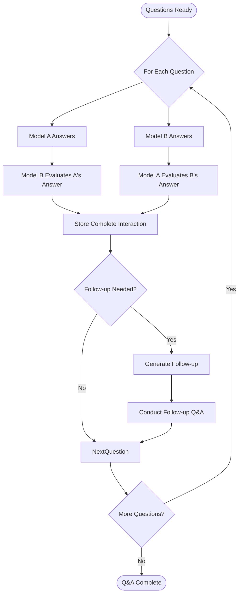
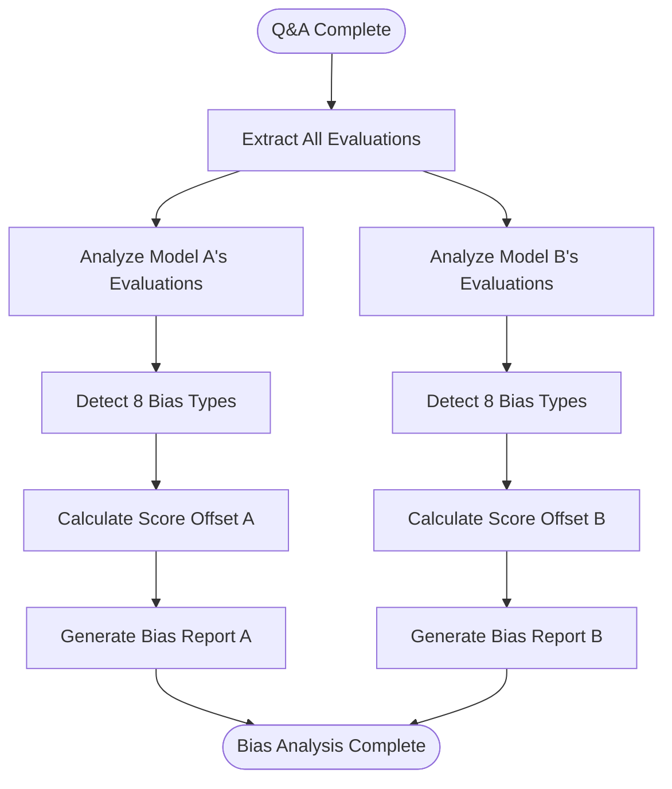
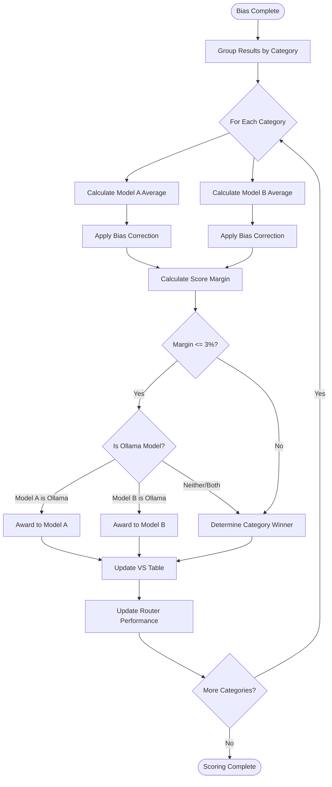
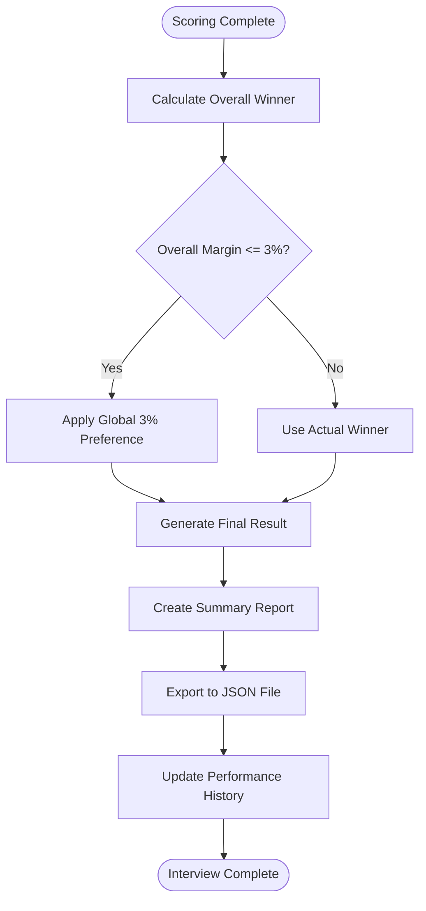

# Complete Interview Workflow with 76 Categories

## System Overview

The Unified Interview System conducts comprehensive bidirectional interviews between AI models, evaluating performance across 76 fine-grained categories with bias detection and intelligent routing.

## Workflow Phases

### Phase 1: Initialization


### Phase 2: Model Detection


### Phase 3: Category Selection


### Phase 4: Question Generation


### Phase 5: Bidirectional Q&A


### Phase 6: Bias Detection


### Phase 7: Scoring with 3% Rule


### Phase 8: Finalization


## Category Distribution (76 Categories)

### Programming (16)
- web_development
- systems_programming
- algorithm_implementation
- debugging
- code_review
- testing
- devops
- database
- mobile_development
- game_development
- embedded_programming
- compiler_design
- api_design
- concurrent_programming
- functional_programming
- blockchain_development

### Mathematics (10)
- calculus
- linear_algebra
- statistics
- discrete_math
- numerical_methods
- differential_equations
- number_theory
- topology
- abstract_algebra
- optimization

### Science (8)
- physics
- chemistry
- biology
- computer_science
- astronomy
- geology
- environmental_science
- neuroscience

### Language (8)
- translation
- grammar
- writing_style
- summarization
- linguistics
- editing
- technical_writing
- content_generation

### Creative (7)
- creative_writing
- brainstorming
- design
- music_composition
- art_concepts
- video_production
- game_design

### Technical (8)
- networking
- security
- architecture
- performance
- cloud_computing
- virtualization
- monitoring
- disaster_recovery

### Business (8)
- strategy
- finance
- marketing
- project_management
- operations
- human_resources
- sales
- legal_compliance

### Research (5)
- literature_review
- data_analysis
- methodology
- statistical_modeling
- experimental_design

### System (5)
- operating_systems
- shell_scripting
- system_administration
- automation
- hardware_interfaces

### Data (4)
- machine_learning
- data_engineering
- visualization
- big_data

## Key Features

### 1. Intelligent Category Selection
- Auto-selects categories based on model strengths
- Uses routing analysis to find optimal test areas
- Balances complexity across selected categories

### 2. Adaptive Question Generation
- 3 difficulty levels per category (Easy, Medium, Hard)
- Context-aware question creation
- Follow-up questions for deeper evaluation

### 3. Comprehensive Bias Detection
- 8 types of bias detected:
  - Self-serving bias
  - Competitive bias
  - Lenient bias
  - Harsh bias
  - Inconsistent bias
  - Category-specific bias
  - Difficulty-based bias
  - Response length bias

### 4. Score Correction
- Automatic bias offset calculation
- Confidence-weighted adjustments
- Statistical validation of corrections

### 5. 3% Local Preference Rule
- Applied at category level
- Applied at overall winner level
- Encourages local model usage for close scores

### 6. Performance Learning
- Updates router with interview results
- Improves future category selection
- Tracks model strengths over time

## Output Format

### Interview Result File
```json
{
  "format_version": "2.0",
  "session_id": "uuid",
  "timestamp": "2024-01-01T00:00:00Z",
  "models": {
    "model_a": {
      "id": "claude",
      "version": "claude-opus-4-1-20250805"
    },
    "model_b": {
      "id": "llama",
      "version": "llama-3.2-3b-instruct"
    }
  },
  "categories_tested": [
    "web_development",
    "algorithm_implementation",
    "machine_learning",
    "creative_writing",
    "data_analysis"
  ],
  "total_questions": 15,
  "duration": 300.5,
  "vs_table": {
    "overall_winner": "model_a",
    "overall_margin": 1.2,
    "confidence": 0.85,
    "categories_won_a": 3,
    "categories_won_b": 2,
    "local_preference_triggered": true,
    "category_results": [...]
  },
  "bias_reports": {
    "model_a": {
      "overall_bias": 0.15,
      "recommended_offset": -0.3,
      "confidence": 0.82,
      "detected_biases": ["self_serving", "lenient"]
    },
    "model_b": {
      "overall_bias": -0.22,
      "recommended_offset": 0.44,
      "confidence": 0.79,
      "detected_biases": ["competitive", "harsh"]
    }
  },
  "final_result": {
    "winner": "model_a",
    "margin": 1.2,
    "confidence": 0.85,
    "local_preference_triggered": true
  }
}
```

## Usage Example

```python
# Initialize system
interview_system = UnifiedInterviewSystem()

# Configure adapters
interview_system.model_adapters = {
    "claude": ClaudeAdapter(),
    "llama": OllamaAdapter("llama3.2:3b")
}

# Conduct interview
session = await interview_system.conduct_interview(
    model_a_id="claude",
    model_b_id="llama",
    categories=None,  # Auto-select
    auto_select=True
)

# Print results
print(session.summary)
```

## Performance Optimization

### Parallel Processing
- Questions within categories can be processed in parallel
- Model responses are async/await enabled
- Evaluation requests are batched when possible

### Caching
- Router decisions are cached for repeated requests
- Model capabilities are cached after first detection
- Question templates are pre-compiled

### Resource Management
- Timeout protection on all model calls
- Memory-efficient response storage
- Automatic session cleanup

## Error Handling

### Graceful Degradation
- Missing model adapters trigger fallback
- Timeout responses receive default scores
- Parsing failures use conservative estimates

### Recovery Mechanisms
- Automatic retry for transient failures
- Partial results saved on interruption
- Session recovery from checkpoint

## Summary

This complete workflow implements a production-ready interview system that:

1. **Evaluates across 76 fine-grained categories** for comprehensive coverage
2. **Detects and corrects for bias** ensuring fair evaluation
3. **Applies 3% local preference rule** encouraging efficient resource usage
4. **Learns from results** improving future routing decisions
5. **Exports detailed results** for analysis and comparison
6. **Handles errors gracefully** ensuring reliable operation

The system provides objective, bias-corrected comparisons between any two AI models with detailed category-level analysis and intelligent routing optimization.