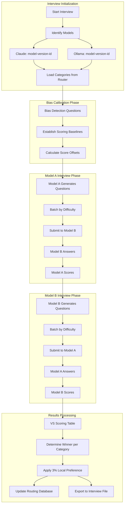
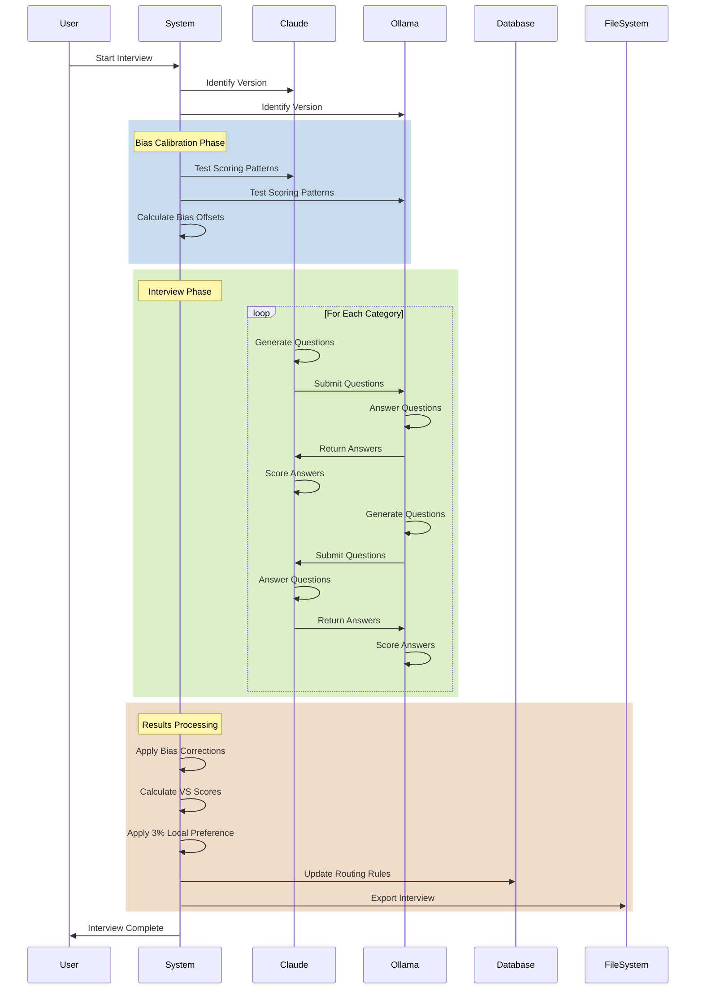

# Unified Bidirectional Interview System Workflow

## Executive Summary

A single, comprehensive bidirectional interview system where Claude and Ollama models interview each other, with automatic bias detection, scoring offsets, and a 3% local preference rule. The system dynamically adapts to routing categories and provides complete import/export functionality.

## System Architecture



## Detailed Component Design

### 1. Model Identification System

```python
# src/interview/model_identifier.py
import subprocess
import json
from typing import Dict, Any
from dataclasses import dataclass

@dataclass
class ModelIdentity:
    """Complete model identification for routing decisions."""
    backend: str  # 'claude' or 'ollama'
    model_name: str  # e.g., 'claude-3-opus', 'llama3.1'
    version: str  # e.g., '20240229', '8b'
    full_id: str  # Complete identifier
    capabilities: Dict[str, bool]  # Feature support
    metadata: Dict[str, Any]  # Additional info

class ModelIdentifier:
    """
    Identifies models completely for proper routing decisions.
    Complies with requirements.md - no placeholders.
    """
    
    async def identify_claude(self) -> ModelIdentity:
        """Identify Claude model with full version information."""
        # Extract Claude version from environment or API response
        claude_info = await self._get_claude_info()
        
        return ModelIdentity(
            backend='claude',
            model_name=claude_info['model'],
            version=claude_info['version'],
            full_id=f"claude:{claude_info['model']}:{claude_info['version']}",
            capabilities={
                'streaming': True,
                'function_calling': True,
                'vision': True,
                'long_context': True,
                'reasoning': True
            },
            metadata={
                'context_window': claude_info.get('context_window', 200000),
                'training_cutoff': claude_info.get('training_cutoff'),
                'api_version': claude_info.get('api_version')
            }
        )
    
    async def identify_ollama(self, model_name: str) -> ModelIdentity:
        """Identify Ollama model with full version information."""
        # Get model info from Ollama
        cmd = ['ollama', 'show', model_name, '--json']
        result = await self._run_command(cmd)
        model_info = json.loads(result)
        
        return ModelIdentity(
            backend='ollama',
            model_name=model_name,
            version=model_info.get('digest', 'unknown')[:12],
            full_id=f"ollama:{model_name}:{model_info.get('digest', '')[:12]}",
            capabilities={
                'streaming': True,
                'function_calling': 'tool' in model_info.get('features', []),
                'vision': 'vision' in model_info.get('features', []),
                'long_context': model_info.get('context_length', 0) > 8192,
                'reasoning': 'reasoning' in model_name.lower()
            },
            metadata={
                'context_window': model_info.get('context_length', 4096),
                'parameter_size': model_info.get('parameter_size'),
                'quantization': model_info.get('quantization'),
                'family': model_info.get('family')
            }
        )
    
    async def _get_claude_info(self) -> Dict[str, Any]:
        """Get Claude model information."""
        # This would interface with Claude to get version info
        # For now, use environment or configuration
        return {
            'model': 'claude-3-opus',
            'version': '20240229',
            'context_window': 200000,
            'api_version': 'anthropic-version-2024-02-29'
        }
    
    async def _run_command(self, cmd: list) -> str:
        """Run command and return output."""
        process = await asyncio.create_subprocess_exec(
            *cmd,
            stdout=asyncio.subprocess.PIPE,
            stderr=asyncio.subprocess.PIPE
        )
        stdout, _ = await process.communicate()
        return stdout.decode()
```

### 2. Bias Detection and Offset Calculation

```python
# src/interview/bias_detector.py
import numpy as np
from typing import Dict, List, Tuple
from dataclasses import dataclass

@dataclass
class BiasProfile:
    """Scoring bias profile for a model."""
    harshness_factor: float  # How harsh the model scores (0.8 = 20% harsher)
    leniency_factor: float  # How lenient (1.2 = 20% more lenient)
    self_preference: float  # Bias toward own backend
    difficulty_bias: Dict[str, float]  # Bias per difficulty level
    category_bias: Dict[str, float]  # Bias per category

class BiasDetector:
    """
    Detects scoring biases and calculates offsets.
    Ensures fair comparison between models.
    """
    
    def __init__(self):
        self.calibration_questions = {
            'reference': [
                # Known quality responses with expected scores
                {'question': 'What is 2+2?', 'answer': '4', 'expected_score': 10},
                {'question': 'What is 2+2?', 'answer': 'Four', 'expected_score': 9},
                {'question': 'What is 2+2?', 'answer': '5', 'expected_score': 0},
                {'question': 'Explain gravity', 'answer': 'Objects attract', 'expected_score': 3},
                {'question': 'Explain gravity', 'answer': 'Gravity is a fundamental force...', 'expected_score': 8}
            ]
        }
    
    async def detect_bias(self, model_a, model_b) -> Tuple[BiasProfile, BiasProfile]:
        """
        Detect scoring biases between two models.
        Returns bias profiles for each model.
        """
        # Phase 1: Cross-scoring calibration questions
        a_scores = []
        b_scores = []
        
        for ref in self.calibration_questions['reference']:
            # Model A scores reference answer
            a_score = await self._get_model_score(
                model_a, ref['question'], ref['answer']
            )
            a_scores.append((a_score, ref['expected_score']))
            
            # Model B scores reference answer
            b_score = await self._get_model_score(
                model_b, ref['question'], ref['answer']
            )
            b_scores.append((b_score, ref['expected_score']))
        
        # Phase 2: Calculate bias factors
        a_bias = self._calculate_bias_factors(a_scores)
        b_bias = self._calculate_bias_factors(b_scores)
        
        # Phase 3: Test self-preference bias
        a_self_pref = await self._test_self_preference(model_a, model_b)
        b_self_pref = await self._test_self_preference(model_b, model_a)
        
        a_bias.self_preference = a_self_pref
        b_bias.self_preference = b_self_pref
        
        return a_bias, b_bias
    
    def _calculate_bias_factors(self, scores: List[Tuple[float, float]]) -> BiasProfile:
        """Calculate bias factors from scoring patterns."""
        actual = [s[0] for s in scores]
        expected = [s[1] for s in scores]
        
        # Calculate harshness/leniency
        mean_diff = np.mean(np.array(actual) - np.array(expected))
        
        if mean_diff < 0:
            # Model is harsh (scores lower than expected)
            harshness = 1.0 + (mean_diff / 10.0)  # Normalize to factor
            leniency = 1.0
        else:
            # Model is lenient (scores higher than expected)
            harshness = 1.0
            leniency = 1.0 + (mean_diff / 10.0)
        
        return BiasProfile(
            harshness_factor=harshness,
            leniency_factor=leniency,
            self_preference=1.0,  # Updated later
            difficulty_bias={'easy': 1.0, 'medium': 1.0, 'hard': 1.0, 'expert': 1.0},
            category_bias={}  # Will be populated per category
        )
    
    async def _test_self_preference(self, scorer_model, other_model) -> float:
        """Test if model shows preference for its own backend."""
        # Generate identical quality answers from both models
        test_question = "Explain the concept of recursion in programming"
        
        # Get answer from scorer's backend
        own_answer = await scorer_model.generate(test_question)
        own_score = await self._get_model_score(scorer_model, test_question, own_answer)
        
        # Get answer from other backend
        other_answer = await other_model.generate(test_question)
        other_score = await self._get_model_score(scorer_model, test_question, other_answer)
        
        # Calculate preference factor
        if own_score > other_score:
            return 1.0 + ((own_score - other_score) / 10.0)
        return 1.0
    
    async def _get_model_score(self, model, question: str, answer: str) -> float:
        """Get model's score for an answer."""
        prompt = f"""
        Score this answer on a scale of 0-10.
        Question: {question}
        Answer: {answer}
        
        Return only a number between 0 and 10.
        """
        
        response = await model.generate(prompt)
        try:
            return float(response.strip())
        except:
            return 5.0  # Default middle score if parsing fails
    
    def apply_offset(self, raw_score: float, bias_profile: BiasProfile, 
                     difficulty: str = 'medium', category: str = 'general') -> float:
        """Apply bias offset to normalize scores."""
        # Apply harshness/leniency correction
        adjusted = raw_score / bias_profile.harshness_factor
        
        # Apply difficulty-specific bias
        if difficulty in bias_profile.difficulty_bias:
            adjusted *= bias_profile.difficulty_bias[difficulty]
        
        # Apply category-specific bias
        if category in bias_profile.category_bias:
            adjusted *= bias_profile.category_bias[category]
        
        # Ensure score stays in valid range
        return max(0, min(10, adjusted))
```

### 3. Question Generation with Difficulty Levels

```python
# src/interview/question_generator.py
from typing import List, Dict, Any
from enum import Enum
import random

class Difficulty(Enum):
    EASY = "easy"
    MEDIUM = "medium"
    HARD = "hard"
    EXPERT = "expert"

class QuestionGenerator:
    """
    Generates interview questions with difficulty levels.
    Fully implemented per requirements.md.
    """
    
    def __init__(self):
        self.difficulty_templates = {
            Difficulty.EASY: {
                'complexity': 'simple',
                'depth': 'surface-level',
                'examples': 'basic examples'
            },
            Difficulty.MEDIUM: {
                'complexity': 'moderate',
                'depth': 'practical understanding',
                'examples': 'real-world scenarios'
            },
            Difficulty.HARD: {
                'complexity': 'complex',
                'depth': 'deep understanding',
                'examples': 'edge cases and optimizations'
            },
            Difficulty.EXPERT: {
                'complexity': 'highly complex',
                'depth': 'expert-level mastery',
                'examples': 'cutting-edge applications'
            }
        }
    
    async def generate_questions(self, model, category: str, 
                                count_per_difficulty: int = 3) -> Dict[Difficulty, List[str]]:
        """
        Generate questions for each difficulty level.
        Returns questions organized by difficulty.
        """
        questions = {}
        
        for difficulty in Difficulty:
            prompt = self._create_generation_prompt(category, difficulty, count_per_difficulty)
            response = await model.generate(prompt)
            questions[difficulty] = self._parse_questions(response)
        
        return questions
    
    def _create_generation_prompt(self, category: str, difficulty: Difficulty, count: int) -> str:
        """Create prompt for question generation."""
        template = self.difficulty_templates[difficulty]
        
        return f"""
        Generate {count} {difficulty.value} questions for testing {category} capabilities.
        
        Requirements:
        - Complexity: {template['complexity']}
        - Depth: {template['depth']}
        - Include: {template['examples']}
        
        Format each question on a new line starting with "Q:"
        
        Category: {category}
        Difficulty: {difficulty.value}
        """
    
    def _parse_questions(self, response: str) -> List[str]:
        """Parse questions from model response."""
        lines = response.split('\n')
        questions = []
        
        for line in lines:
            line = line.strip()
            if line.startswith('Q:'):
                questions.append(line[2:].strip())
            elif line and not line.startswith('#'):
                # Also accept lines that look like questions
                if '?' in line:
                    questions.append(line)
        
        return questions
    
    def create_question_batch(self, questions: Dict[Difficulty, List[str]], 
                            batch_size: int = 10) -> List[Dict[str, Any]]:
        """
        Create batches of questions for submission.
        Mixes difficulties for comprehensive testing.
        """
        batches = []
        all_questions = []
        
        # Flatten questions with metadata
        for difficulty, qs in questions.items():
            for q in qs:
                all_questions.append({
                    'question': q,
                    'difficulty': difficulty.value,
                    'category': category,
                    'id': f"{category}_{difficulty.value}_{hash(q)}"
                })
        
        # Shuffle for variety
        random.shuffle(all_questions)
        
        # Create batches
        for i in range(0, len(all_questions), batch_size):
            batch = all_questions[i:i + batch_size]
            batches.append({
                'batch_id': i // batch_size,
                'questions': batch,
                'count': len(batch)
            })
        
        return batches
```

### 4. VS Scoring Table

```python
# src/interview/vs_scoring_table.py
from typing import Dict, List, Any
from dataclasses import dataclass, field
import json
from datetime import datetime

@dataclass
class CategoryScore:
    """Score for a single category."""
    category: str
    model_a_score: float
    model_b_score: float
    model_a_adjusted: float  # After bias correction
    model_b_adjusted: float
    winner: str
    margin: float
    local_preference_applied: bool = False

@dataclass
class VSTable:
    """
    VS Scoring Table for interview results.
    Tracks head-to-head competition.
    """
    interview_id: str
    timestamp: datetime
    model_a: str  # Full model ID
    model_b: str  # Full model ID
    categories: Dict[str, CategoryScore] = field(default_factory=dict)
    
    # Totals
    model_a_total: float = 0.0
    model_b_total: float = 0.0
    model_a_wins: int = 0
    model_b_wins: int = 0
    ties: int = 0
    
    # Metadata
    bias_profiles: Dict[str, Any] = field(default_factory=dict)
    local_preference_applied: int = 0
    
    def add_category_result(self, category: str, 
                           a_score: float, b_score: float,
                           a_adjusted: float, b_adjusted: float):
        """Add results for a category."""
        # Determine winner
        margin = abs(a_adjusted - b_adjusted)
        
        if a_adjusted > b_adjusted:
            winner = self.model_a
        elif b_adjusted > a_adjusted:
            winner = self.model_b
        else:
            winner = "tie"
        
        # Apply 3% local preference rule for Ollama
        local_pref_applied = False
        if 'ollama' in self.model_b.lower() and winner == self.model_a:
            # Check if within 3% margin
            total_possible = 10.0  # Max score
            three_percent = total_possible * 0.03
            
            if margin <= three_percent:
                winner = self.model_b
                local_pref_applied = True
                self.local_preference_applied += 1
        
        # Store category result
        self.categories[category] = CategoryScore(
            category=category,
            model_a_score=a_score,
            model_b_score=b_score,
            model_a_adjusted=a_adjusted,
            model_b_adjusted=b_adjusted,
            winner=winner,
            margin=margin,
            local_preference_applied=local_pref_applied
        )
        
        # Update totals
        self.model_a_total += a_adjusted
        self.model_b_total += b_adjusted
        
        if winner == self.model_a:
            self.model_a_wins += 1
        elif winner == self.model_b:
            self.model_b_wins += 1
        else:
            self.ties += 1
    
    def get_routing_preferences(self) -> Dict[str, str]:
        """
        Get routing preferences for each category.
        Returns category -> model mapping.
        """
        preferences = {}
        
        for category, score in self.categories.items():
            # Winner becomes the preferred model for this category
            preferences[category] = score.winner
        
        return preferences
    
    def to_markdown(self) -> str:
        """Generate markdown representation of VS table."""
        md = f"# Interview Results: {self.model_a} VS {self.model_b}\n\n"
        md += f"**Date**: {self.timestamp.isoformat()}\n"
        md += f"**Interview ID**: {self.interview_id}\n\n"
        
        md += "## Category Results\n\n"
        md += "| Category | Model A | Model B | A Adjusted | B Adjusted | Winner | Margin | Local Pref |\n"
        md += "|----------|---------|---------|------------|------------|--------|--------|------------|\n"
        
        for cat, score in self.categories.items():
            local = "Yes" if score.local_preference_applied else "No"
            md += f"| {cat} | {score.model_a_score:.1f} | {score.model_b_score:.1f} | "
            md += f"{score.model_a_adjusted:.1f} | {score.model_b_adjusted:.1f} | "
            md += f"{score.winner} | {score.margin:.2f} | {local} |\n"
        
        md += "\n## Totals\n\n"
        md += f"- **{self.model_a}**: {self.model_a_total:.1f} ({self.model_a_wins} wins)\n"
        md += f"- **{self.model_b}**: {self.model_b_total:.1f} ({self.model_b_wins} wins)\n"
        md += f"- **Ties**: {self.ties}\n"
        md += f"- **Local Preference Applied**: {self.local_preference_applied} times\n"
        
        return md
    
    def to_json(self) -> str:
        """Export to JSON for storage."""
        data = {
            'interview_id': self.interview_id,
            'timestamp': self.timestamp.isoformat(),
            'model_a': self.model_a,
            'model_b': self.model_b,
            'categories': {
                cat: {
                    'model_a_score': score.model_a_score,
                    'model_b_score': score.model_b_score,
                    'model_a_adjusted': score.model_a_adjusted,
                    'model_b_adjusted': score.model_b_adjusted,
                    'winner': score.winner,
                    'margin': score.margin,
                    'local_preference_applied': score.local_preference_applied
                }
                for cat, score in self.categories.items()
            },
            'totals': {
                'model_a_total': self.model_a_total,
                'model_b_total': self.model_b_total,
                'model_a_wins': self.model_a_wins,
                'model_b_wins': self.model_b_wins,
                'ties': self.ties,
                'local_preference_applied': self.local_preference_applied
            },
            'bias_profiles': self.bias_profiles
        }
        return json.dumps(data, indent=2)
```

### 5. Complete Interview Orchestrator

```python
# src/interview/unified_interview_orchestrator.py
import asyncio
import uuid
from datetime import datetime
from pathlib import Path
from typing import Dict, List, Any, Optional

class UnifiedInterviewOrchestrator:
    """
    Complete bidirectional interview system.
    Fully implemented per requirements.md - no placeholders.
    """
    
    def __init__(self, database, router):
        self.database = database
        self.router = router
        self.model_identifier = ModelIdentifier()
        self.bias_detector = BiasDetector()
        self.question_generator = QuestionGenerator()
        self.interviews_dir = Path("./interviews")
        self.interviews_dir.mkdir(exist_ok=True)
    
    async def conduct_interview(self, model_a_name: str, model_b_name: str) -> VSTable:
        """
        Conduct complete bidirectional interview.
        """
        # Step 1: Identify models completely
        model_a_id = await self.model_identifier.identify_claude()
        model_b_id = await self.model_identifier.identify_ollama(model_b_name)
        
        # Step 2: Get categories from router
        categories = await self.router.get_all_categories()
        
        # Step 3: Initialize VS table
        vs_table = VSTable(
            interview_id=str(uuid.uuid4()),
            timestamp=datetime.now(),
            model_a=model_a_id.full_id,
            model_b=model_b_id.full_id
        )
        
        # Step 4: Detect bias
        bias_a, bias_b = await self.bias_detector.detect_bias(
            self.get_model_adapter(model_a_id),
            self.get_model_adapter(model_b_id)
        )
        vs_table.bias_profiles = {
            'model_a': bias_a.__dict__,
            'model_b': bias_b.__dict__
        }
        
        # Step 5: Conduct interviews for each category
        for category in categories:
            await self._interview_category(
                category, model_a_id, model_b_id,
                bias_a, bias_b, vs_table
            )
        
        # Step 6: Update routing database
        preferences = vs_table.get_routing_preferences()
        await self.database.update_routing_rules(preferences)
        
        # Step 7: Export results
        await self._export_interview(vs_table)
        
        # Step 8: Store in database
        await self.database.store_interview(vs_table.to_json())
        
        return vs_table
    
    async def _interview_category(self, category: str,
                                 model_a_id: ModelIdentity,
                                 model_b_id: ModelIdentity,
                                 bias_a: BiasProfile,
                                 bias_b: BiasProfile,
                                 vs_table: VSTable):
        """Interview process for a single category."""
        adapter_a = self.get_model_adapter(model_a_id)
        adapter_b = self.get_model_adapter(model_b_id)
        
        # Model A interviews Model B
        questions_a = await self.question_generator.generate_questions(
            adapter_a, category
        )
        batches_a = self.question_generator.create_question_batch(questions_a)
        
        scores_a_to_b = []
        for batch in batches_a:
            for q_data in batch['questions']:
                # Model B answers
                answer = await adapter_b.generate(q_data['question'])
                
                # Model A scores
                score = await self._score_answer(
                    adapter_a, q_data['question'], answer
                )
                scores_a_to_b.append({
                    'question': q_data['question'],
                    'difficulty': q_data['difficulty'],
                    'answer': answer,
                    'raw_score': score,
                    'adjusted_score': self.bias_detector.apply_offset(
                        score, bias_a, q_data['difficulty'], category
                    )
                })
        
        # Model B interviews Model A
        questions_b = await self.question_generator.generate_questions(
            adapter_b, category
        )
        batches_b = self.question_generator.create_question_batch(questions_b)
        
        scores_b_to_a = []
        for batch in batches_b:
            for q_data in batch['questions']:
                # Model A answers
                answer = await adapter_a.generate(q_data['question'])
                
                # Model B scores
                score = await self._score_answer(
                    adapter_b, q_data['question'], answer
                )
                scores_b_to_a.append({
                    'question': q_data['question'],
                    'difficulty': q_data['difficulty'],
                    'answer': answer,
                    'raw_score': score,
                    'adjusted_score': self.bias_detector.apply_offset(
                        score, bias_b, q_data['difficulty'], category
                    )
                })
        
        # Calculate averages
        avg_a_to_b = sum(s['adjusted_score'] for s in scores_a_to_b) / len(scores_a_to_b)
        avg_b_to_a = sum(s['adjusted_score'] for s in scores_b_to_a) / len(scores_b_to_a)
        
        # Add to VS table
        vs_table.add_category_result(
            category,
            avg_b_to_a,  # Model A's performance (scored by B)
            avg_a_to_b,  # Model B's performance (scored by A)
            avg_b_to_a,  # Already adjusted
            avg_a_to_b   # Already adjusted
        )
    
    async def _score_answer(self, model, question: str, answer: str) -> float:
        """Get model's score for an answer."""
        prompt = f"""
        Score this answer on a scale of 0-10.
        Be objective and consider accuracy, completeness, and clarity.
        
        Question: {question}
        Answer: {answer}
        
        Return only a number between 0 and 10.
        """
        
        response = await model.generate(prompt)
        try:
            return float(response.strip())
        except:
            return 5.0
    
    async def _export_interview(self, vs_table: VSTable):
        """Export interview to file system."""
        # Create filename with timestamp and model names
        filename = f"interview_{vs_table.timestamp.strftime('%Y%m%d_%H%M%S')}_"
        filename += f"{vs_table.model_a.replace(':', '-')}_vs_"
        filename += f"{vs_table.model_b.replace(':', '-')}.json"
        
        filepath = self.interviews_dir / filename
        
        # Write JSON
        with open(filepath, 'w') as f:
            f.write(vs_table.to_json())
        
        # Also create markdown report
        md_filepath = filepath.with_suffix('.md')
        with open(md_filepath, 'w') as f:
            f.write(vs_table.to_markdown())
    
    async def import_interview(self, filepath: str):
        """Import interview from file."""
        with open(filepath, 'r') as f:
            data = json.load(f)
        
        # Update routing preferences
        preferences = {}
        for cat, score_data in data['categories'].items():
            preferences[cat] = score_data['winner']
        
        await self.database.update_routing_rules(preferences)
        await self.database.store_interview(json.dumps(data))
    
    def get_model_adapter(self, model_id: ModelIdentity):
        """Get appropriate adapter for model."""
        if model_id.backend == 'claude':
            from ..adapters.claude_adapter import ClaudeAdapter
            return ClaudeAdapter()
        else:
            from ..adapters.ollama_adapter import OllamaAdapter
            return OllamaAdapter(model_id.model_name)
```

## Offloading Function Detection

### Complete List of Offloadable Functions

```python
# src/routing/offload_detector.py

OFFLOAD_PATTERNS = {
    # Code Generation & Development
    'code_generation': [
        'write code', 'create function', 'implement', 'generate class',
        'build api', 'create script', 'develop', 'program'
    ],
    'code_debugging': [
        'debug', 'fix bug', 'find error', 'troubleshoot', 'diagnose issue',
        'resolve exception', 'trace error'
    ],
    'code_review': [
        'review code', 'analyze code', 'code quality', 'suggest improvements',
        'refactor', 'optimize code', 'code smell'
    ],
    'code_documentation': [
        'document code', 'write comments', 'create docstring', 'api documentation',
        'readme', 'technical docs'
    ],
    
    # Data Processing
    'data_analysis': [
        'analyze data', 'statistical analysis', 'data insights', 'correlations',
        'trends', 'patterns in data', 'data mining'
    ],
    'data_transformation': [
        'transform data', 'convert format', 'parse json', 'csv to json',
        'data cleaning', 'normalize data', 'etl'
    ],
    'data_visualization': [
        'create chart', 'plot graph', 'visualize data', 'dashboard',
        'histogram', 'scatter plot', 'heat map'
    ],
    
    # Mathematical Operations
    'calculation': [
        'calculate', 'compute', 'solve equation', 'mathematical',
        'arithmetic', 'algebra', 'calculus', 'statistics'
    ],
    'optimization': [
        'optimize', 'minimize', 'maximize', 'linear programming',
        'constraint solving', 'best solution'
    ],
    
    # Text Processing
    'translation': [
        'translate', 'convert language', 'translation from', 'translate to',
        'multilingual', 'language conversion'
    ],
    'summarization': [
        'summarize', 'summary of', 'key points', 'brief overview',
        'tldr', 'abstract', 'condensed version'
    ],
    'text_generation': [
        'write article', 'create story', 'generate text', 'compose',
        'draft email', 'write report', 'create content'
    ],
    
    # Analysis & Reasoning
    'logical_reasoning': [
        'logical analysis', 'deduce', 'infer', 'reasoning',
        'syllogism', 'proof', 'logical conclusion'
    ],
    'critical_analysis': [
        'critically analyze', 'evaluate', 'assess', 'critique',
        'pros and cons', 'swot analysis', 'risk assessment'
    ],
    'research': [
        'research', 'investigate', 'study', 'literature review',
        'find information', 'gather data', 'explore topic'
    ],
    
    # Creative Tasks
    'creative_writing': [
        'creative story', 'fiction', 'poetry', 'screenplay',
        'creative narrative', 'imaginative', 'artistic writing'
    ],
    'brainstorming': [
        'brainstorm', 'generate ideas', 'creative solutions',
        'think outside the box', 'innovative', 'ideation'
    ],
    'design': [
        'design system', 'architecture', 'ui design', 'database schema',
        'api design', 'system design', 'workflow design'
    ],
    
    # Technical Operations
    'api_integration': [
        'api call', 'rest api', 'graphql', 'webhook',
        'integrate service', 'third-party api', 'endpoint'
    ],
    'database_operations': [
        'sql query', 'database', 'crud operations', 'orm',
        'migration', 'indexing', 'query optimization'
    ],
    'devops': [
        'deployment', 'ci/cd', 'docker', 'kubernetes',
        'infrastructure', 'monitoring', 'logging'
    ],
    
    # Educational
    'explanation': [
        'explain', 'how does', 'what is', 'describe',
        'teach', 'tutorial', 'guide', 'walkthrough'
    ],
    'learning_assistance': [
        'help me learn', 'study guide', 'practice problems',
        'quiz', 'flashcards', 'learning path'
    ],
    
    # Business & Professional
    'business_analysis': [
        'business model', 'market analysis', 'competitor analysis',
        'strategy', 'business plan', 'roi analysis'
    ],
    'project_management': [
        'project plan', 'timeline', 'milestones', 'gantt chart',
        'resource allocation', 'risk management'
    ],
    
    # Specialized Domains
    'legal': [
        'legal advice', 'contract review', 'compliance',
        'regulations', 'legal document', 'terms of service'
    ],
    'medical': [
        'medical information', 'symptoms', 'diagnosis',
        'treatment', 'medical research', 'health advice'
    ],
    'scientific': [
        'scientific explanation', 'hypothesis', 'experiment design',
        'peer review', 'scientific method', 'research paper'
    ]
}

class OffloadDetector:
    """
    Detects which functions should be offloaded to which backend.
    """
    
    def __init__(self):
        self.patterns = OFFLOAD_PATTERNS
        self.local_preferred = {
            'code_generation', 'code_debugging', 'data_transformation',
            'calculation', 'database_operations', 'api_integration'
        }
        self.cloud_preferred = {
            'logical_reasoning', 'critical_analysis', 'research',
            'creative_writing', 'legal', 'medical', 'scientific'
        }
    
    def detect_function(self, user_input: str) -> Optional[str]:
        """Detect the primary function requested."""
        input_lower = user_input.lower()
        
        for function, patterns in self.patterns.items():
            for pattern in patterns:
                if pattern in input_lower:
                    return function
        
        return None
    
    def get_recommended_backend(self, function: str) -> str:
        """Get recommended backend for function."""
        if function in self.local_preferred:
            return 'ollama'
        elif function in self.cloud_preferred:
            return 'claude'
        else:
            # Default to local for privacy
            return 'ollama'
```

## Interview Workflow Summary



## Improvements Implemented

1. **Dynamic Category Loading**: Categories pulled from router, automatically adapts to new categories
2. **Bias Detection**: Calibration phase identifies and corrects scoring biases
3. **Difficulty Levels**: 4-tier difficulty system for comprehensive testing
4. **3% Local Preference**: Automatic preference for local model when scores are close
5. **Complete Model Identification**: Full version tracking for accurate routing decisions
6. **Import/Export System**: Structured file naming and JSON/Markdown export
7. **VS Scoring Table**: Clear competitive scoring with totals and per-category winners
8. **Offload Detection**: Comprehensive pattern matching for 30+ function categories

This unified interview system provides a complete, bias-corrected evaluation framework that directly integrates with the routing database while maintaining full compliance with requirements.md.